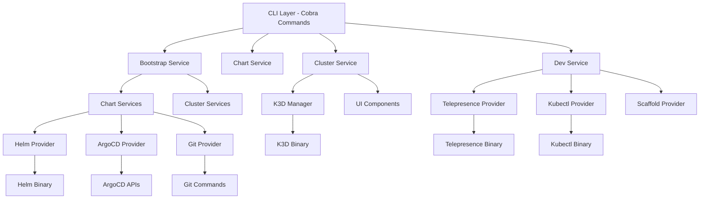

<div align="center">
  <picture>
    <source media="(prefers-color-scheme: dark)" srcset="https://shdrojejslhgnojzkzak.supabase.co/storage/v1/object/public/public/doc-orchestrator/logos/1771384772513-n227fc-logo-openframe-full-dark-bg.png">
    <source media="(prefers-color-scheme: light)" srcset="https://shdrojejslhgnojzkzak.supabase.co/storage/v1/object/public/public/doc-orchestrator/logos/1771384777189-nbcwbo-logo-openframe-full-light-bg.png">
    
  </picture>
</div>

<p align="center">
  <a href="LICENSE.md"></a>
</p>

# OpenFrame CLI

A modern, interactive command-line tool for managing OpenFrame Kubernetes clusters and development workflows. OpenFrame CLI provides seamless cluster lifecycle management, chart installation with ArgoCD, and developer-friendly tools for service intercepts and scaffolding.

[](https://www.youtube.com/watch?v=bINdW0CQbvY)

## 🚀 Features

### **One-Command Bootstrap**
- Create and configure complete K3D clusters instantly
- Automated ArgoCD installation and app-of-apps setup
- GitHub integration for seamless repository management

### **Cluster Lifecycle Management**
- Create, delete, list, and monitor K3D clusters
- Cross-platform support (Linux, macOS, Windows with WSL2)
- Built-in cleanup and status monitoring

### **Chart Management**
- Interactive deployment mode selection (GHCR, SaaS, Local)
- Helm values configuration wizard
- ArgoCD application synchronization monitoring

### **Developer Tools**
- Telepresence service intercepts for local development
- Skaffold scaffolding for new services
- Kubernetes namespace and service management

### **Smart Prerequisites**
- Automatic tool detection and installation
- Support for K3D, Helm, kubectl, Telepresence
- Windows-specific path handling and WSL compatibility

## ⚡ Quick Start

### Prerequisites

- **Hardware**: Minimum 24GB RAM, 6 CPU cores, 50GB disk (Recommended: 32GB RAM, 12 CPU cores, 100GB disk)
- **Software**: Go 1.19+, Docker 20.10+
- **OS**: Linux, macOS, or Windows with WSL2

### Installation

```bash
# Clone the repository
git clone https://github.com/flamingo-stack/openframe-oss-tenant.git
cd openframe-oss-tenant

# Build the CLI
go build -o openframe .

# Bootstrap complete environment (creates cluster + installs charts)
./openframe bootstrap
```

That's it! The bootstrap command will:
- Check and install prerequisites (K3D, Helm, kubectl)
- Create a local K3D Kubernetes cluster
- Install and configure ArgoCD
- Deploy the OpenFrame app-of-apps pattern

### Verify Installation

```bash
# Check cluster status
./openframe cluster status

# Access ArgoCD UI at https://localhost:8080
# Credentials displayed during bootstrap
```

## 🏗️ Architecture

OpenFrame CLI follows a clean, layered architecture with clear separation of concerns:



## 💻 Technology Stack

- **Language**: Go 1.19+ with Cobra CLI framework
- **Container Runtime**: Docker with K3D for local Kubernetes
- **Package Management**: Helm for Kubernetes applications
- **GitOps**: ArgoCD for continuous delivery
- **Development Tools**: Telepresence for service intercepts
- **UI/UX**: pterm for interactive terminal interfaces

## 🔧 Core Commands

### Bootstrap Operations
```bash
# Complete environment setup
./openframe bootstrap                 # Full bootstrap
./openframe bootstrap --cluster-only # Just cluster creation
./openframe bootstrap --charts-only  # Just chart installation
```

### Cluster Management
```bash
./openframe cluster create <name>     # Create new cluster
./openframe cluster list              # List all clusters
./openframe cluster status <name>     # Check cluster health
./openframe cluster delete <name>     # Remove cluster
```

### Chart Operations
```bash
./openframe chart install             # Interactive installation
./openframe chart install --mode=ghcr # GHCR deployment mode
./openframe chart install --mode=local # Local development mode
```

### Development Tools
```bash
./openframe dev intercept <service>   # Create service intercept
./openframe dev intercept --list      # List available services
./openframe dev scaffold <service>    # Create new service template
```

## 🎯 Use Cases

### **DevOps Engineers**
- Simplify Kubernetes cluster provisioning
- Automate ArgoCD deployments
- Standardize development environments

### **Platform Engineers**
- Manage multiple OpenFrame deployments
- Configure chart installations consistently
- Monitor application synchronization

### **Developers**
- Set up local development environments quickly
- Test services with Telepresence intercepts
- Scaffold new microservices efficiently

### **MSP Teams**
- Deploy OpenFrame platforms rapidly
- Standardize client environment setups
- Manage multi-tenant configurations

## 📚 Documentation

📚 See the [Documentation](./docs/README.md) for comprehensive guides including:

- **Getting Started**: Prerequisites, installation, and first steps
- **Development**: Local setup, architecture, and contributing guidelines
- **Reference**: Technical documentation and API specifications
- **Diagrams**: Visual architecture and workflow documentation

## 🔐 Platform-Specific Notes

### Windows Installation
1. Download Windows AMD64 binary: [Latest Release](https://github.com/flamingo-stack/openframe-cli/releases/latest/download/openframe-cli_windows_amd64.zip)
2. Extract and run the installer using the same process as other operating systems
3. Ensure WSL2 is installed and configured for optimal performance

### Cross-Platform Support
- **Linux**: Full native support
- **macOS**: Intel and Apple Silicon support
- **Windows**: Requires WSL2 with Docker Desktop integration

## 🌐 Community & Support

- **Slack Community**: [OpenMSP Slack](https://join.slack.com/t/openmsp/shared_invite/zt-36bl7mx0h-3~U2nFH6nqHqoTPXMaHEHA)
- **Platform**: [OpenFrame.ai](https://openframe.ai)
- **Company**: [Flamingo.run](https://flamingo.run)

> **Note**: We don't use GitHub Issues or GitHub Discussions. All support and community discussions happen in our OpenMSP Slack community.

## 🤝 Contributing

We welcome contributions! Please see our [Contributing Guide](./CONTRIBUTING.md) for details on:

- Development setup and workflow
- Code style and testing standards  
- Pull request process
- Community guidelines

## 📋 External Repositories

### CLI Implementation
The OpenFrame CLI main codebase is maintained in a separate repository:

- **Repository**: [flamingo-stack/openframe-oss-tenant](https://github.com/flamingo-stack/openframe-oss-tenant)
- **Documentation**: [CLI Documentation](https://github.com/flamingo-stack/openframe-oss-tenant/tree/main/docs)

> **Important**: CLI tools are NOT located in this repository. Always refer to the external repository for installation and usage instructions.

## 📄 License

This project is licensed under the Flamingo AI Unified License v1.0. See [LICENSE.md](LICENSE.md) for details.

---
<div align="center">
  Built with 💛 by the <a href="https://www.flamingo.run/about"><b>Flamingo</b></a> team
</div>