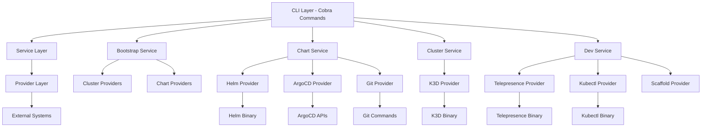

<div align="center">
  <picture>
    <source media="(prefers-color-scheme: dark)" srcset="https://shdrojejslhgnojzkzak.supabase.co/storage/v1/object/public/public/doc-orchestrator/logos/1771384772513-n227fc-logo-openframe-full-dark-bg.png">
    <source media="(prefers-color-scheme: light)" srcset="https://shdrojejslhgnojzkzak.supabase.co/storage/v1/object/public/public/doc-orchestrator/logos/1771384777189-nbcwbo-logo-openframe-full-light-bg.png">
    
  </picture>
</div>

<p align="center">
  <a href="LICENSE.md"></a>
</p>

# OpenFrame CLI

OpenFrame CLI is a modern, interactive command-line tool for managing OpenFrame Kubernetes clusters and development workflows. It provides seamless cluster lifecycle management, chart installation with ArgoCD, and developer-friendly tools for service intercepts and scaffolding, replacing shell scripts with a robust Go-based CLI that supports both interactive and automation use cases.

OpenFrame is part of the Flamingo AI-powered MSP platform that replaces expensive proprietary software with open-source alternatives enhanced by intelligent automation.

## 🎥 Product Overview

[](https://www.youtube.com/watch?v=awc-yAnkhIo)

[](https://www.youtube.com/watch?v=O8hbBO5Mym8)

## ✨ Features

### 🚀 One-Command Bootstrap
```bash
openframe bootstrap
```
Creates a complete Kubernetes environment with ArgoCD, networking, and certificates in minutes.

### 🎯 Interactive Developer Experience
- **Wizard-Driven Setup**: Smart defaults with customization options for new users
- **Real-Time Progress**: Visual feedback and status tracking during operations
- **Auto-Installation**: Automatically installs missing prerequisites (K3D, Helm, kubectl)

### 🔧 Comprehensive Development Tools
- **Service Intercepts**: Debug microservices locally using Telepresence integration
- **Hot Reload Development**: Skaffold integration for rapid development cycles
- **Code Scaffolding**: Generate new services with MSP platform best practices
- **GitOps Workflows**: Built-in ArgoCD integration for continuous delivery

### 🏗️ Enterprise-Ready Architecture
- **Clean Layered Design**: Separation of concerns with service and provider layers
- **Comprehensive Testing**: Unit, integration, and end-to-end test coverage
- **Robust Error Handling**: Retry mechanisms and detailed error reporting
- **Cross-Platform Support**: Windows, Linux, and macOS compatibility

## 🚀 Quick Start

### Prerequisites
- **Minimum**: 24GB RAM, 6 CPU cores, 50GB disk
- **Recommended**: 32GB RAM, 12 CPU cores, 100GB disk
- Docker installed and running
- **Windows**: WSL2 with Ubuntu (automatically configured during bootstrap)

### Installation

**Windows AMD64:**
```bash
curl -LO https://github.com/flamingo-stack/openframe-cli/releases/latest/download/openframe-cli_windows_amd64.zip
unzip openframe-cli_windows_amd64.zip
# Add to PATH environment variable
```

**Linux/macOS:**
```bash
# Download for your platform
curl -LO https://github.com/flamingo-stack/openframe-cli/releases/latest/download/openframe-cli_linux_amd64.tar.gz
tar -xzf openframe-cli_linux_amd64.tar.gz
chmod +x openframe-cli
sudo mv openframe-cli /usr/local/bin/openframe
```

### Bootstrap Your Environment

```bash
# Verify installation
openframe --version

# Interactive — walks you through deployment mode and configuration
openframe bootstrap

# One-liner with no prompts — ideal for getting started fast
openframe bootstrap --deployment-mode=oss-tenant

# Full CI/CD mode — zero interaction, uses existing helm-values.yaml
openframe bootstrap --deployment-mode=oss-tenant --non-interactive

# Continue past memory warnings (useful for machines with <24GB RAM)
openframe bootstrap --force
```

This single command will:

1. ✅ Run a unified pre-flight check — validates **all** prerequisites (tools, memory, certificates) upfront
2. ✅ Auto-install missing tools (K3D, Helm, kubectl, mkcert) across macOS, Linux, and Windows/WSL2
3. ✅ Create K3D cluster with networking configuration
4. ✅ Install ArgoCD for GitOps continuous delivery
5. ✅ Deploy application charts using app-of-apps pattern
6. ✅ Configure local HTTPS certificates
7. ✅ Verify all services are healthy and running

> **Contributing from a fork?** Use `--repo` and `--branch` to point bootstrap at your fork:
>
> ```bash
> openframe bootstrap --repo=https://github.com/myorg/openframe-oss-tenant --branch=my-feature
> ```

### Access Your Environment

After successful bootstrap:

```bash
# Check cluster status
openframe cluster status

# Access ArgoCD dashboard
kubectl port-forward -n argocd svc/argocd-server 8080:443 &
open https://localhost:8080

# Get ArgoCD admin password
kubectl -n argocd get secret argocd-initial-admin-secret -o jsonpath="{.data.password}" | base64 -d
```

## 🏗️ Architecture

The OpenFrame CLI follows a clean, layered architecture with clear separation of concerns:



## 🛠️ Core Commands

| Command | Description | Example |
|---------|-------------|---------|
| `bootstrap` | Complete environment setup (cluster + charts) | `openframe bootstrap` |
| `cluster create` | Create new K3D cluster | `openframe cluster create my-cluster` |
| `cluster delete` | Remove existing cluster | `openframe cluster delete my-cluster` |
| `cluster list` | Show all clusters | `openframe cluster list` |
| `cluster status` | Detailed cluster information | `openframe cluster status my-cluster` |
| `chart install` | Install ArgoCD and app-of-apps | `openframe chart install` |
| `dev intercept` | Telepresence service intercept | `openframe dev intercept my-service` |
| `dev skaffold` | Development workflow with hot reload | `openframe dev skaffold` |

### Advanced Usage

```bash
# Interactive mode with deployment selection
openframe bootstrap

# Pre-configured deployment mode
openframe bootstrap --deployment-mode=oss-tenant

# Non-interactive with custom configuration
openframe bootstrap --deployment-mode=saas-shared --non-interactive

# Force past memory warnings
openframe bootstrap --deployment-mode=oss-tenant --force

# Bootstrap from a fork or feature branch
openframe bootstrap --repo=https://github.com/myorg/openframe-oss-tenant --branch=dev

# Cluster management with custom settings
openframe cluster create --nodes 5 --type k3d --version v1.31.5-k3s1

# Development workflow with service intercepts
openframe dev intercept my-service --port 8080 --namespace production
```

## 🧪 Technology Stack

**Core Technologies:**
- **Go**: High-performance, cross-platform CLI development
- **Cobra**: Command-line interface framework with subcommands
- **Kubernetes**: Container orchestration with K3D for local development
- **ArgoCD**: GitOps continuous delivery and application management
- **Helm**: Kubernetes package management
- **Telepresence**: Service mesh intercepts for debugging

**External Integrations:**
- **K3D**: Lightweight Kubernetes distribution in Docker
- **kubectl**: Kubernetes command-line tool
- **Docker**: Container runtime for local clusters
- **Git**: Repository operations for chart sources
- **mkcert**: Local HTTPS certificate generation

**Development Tools:**
- **pterm**: Terminal UI components and styling
- **promptui**: Interactive prompts and selection
- **client-go**: Kubernetes Go client library
- **testify**: Comprehensive testing framework

## 📚 Documentation

📚 See the [Documentation](./docs/README.md) for comprehensive guides including:

- **Getting Started**: Prerequisites, installation, and first steps
- **Development**: Local development setup and contribution guidelines
- **Reference**: Architecture documentation and API specifications
- **Tutorials**: Step-by-step workflows and advanced usage

## 🤝 Community & Support

- **Community Support**: Join our OpenMSP Slack community at https://www.openmsp.ai/
- **Slack Invite**: https://join.slack.com/t/openmsp/shared_invite/zt-36bl7mx0h-3~U2nFH6nqHqoTPXMaHEHA
- **Documentation**: Comprehensive guides in the `/docs` directory
- **Issues**: Report bugs and request features via our Slack community (we don't use GitHub Issues)

## 🔗 Related Projects

OpenFrame CLI is part of the broader OpenFrame ecosystem:

- **[OpenFrame OSS Tenant](https://github.com/flamingo-stack/openframe-oss-tenant)**: Main OpenFrame platform repository
- **[Flamingo Platform](https://flamingo.run)**: AI-powered MSP platform
- **[OpenMSP Community](https://www.openmsp.ai/)**: Open-source MSP tools and resources

## 📄 License

Licensed under the [Flamingo AI Unified License v1.0](LICENSE.md)

---
<div align="center">
  Built with 💛 by the <a href="https://www.flamingo.run/about"><b>Flamingo</b></a> team
</div>