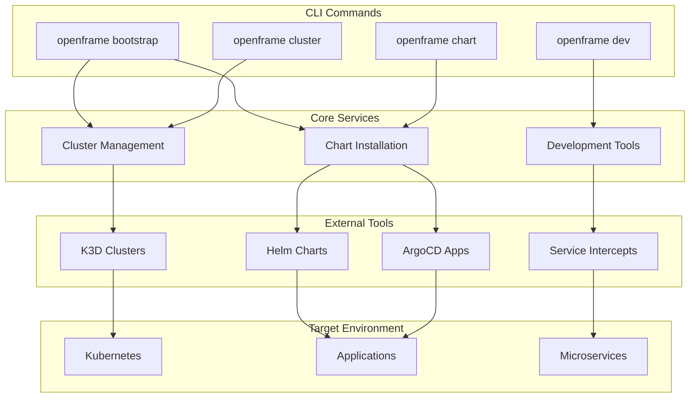

<div align="center">
  <picture>
    <source media="(prefers-color-scheme: dark)" srcset="https://shdrojejslhgnojzkzak.supabase.co/storage/v1/object/public/public/doc-orchestrator/logos/1771384772513-n227fc-logo-openframe-full-dark-bg.png">
    <source media="(prefers-color-scheme: light)" srcset="https://shdrojejslhgnojzkzak.supabase.co/storage/v1/object/public/public/doc-orchestrator/logos/1771384777189-nbcwbo-logo-openframe-full-light-bg.png">
    
  </picture>
</div>

<p align="center">
  <a href="LICENSE.md"></a>
</p>

# OpenFrame CLI

OpenFrame CLI is a modern, interactive command-line tool for managing OpenFrame Kubernetes clusters and development workflows. It provides seamless cluster lifecycle management, chart installation with ArgoCD, and developer-friendly tools for service intercepts and scaffolding.

[](https://www.youtube.com/watch?v=bINdW0CQbvY)

## What is OpenFrame CLI?

OpenFrame CLI is part of the broader [OpenFrame](https://openframe.ai) ecosystem - an AI-powered MSP platform that replaces expensive proprietary software with open-source alternatives enhanced by intelligent automation. The CLI serves as the entry point for developers and operators to bootstrap, manage, and develop on OpenFrame environments.

## Key Features

### 🚀 Complete Environment Bootstrapping
- **One-command setup**: Bootstrap entire OpenFrame environments with `openframe bootstrap`
- **Multi-mode deployment**: Support for OSS tenant, SaaS tenant, and SaaS shared modes
- **Automated cluster creation**: Creates K3D clusters with all necessary components
- **ArgoCD integration**: Automatic chart installation and application management

### 🔧 Cluster Management
- **Lifecycle operations**: Create, delete, list, and monitor Kubernetes clusters
- **K3D integration**: Lightweight Kubernetes for development and testing
- **Status monitoring**: Real-time cluster health and resource monitoring
- **Easy cleanup**: Remove clusters and associated resources with simple commands

### 📦 Chart & Application Management
- **Helm chart installation**: Streamlined chart deployment with dependency management
- **ArgoCD applications**: GitOps-based application lifecycle management
- **App-of-apps pattern**: Hierarchical application management for complex deployments
- **Synchronization monitoring**: Track deployment progress with detailed logging

### 🛠 Development Tools
- **Service intercepts**: Local development with Telepresence integration
- **Scaffolding**: Generate boilerplate code and configurations
- **Live debugging**: Debug services running in Kubernetes from your local environment
- **Hot reload**: Rapid development cycles with instant feedback

## Architecture Overview



## Quick Start

Get OpenFrame CLI up and running in 5 minutes!

### System Requirements

| Resource | Minimum | Recommended |
|----------|---------|-------------|
| **RAM** | 24GB | 32GB |
| **CPU Cores** | 6 cores | 12 cores |
| **Disk Space** | 50GB free | 100GB free |

### Prerequisites

Before installation, ensure you have:
- [Docker](https://docs.docker.com/get-docker/) 20.10+
- [kubectl](https://kubernetes.io/docs/tasks/tools/) 1.25+
- [Helm](https://helm.sh/docs/intro/install/) 3.10+
- [K3D](https://k3d.io/v5.4.6/#installation) 5.0+

### Installation

Choose your platform and install OpenFrame CLI:

#### Linux (AMD64)
```bash
curl -fsSL https://github.com/flamingo-stack/openframe-cli/releases/latest/download/openframe-cli_linux_amd64.tar.gz | tar -xz
sudo mv openframe /usr/local/bin/
chmod +x /usr/local/bin/openframe
```

#### macOS (Apple Silicon)
```bash
curl -fsSL https://github.com/flamingo-stack/openframe-cli/releases/latest/download/openframe-cli_darwin_arm64.tar.gz | tar -xz
sudo mv openframe /usr/local/bin/
chmod +x /usr/local/bin/openframe
```

#### Windows (WSL2)
1. Download: https://github.com/flamingo-stack/openframe-cli/releases/latest/download/openframe-cli_windows_amd64.zip
2. Extract and move `openframe.exe` to a directory in your `PATH`
3. Open WSL2 terminal and verify access

### Bootstrap Your Environment

Create a complete OpenFrame environment with a single command:

```bash
# Verify installation
openframe --version

# Bootstrap complete environment
openframe bootstrap

# Check cluster status
openframe cluster status
```

The bootstrap process creates:
- K3D Kubernetes cluster
- ArgoCD for GitOps deployment
- Traefik ingress controller
- Core monitoring and logging components

## Core Commands

| Command | Description | Example |
|---------|-------------|---------|
| `openframe bootstrap` | Complete environment setup | `openframe bootstrap my-cluster` |
| `openframe cluster create` | Create Kubernetes cluster | `openframe cluster create --nodes 3` |
| `openframe cluster delete` | Remove existing cluster | `openframe cluster delete my-cluster` |
| `openframe cluster status` | Show cluster information | `openframe cluster status` |
| `openframe chart install` | Install charts with ArgoCD | `openframe chart install` |
| `openframe dev intercept` | Start service intercepts | `openframe dev intercept my-service` |

## Technology Stack

OpenFrame CLI integrates with industry-standard tools:

- **Kubernetes**: Container orchestration with K3D for development
- **ArgoCD**: GitOps continuous deployment
- **Helm**: Package management for Kubernetes
- **Telepresence**: Local development with remote services
- **Docker**: Container runtime and image management
- **Cobra**: Modern CLI framework with rich help and completion

## Documentation

📚 See the [Documentation](./docs/README.md) for comprehensive guides including:

- **Getting Started**: Prerequisites, installation, and first steps
- **Development**: Local setup, architecture, and contribution guidelines  
- **Reference**: Technical documentation, API specs, and configuration
- **CLI Tools**: Links to external repositories and tools

## Community and Support

OpenFrame is built by the community for the community:

- **OpenMSP Slack**: [Join the community](https://join.slack.com/t/openmsp/shared_invite/zt-36bl7mx0h-3~U2nFH6nqHqoTPXMaHEHA) - Primary support channel
- **Website**: [https://flamingo.run](https://flamingo.run)
- **OpenFrame Platform**: [https://openframe.ai](https://openframe.ai)

> **Note**: We don't use GitHub Issues or Discussions. All support and community interaction happens in the OpenMSP Slack community.

## License

This project is licensed under the Flamingo AI Unified License v1.0 - see the [LICENSE.md](LICENSE.md) file for details.

---
<div align="center">
  Built with 💛 by the <a href="https://www.flamingo.run/about"><b>Flamingo</b></a> team
</div>