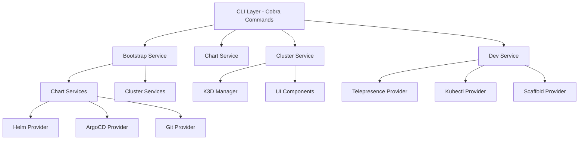

# OpenFrame CLI Documentation

Welcome to the comprehensive documentation for OpenFrame CLI - a modern, interactive command-line tool for managing Kubernetes clusters and development workflows.

## 📚 Table of Contents

### 🚀 Getting Started

New to OpenFrame CLI? Start here to get up and running quickly:

- [Introduction](getting-started/introduction.md) - Overview of OpenFrame CLI capabilities and architecture
- [Prerequisites](getting-started/prerequisites.md) - System requirements and dependency setup  
- [Quick Start](getting-started/quick-start.md) - Get OpenFrame CLI running in 5 minutes
- [First Steps](getting-started/first-steps.md) - Essential commands and workflows after installation

### 🔧 Development

Guides for developers working with OpenFrame CLI:

- [Development Overview](development/README.md) - Development environment and workflow overview
- [Local Development Setup](development/setup/local-development.md) - Set up your development environment
- [Environment Configuration](development/setup/environment.md) - Configure development tools and settings
- [Contributing Guidelines](development/contributing/guidelines.md) - How to contribute to the project
- [Architecture Guide](development/architecture/README.md) - System design and component architecture  
- [Testing Guide](development/testing/README.md) - Testing standards and practices
- [Security Guidelines](development/security/README.md) - Security best practices and considerations

### 📖 Reference

Technical reference documentation:

- [Architecture Overview](architecture/overview.md) - Complete system architecture and component relationships

### 🎨 Visual Documentation

Architecture diagrams and visual guides:

- [Architecture Diagrams](diagrams/architecture/README.md) - Visual documentation of system architecture, workflows, and data flows

## 🚀 Quick Navigation

### For New Users
1. **[Introduction](getting-started/introduction.md)** - Understand what OpenFrame CLI does
2. **[Prerequisites](getting-started/prerequisites.md)** - Prepare your system  
3. **[Quick Start](getting-started/quick-start.md)** - Install and run your first cluster
4. **[First Steps](getting-started/first-steps.md)** - Learn essential operations

### For Developers
1. **[Local Development Setup](development/setup/local-development.md)** - Set up development environment
2. **[Architecture Guide](development/architecture/README.md)** - Understand the codebase structure
3. **[Contributing Guidelines](development/contributing/guidelines.md)** - Learn contribution workflow
4. **[Testing Guide](development/testing/README.md)** - Write and run tests

### For Platform Engineers
1. **[Architecture Overview](architecture/overview.md)** - System design and components
2. **[Security Guidelines](development/security/README.md)** - Security considerations
3. **[Architecture Diagrams](diagrams/architecture/README.md)** - Visual system documentation

## 🎯 What is OpenFrame CLI?

OpenFrame CLI is a powerful Go-based command-line interface that orchestrates complex Kubernetes operations with simple, interactive commands. It provides:

- **🚀 One-Command Bootstrap**: Create complete K3D clusters with ArgoCD instantly
- **🔧 Cluster Management**: Full lifecycle management of local Kubernetes clusters
- **📦 Chart Installation**: Interactive deployment with Helm and ArgoCD
- **🛠️ Developer Tools**: Telepresence intercepts and scaffolding utilities
- **🎯 Smart Prerequisites**: Automatic tool detection and installation

## 🏗️ Architecture Overview

## 🔗 External Resources

### CLI Implementation
The OpenFrame CLI main codebase is maintained in a separate repository:

- **Repository**: [flamingo-stack/openframe-oss-tenant](https://github.com/flamingo-stack/openframe-oss-tenant)
- **Documentation**: [CLI Documentation](https://github.com/flamingo-stack/openframe-oss-tenant/tree/main/docs)

> **Important**: CLI tools are NOT located in this repository. Always refer to the external repository for installation and usage instructions.

### Community & Support
- **Slack Community**: [OpenMSP Slack](https://join.slack.com/t/openmsp/shared_invite/zt-36bl7mx0h-3~U2nFH6nqHqoTPXMaHEHA)
- **Platform**: [OpenFrame.ai](https://openframe.ai)
- **Company**: [Flamingo.run](https://flamingo.run)

> **Note**: We don't use GitHub Issues or GitHub Discussions. All support and community discussions happen in our OpenMSP Slack community.

## 📖 Quick Links

- [Project README](../README.md) - Main project README with installation and overview
- [Contributing Guide](../CONTRIBUTING.md) - How to contribute to OpenFrame CLI
- [License](../LICENSE.md) - License information and terms

## 🆘 Need Help?

1. **Built-in Help**: Use `./openframe <command> --help` for command-specific help
2. **Documentation**: Browse the sections above for comprehensive guides  
3. **Community Support**: Join our [Slack community](https://join.slack.com/t/openmsp/shared_invite/zt-36bl7mx0h-3~U2nFH6nqHqoTPXMaHEHA)
4. **Interactive Wizards**: Most commands include step-by-step guidance

The CLI is designed to be intuitive and self-guiding, with interactive wizards that walk you through complex operations.

---

*Documentation generated by [OpenFrame Doc Orchestrator](https://github.com/flamingo-stack/openframe-oss-tenant)*