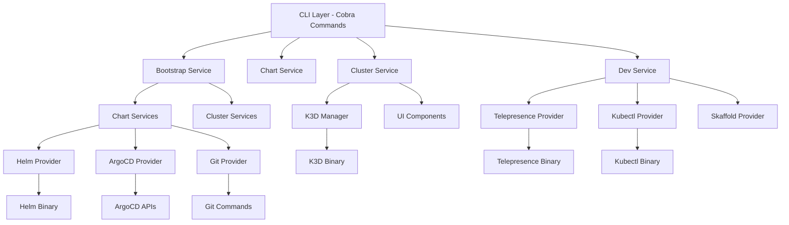
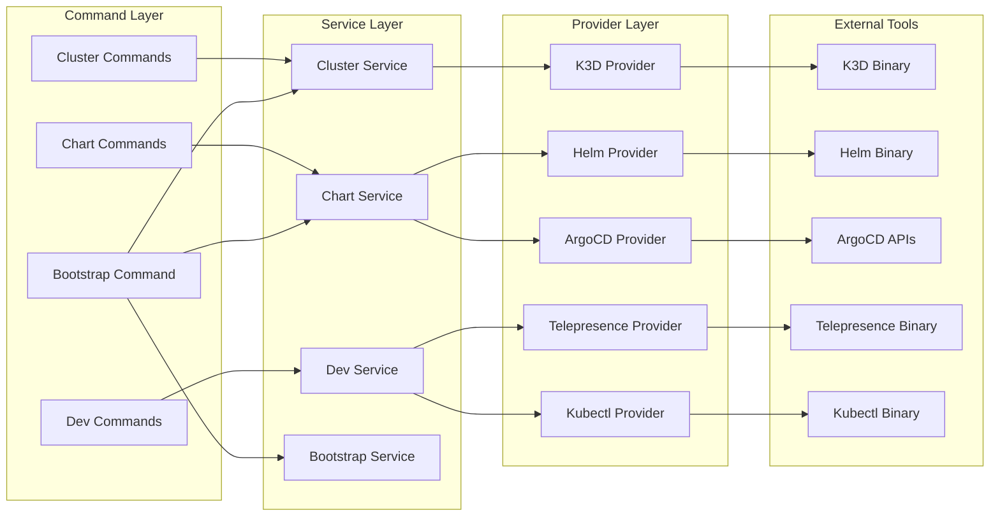
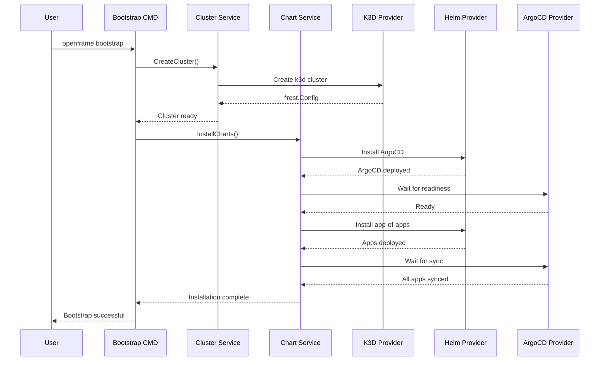
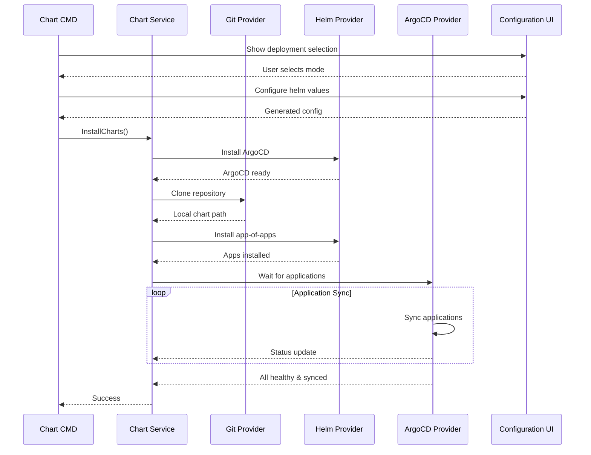

# openframe-cli Module Documentation

# OpenFrame CLI Architecture

OpenFrame CLI is a modern, interactive command-line tool for managing OpenFrame Kubernetes clusters and development workflows, providing seamless cluster lifecycle management, chart installation with ArgoCD, and developer-friendly tools for service intercepts and scaffolding.

## Architecture Overview

The OpenFrame CLI follows a clean, layered architecture with clear separation of concerns across domain boundaries. The system is built using Go with Cobra for CLI management and integrates with external tools like K3D, Helm, ArgoCD, and Telepresence.

### High-Level Architecture



## Core Components

| Component | Package | Responsibility |
|-----------|---------|----------------|
| **CLI Commands** | `cmd/*` | Cobra command definitions and flag management |
| **Bootstrap Service** | `internal/bootstrap` | Orchestrates cluster creation + chart installation |
| **Chart Services** | `internal/chart` | ArgoCD and app-of-apps installation with GitHub integration |
| **Cluster Services** | `internal/cluster` | K3D cluster lifecycle management |
| **Dev Services** | `internal/dev` | Telepresence intercepts and Skaffold workflows |
| **Shared Utilities** | `internal/shared` | Command execution, UI components, error handling |
| **Prerequisites** | `internal/*/prerequisites` | Tool validation and auto-installation |
| **Providers** | `internal/*/providers` | External tool integrations (K3D, Helm, ArgoCD) |

## Component Relationships



## Data Flow

### Bootstrap Workflow



### Chart Installation Flow



## Key Files

| File Path | Purpose |
|-----------|---------|
| `main.go` | Application entry point |
| `cmd/root.go` | Root Cobra command with version info and global setup |
| `cmd/bootstrap/bootstrap.go` | Bootstrap command orchestrating cluster + chart setup |
| `internal/bootstrap/service.go` | Bootstrap service implementation |
| `internal/cluster/service.go` | Cluster lifecycle management service |
| `internal/cluster/providers/k3d/manager.go` | K3D cluster provider with Windows/WSL support |
| `internal/chart/services/chart_service.go` | Chart installation orchestration |
| `internal/chart/providers/helm/manager.go` | Helm chart management with native Kubernetes clients |
| `internal/chart/providers/argocd/applications.go` | ArgoCD application management |
| `internal/dev/services/intercept/service.go` | Telepresence intercept management |
| `internal/shared/executor/executor.go` | Command execution with WSL support |
| `internal/shared/ui/` | Terminal UI components and wizards |

## Dependencies

The CLI integrates with several external tools and libraries:

### External Tool Dependencies
- **K3D**: Local Kubernetes cluster creation and management
- **Helm**: Package manager for Kubernetes applications
- **ArgoCD**: GitOps continuous delivery tool
- **Telepresence**: Service mesh development tool for traffic interception
- **Kubectl**: Kubernetes command-line interface
- **Docker**: Container runtime required by K3D

### Go Library Dependencies
- **Cobra**: CLI framework for command structure and flag parsing
- **pterm**: Terminal UI library for spinners, progress bars, and interactive prompts
- **client-go**: Official Kubernetes Go client library
- **promptui**: Interactive prompt library for user input
- **yaml.v3**: YAML parsing for configuration files

### Platform-Specific Features
- **Windows/WSL2**: Special handling for Docker networking and path conversion
- **Certificate Management**: Automatic mkcert integration for HTTPS development
- **Prerequisites**: Auto-detection and installation of missing tools

## CLI Commands

### Core Commands

```bash
# Bootstrap complete environment
openframe bootstrap [cluster-name] [--deployment-mode=oss-tenant|saas-tenant|saas-shared]

# Cluster management
openframe cluster create [cluster-name] [--nodes=3] [--skip-wizard]
openframe cluster delete [cluster-name] [--force]  
openframe cluster list [--quiet]
openframe cluster status [cluster-name] [--detailed]
openframe cluster cleanup [cluster-name] [--force]

# Chart management  
openframe chart install [cluster-name] [--deployment-mode=oss-tenant]

# Development tools
openframe dev intercept [service-name] [--port=8080] [--namespace=default]
openframe dev skaffold [cluster-name] [--skip-bootstrap]
```

### Global Flags

```bash
--verbose, -v    Enable detailed logging
--dry-run        Show actions without executing  
--force, -f      Skip confirmation prompts
--silent         Suppress non-error output
```

### Interactive vs Non-Interactive Modes

The CLI provides both interactive wizards for ease of use and flag-based operation for automation:

- **Interactive Mode**: Step-by-step prompts with smart defaults
- **Non-Interactive Mode**: Full flag specification for CI/CD pipelines
- **Hybrid Mode**: Partial flags with prompts for missing required values

Each command includes comprehensive help documentation with examples for both usage patterns.
