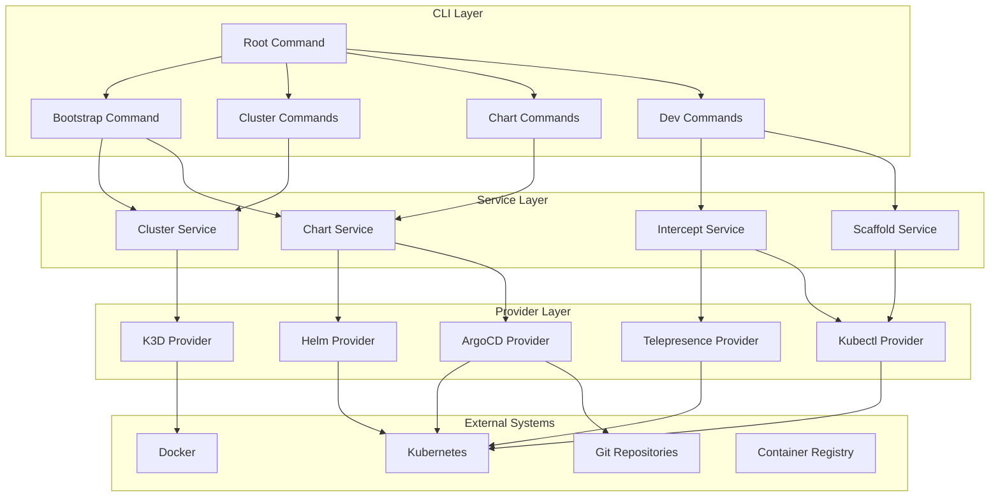
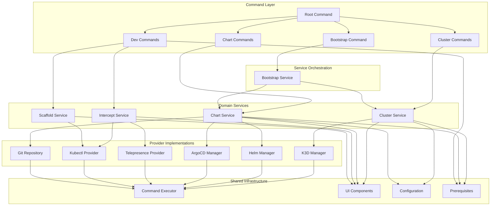
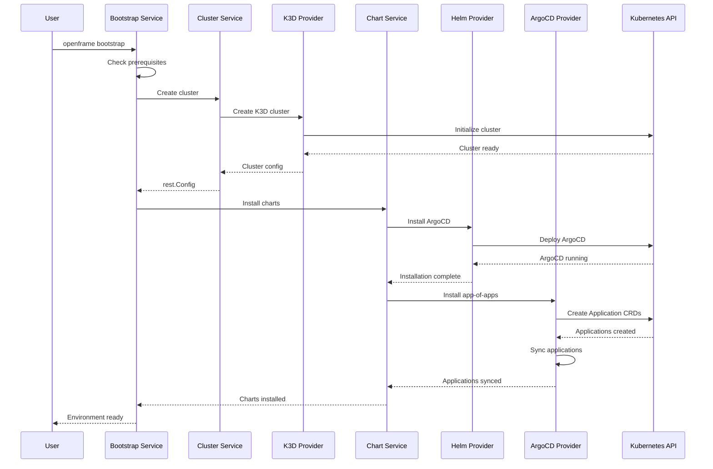
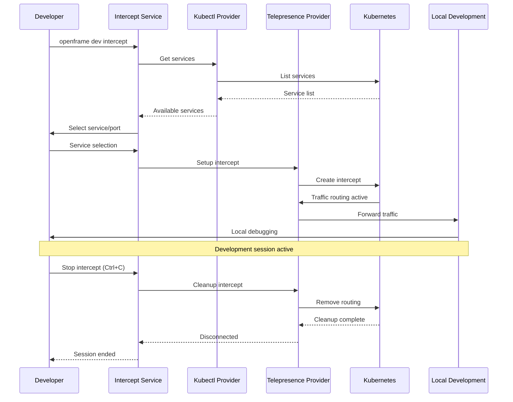

# openframe-cli Module Documentation

# OpenFrame CLI Architecture Documentation

OpenFrame CLI is a modern, interactive command-line tool for managing OpenFrame Kubernetes clusters and development workflows, providing seamless cluster lifecycle management, chart installation with ArgoCD, and developer-friendly tools for service intercepts and scaffolding.

## Architecture

### High-Level System Design

## Core Components

| Component | Package | Responsibility |
|-----------|---------|---------------|
| **CLI Commands** | `cmd/` | Command definitions and argument parsing using Cobra |
| **Cluster Service** | `internal/cluster/` | Kubernetes cluster lifecycle management (K3D) |
| **Chart Service** | `internal/chart/` | Helm chart and ArgoCD application management |
| **Dev Tools** | `internal/dev/` | Development workflows (Telepresence, Skaffold) |
| **Bootstrap Service** | `internal/bootstrap/` | Complete environment setup orchestration |
| **K3D Provider** | `internal/cluster/providers/k3d/` | K3D cluster operations and configuration |
| **Helm Provider** | `internal/chart/providers/helm/` | Helm chart installation and management |
| **ArgoCD Provider** | `internal/chart/providers/argocd/` | ArgoCD application lifecycle and monitoring |
| **Telepresence Provider** | `internal/dev/providers/telepresence/` | Traffic interception for local development |
| **Shared Utilities** | `internal/shared/` | Common functionality (UI, config, errors, execution) |
| **Prerequisites** | `internal/*/prerequisites/` | Tool installation and validation |

## Component Relationships

### Dependency Flow Between Modules

## Data Flow

### Complete Bootstrap Workflow

### Development Intercept Workflow

## Key Files

| File | Purpose |
|------|---------|
| `main.go` | Application entry point and version configuration |
| `cmd/root.go` | Root command definition and global flag management |
| `cmd/bootstrap/bootstrap.go` | Complete environment bootstrap command |
| `internal/cluster/service.go` | Core cluster management business logic |
| `internal/cluster/providers/k3d/manager.go` | K3D cluster provider implementation |
| `internal/chart/services/chart_service.go` | Chart installation orchestration |
| `internal/chart/providers/helm/manager.go` | Helm chart deployment logic |
| `internal/chart/providers/argocd/applications.go` | ArgoCD application management |
| `internal/dev/services/intercept/service.go` | Telepresence intercept workflow |
| `internal/shared/executor/executor.go` | Command execution abstraction with WSL support |
| `internal/shared/ui/logo.go` | Terminal UI and branding components |

## Dependencies

The project integrates with several external tools and libraries:

### Core Kubernetes Libraries
- **client-go**: Native Kubernetes API access for cluster operations
- **apiextensions**: CRD management for ArgoCD applications
- **kubectl**: Command-line cluster interaction fallback

### CLI Framework
- **cobra**: Command structure, argument parsing, and help generation
- **pterm**: Rich terminal UI components, spinners, and progress bars
- **promptui**: Interactive prompts and user input validation

### External Tool Integration
- **K3D**: Lightweight Kubernetes cluster management
- **Helm**: Chart packaging and deployment via command execution
- **ArgoCD**: GitOps application lifecycle through API and CLI
- **Telepresence**: Service mesh traffic interception
- **Docker**: Container runtime for K3D clusters

### Configuration and State
- **YAML**: Configuration file parsing for Helm values and cluster specs
- **JSON**: Structured data exchange with Kubernetes APIs
- **Home directory**: User configuration and certificate storage

## CLI Commands

### Core Commands

| Command | Description | Example |
|---------|-------------|---------|
| `openframe bootstrap` | Complete environment setup (cluster + charts) | `openframe bootstrap my-cluster` |
| `openframe cluster create` | Create new Kubernetes cluster | `openframe cluster create --nodes 3` |
| `openframe cluster delete` | Remove existing cluster | `openframe cluster delete my-cluster` |
| `openframe cluster list` | Show all available clusters | `openframe cluster list` |
| `openframe cluster status` | Detailed cluster information | `openframe cluster status my-cluster` |
| `openframe chart install` | Install ArgoCD and applications | `openframe chart install` |
| `openframe dev intercept` | Start Telepresence traffic intercept | `openframe dev intercept my-service --port 8080` |
| `openframe dev skaffold` | Development workflow with hot reload | `openframe dev skaffold my-cluster` |

### Command Options

**Global Flags:**
- `--verbose, -v`: Enable detailed logging and progress information
- `--dry-run`: Show planned operations without execution
- `--force, -f`: Skip confirmation prompts for automation

**Bootstrap Flags:**
- `--deployment-mode`: Pre-select deployment type (oss-tenant, saas-tenant, saas-shared)
- `--non-interactive`: Use existing configuration without prompts

**Cluster Creation Flags:**
- `--nodes, -n`: Number of worker nodes (default: 3)
- `--type, -t`: Cluster type (k3d, gke)
- `--version`: Kubernetes version
- `--skip-wizard`: Use defaults without interactive configuration

**Development Flags:**
- `--port`: Local port for traffic forwarding
- `--namespace`: Kubernetes namespace for operations
- `--mount`: Mount remote volumes locally
- `--env-file`: Load environment variables from file
