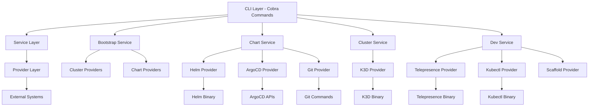
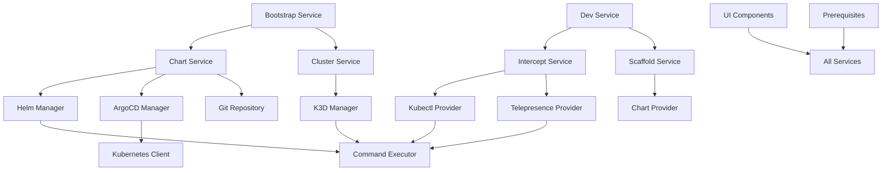
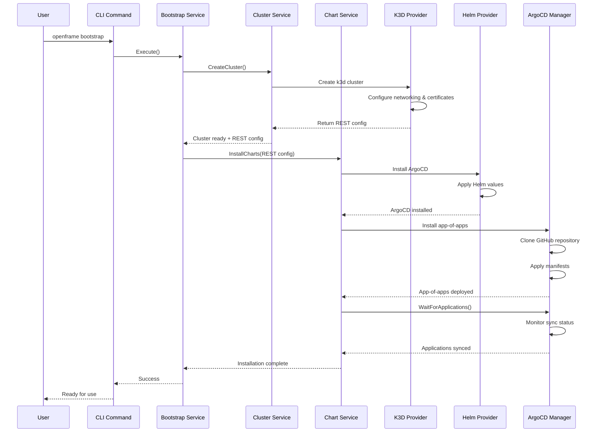

# openframe-cli Module Documentation

# OpenFrame CLI Architecture Documentation

## Overview

OpenFrame CLI is a modern, interactive command-line tool for managing OpenFrame Kubernetes clusters and development workflows. It provides seamless cluster lifecycle management, chart installation with ArgoCD, and developer-friendly tools for service intercepts and scaffolding, replacing shell scripts with a robust Go-based CLI that supports both interactive and automation use cases.

## Architecture

The OpenFrame CLI follows a clean, layered architecture with clear separation of concerns between domain logic, infrastructure providers, and user interfaces.

### High-Level Architecture Diagram


## Core Components

| Component | Package | Responsibility |
|-----------|---------|----------------|
| **CLI Commands** | `cmd/` | Cobra-based command definitions and flag handling |
| **Bootstrap Service** | `internal/bootstrap/` | Orchestrates cluster creation + chart installation |
| **Chart Services** | `internal/chart/` | ArgoCD and Helm chart installation/management |
| **Cluster Services** | `internal/cluster/` | K3D cluster lifecycle operations |
| **Dev Services** | `internal/dev/` | Development tools (intercepts, scaffolding) |
| **Shared Utilities** | `internal/shared/` | Common functionality (UI, errors, execution) |
| **Prerequisites** | `*/prerequisites/` | Tool validation and auto-installation |
| **Providers** | `*/providers/` | External system integrations |
| **UI Components** | `*/ui/` | Interactive terminal interfaces |

## Component Relationships

### Service Dependencies Diagram


## Data Flow

### Bootstrap Command Sequence


## Key Files

| File | Purpose |
|------|---------|
| `main.go` | CLI entry point and version information |
| `cmd/root.go` | Root command definition and global configuration |
| `cmd/bootstrap/bootstrap.go` | One-command cluster + chart setup |
| `internal/cluster/service.go` | Core cluster management business logic |
| `internal/chart/services/chart_service.go` | Chart installation orchestration |
| `internal/bootstrap/service.go` | Bootstrap workflow coordination |
| `internal/cluster/providers/k3d/manager.go` | K3D cluster operations |
| `internal/chart/providers/helm/manager.go` | Helm chart operations |
| `internal/chart/providers/argocd/applications.go` | ArgoCD application management |
| `internal/shared/executor/executor.go` | Command execution abstraction |
| `internal/shared/ui/prompts.go` | Interactive terminal UI |

## Dependencies

The OpenFrame CLI integrates with several external systems and tools:

### External Tool Dependencies
- **K3D**: Local Kubernetes cluster creation and management
- **Helm**: Kubernetes package management for ArgoCD installation
- **kubectl**: Kubernetes cluster interaction
- **ArgoCD**: GitOps continuous delivery
- **Telepresence**: Service mesh intercepts for development
- **Docker**: Container runtime for K3D clusters
- **Git**: Repository operations for chart sources

### Go Library Dependencies
- **Cobra**: CLI framework for commands and flags
- **pterm**: Terminal UI components and styling
- **promptui**: Interactive prompts and selection
- **client-go**: Kubernetes Go client library
- **yaml.v3**: YAML configuration parsing
- **testify**: Testing framework and assertions

### Certificate Management
The CLI includes automatic mkcert integration for local HTTPS development, generating trusted certificates for localhost access to ArgoCD and other services.

## CLI Commands

### Core Commands

| Command | Description | Example |
|---------|-------------|---------|
| `bootstrap` | Complete environment setup (cluster + charts) | `openframe bootstrap` |
| `cluster create` | Create new K3D cluster | `openframe cluster create my-cluster` |
| `cluster delete` | Remove existing cluster | `openframe cluster delete my-cluster` |
| `cluster list` | Show all clusters | `openframe cluster list` |
| `cluster status` | Detailed cluster information | `openframe cluster status my-cluster` |
| `chart install` | Install ArgoCD and app-of-apps | `openframe chart install` |
| `dev intercept` | Telepresence service intercept | `openframe dev intercept my-service` |
| `dev skaffold` | Development workflow with hot reload | `openframe dev skaffold` |

### Bootstrap Options

```bash
# Interactive mode (default)
openframe bootstrap

# Pre-configured deployment mode
openframe bootstrap --deployment-mode=oss-tenant

# Non-interactive with existing helm-values.yaml
openframe bootstrap --deployment-mode=saas-shared --non-interactive

# Verbose output with detailed logs
openframe bootstrap --verbose
```

### Cluster Management

```bash
# Interactive cluster creation with wizard
openframe cluster create

# Direct creation with defaults
openframe cluster create my-cluster --skip-wizard

# Custom configuration
openframe cluster create --nodes 5 --type k3d --version v1.31.5-k3s1

# Cluster operations
openframe cluster status my-cluster --detailed
openframe cluster cleanup my-cluster --force
```

### Development Tools

```bash
# Interactive service intercept
openframe dev intercept

# Direct service intercept
openframe dev intercept my-service --port 8080 --namespace production

# Skaffold development workflow
openframe dev skaffold my-cluster --port 3000
```

The CLI provides both interactive wizards for new users and comprehensive flag-based operation for automation and power users, making it suitable for both local development and CI/CD pipelines.
