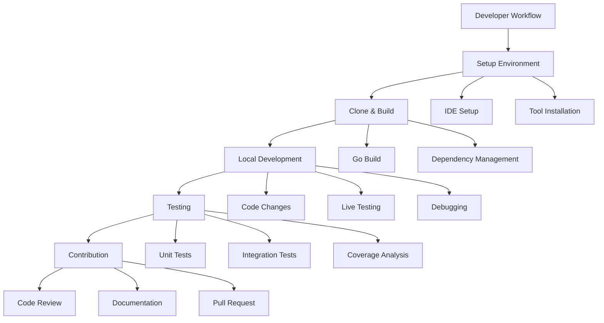

# Development Documentation

Welcome to the OpenFrame CLI development documentation. This section provides comprehensive guides for developers, platform engineers, and contributors working with the OpenFrame CLI codebase.

## Quick Navigation

### 🚀 **Getting Started Development**
- **[Environment Setup](setup/environment.md)** - IDE configuration, tools, and development environment
- **[Local Development](setup/local-development.md)** - Clone, build, run, and debug the CLI locally

### 🏗️ **Architecture & Design**
- **[Architecture Overview](architecture/README.md)** - High-level system design, components, and data flow

### 🔒 **Security**
- **[Security Guidelines](security/README.md)** - Authentication, authorization, and security best practices

### 🧪 **Testing**
- **[Testing Guide](testing/README.md)** - Test structure, running tests, and writing new tests

### 🤝 **Contributing**
- **[Contributing Guidelines](contributing/guidelines.md)** - Code style, PR process, and review checklist

## Development Workflow Overview

The OpenFrame CLI follows a modern Go development workflow with clear separation between CLI commands, business logic, and external integrations.

## Key Development Areas

### Command-Line Interface
The CLI uses Cobra framework for command structure and user interaction:

- **Commands** (`cmd/`): CLI command definitions and flag management
- **Interactive Wizards** (`internal/*/ui/`): Terminal-based user interfaces
- **Help System**: Comprehensive help text and usage examples

### Core Services
Business logic is organized into domain-specific services:

- **Bootstrap Service**: Orchestrates cluster + chart setup
- **Cluster Service**: K3D cluster lifecycle management  
- **Chart Service**: Helm and ArgoCD integration
- **Dev Service**: Development tools and workflows

### External Integrations
The CLI integrates with various external tools:

- **Kubernetes**: kubectl, K3D cluster management
- **GitOps**: Helm charts, ArgoCD applications
- **Development**: Telepresence intercepts, scaffolding
- **Prerequisites**: Tool validation and installation

### Cross-Platform Support
Special considerations for different platforms:

- **Linux**: Native Go binary execution
- **macOS**: Full compatibility with Intel and Apple Silicon
- **Windows**: WSL2 integration and path handling

## Development Tools & Stack

| Category | Tools | Purpose |
|----------|-------|---------|
| **Language** | Go 1.19+ | CLI implementation |
| **CLI Framework** | Cobra | Command structure and parsing |
| **UI Components** | Custom terminal UI | Interactive wizards |
| **Testing** | Go testing, testify | Unit and integration testing |
| **Dependencies** | Go modules | Package management |
| **External Tools** | K3D, Helm, kubectl, Telepresence | Kubernetes operations |

## Documentation Structure

Each development topic is covered in dedicated sections:

### Setup Guides
Step-by-step instructions for preparing your development environment:
- IDE recommendations and configuration
- Required development tools and versions  
- Environment variable setup
- Local development workflow

### Architecture Documentation  
Deep-dive into system design and implementation:
- Component relationships and data flow
- Design patterns and architectural decisions
- Module boundaries and interfaces
- Extension points and customization

### Security Guidelines
Security considerations for CLI development:
- Authentication and authorization patterns
- Secure handling of credentials and secrets
- Input validation and sanitization
- Security testing and code review practices

### Testing Strategy
Comprehensive testing approach:
- Unit testing patterns and utilities
- Integration testing with external tools
- Mock strategies for external dependencies
- Coverage requirements and reporting

### Contributing Process
Guidelines for external and internal contributors:
- Code style and formatting standards
- Git workflow and branching strategy
- Pull request process and review criteria
- Documentation requirements

## Development Principles

The OpenFrame CLI development follows these key principles:

### 🎯 **User-Centric Design**
- Interactive wizards for complex operations
- Clear error messages and help text
- Progressive disclosure of advanced options
- Consistent command patterns across features

### 🔧 **Platform Compatibility**
- Cross-platform support (Linux, macOS, Windows/WSL2)
- Automatic tool installation and validation
- Path handling for different operating systems
- Graceful degradation when tools are unavailable

### 🚀 **Developer Experience**
- Fast build and test cycles
- Comprehensive debugging support
- Live reloading for development
- Clear separation between CLI and business logic

### 📦 **Modular Architecture**
- Clear domain boundaries between services
- Pluggable providers for external tools
- Reusable UI components and utilities
- Testable interfaces and dependency injection

### 🔐 **Security First**
- Secure credential handling
- Input validation at all boundaries
- Least privilege principle
- Regular security reviews

## Getting Started

If you're new to OpenFrame CLI development:

1. **Start with [Environment Setup](setup/environment.md)** to configure your IDE and tools
2. **Follow [Local Development](setup/local-development.md)** to clone and build the project  
3. **Review [Architecture Overview](architecture/README.md)** to understand the system design
4. **Read [Contributing Guidelines](contributing/guidelines.md)** before making changes

## Community & Support

- **Slack Community**: [OpenMSP Slack](https://join.slack.com/t/openmsp/shared_invite/zt-36bl7mx0h-3~U2nFH6nqHqoTPXMaHEHA)
- **Repository**: [flamingo-stack/openframe-oss-tenant](https://github.com/flamingo-stack/openframe-oss-tenant)

> **Note**: We use Slack for all community discussions and support. GitHub Issues and Discussions are not actively monitored.

## Contributing

The OpenFrame CLI is an open-source project welcoming contributions from the community. Whether you're fixing bugs, adding features, improving documentation, or helping with testing, your contributions are valuable.

Before contributing, please review our contributing guidelines and join the Slack community to discuss your ideas with maintainers and other contributors.

---

**Ready to start developing?** Choose the guide that matches your current needs and dive in. The OpenFrame CLI codebase is designed to be approachable for new contributors while providing the flexibility needed for complex Kubernetes operations.