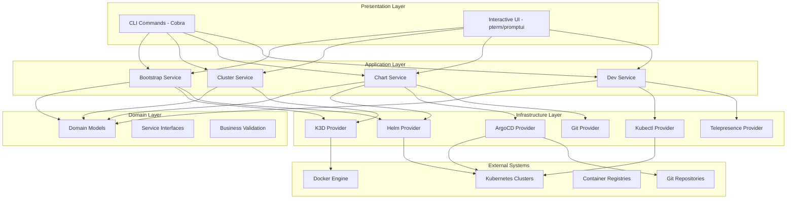
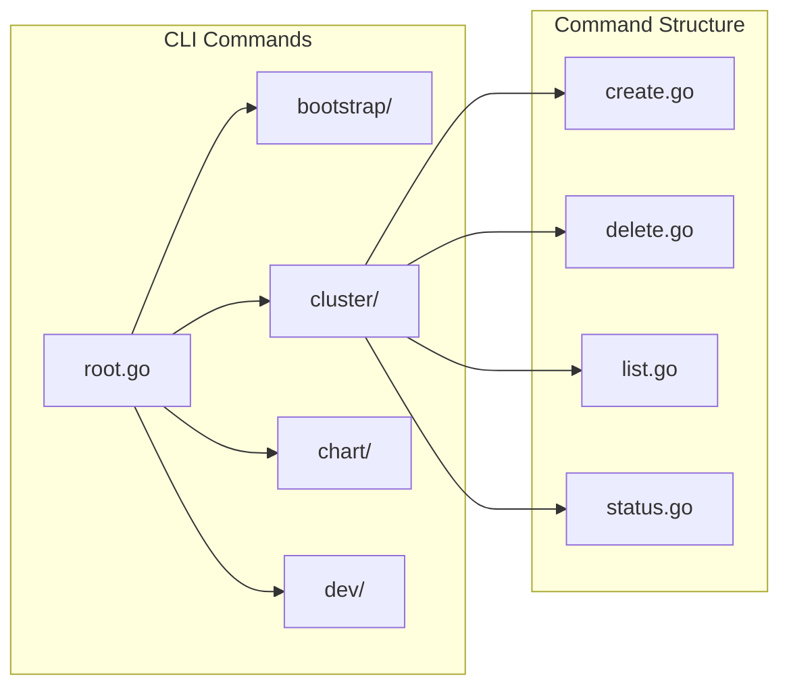
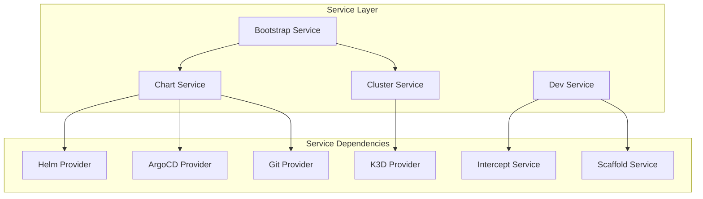
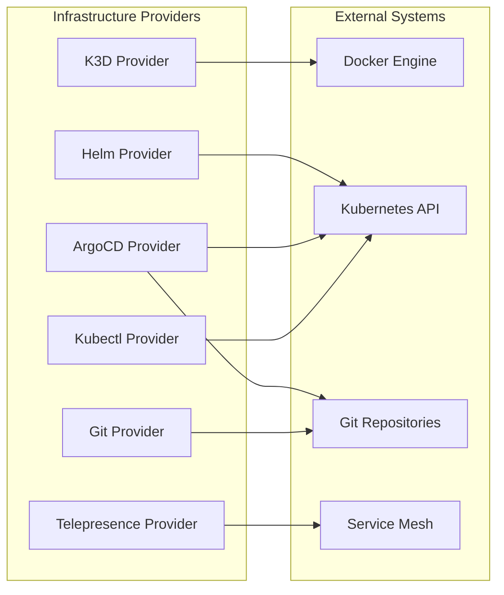
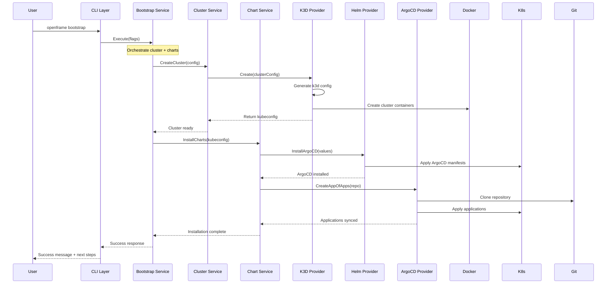
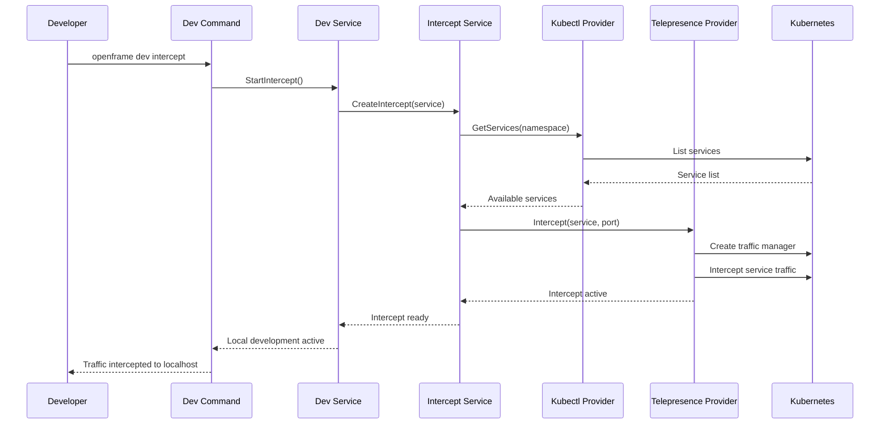
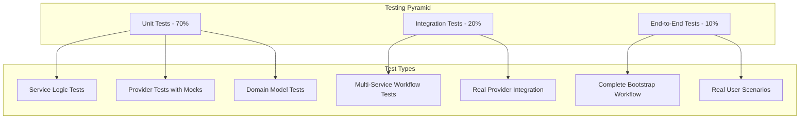

# Architecture Overview

Understand OpenFrame CLI's clean architecture design, component relationships, and architectural patterns that make it a robust, maintainable, and extensible Kubernetes management tool.

## 🏗️ High-Level Architecture

OpenFrame CLI follows a layered architecture with clear separation of concerns, dependency inversion, and interface-based design for maximum testability and maintainability.

### Architecture Layers



## 🎯 Core Design Principles

### 1. Clean Architecture

**Dependency Direction**: High-level modules (services) don't depend on low-level modules (providers). Both depend on abstractions (interfaces).

```go
// ❌ Bad: Service depends on concrete provider
type ClusterService struct {
    k3dManager *k3d.Manager  // Concrete dependency
}

// ✅ Good: Service depends on interface
type ClusterService struct {
    provider ClusterProvider  // Interface dependency
}

type ClusterProvider interface {
    Create(config ClusterConfig) (*Cluster, error)
    Delete(name string) error
    List() ([]*Cluster, error)
}
```

### 2. Single Responsibility Principle

Each component has a single, well-defined responsibility:

| Component | Responsibility |
|-----------|----------------|
| **CLI Commands** | Parse flags, validate input, call services |
| **Services** | Business logic orchestration and validation |
| **Providers** | External system integration and communication |
| **Models** | Data structures and domain logic |
| **UI Components** | User interaction and presentation |

### 3. Interface Segregation

Small, focused interfaces prevent unnecessary coupling:

```go
// ❌ Bad: Fat interface
type ClusterManager interface {
    Create(config ClusterConfig) error
    Delete(name string) error
    InstallHelm(cluster string) error
    InstallArgoCD(cluster string) error
    CreateIngress(cluster string) error
}

// ✅ Good: Segregated interfaces
type ClusterProvider interface {
    Create(config ClusterConfig) error
    Delete(name string) error
}

type ChartInstaller interface {
    InstallHelm(cluster string) error
    InstallArgoCD(cluster string) error
}
```

## 🔧 Component Architecture

### CLI Layer (`cmd/`)

The CLI layer handles user interaction and command parsing using the Cobra framework.



**Key Responsibilities:**
- Command definition and flag parsing
- Input validation and error handling
- Service orchestration
- Output formatting and user feedback

### Service Layer (`internal/*/service.go`)

The service layer contains the core business logic and orchestrates operations across multiple providers.



**Service Patterns:**
- **Orchestration**: Coordinate multiple providers
- **Validation**: Business rule enforcement  
- **Error Handling**: Centralized error management
- **Logging**: Structured logging and tracing

### Provider Layer (`internal/*/providers/`)

Providers encapsulate external system interactions and provide clean interfaces for services.



**Provider Responsibilities:**
- External tool execution and management
- Configuration file generation and management
- Resource lifecycle management
- Health checking and validation

## 🔄 Data Flow Architecture

### Bootstrap Workflow

The bootstrap command demonstrates the complete data flow through all architectural layers:



### Service Intercept Workflow

Development workflows showcase the modular provider system:



## 📦 Package Architecture

### Directory Structure and Relationships

```text
openframe-cli/
├── cmd/                           # CLI layer - user interface
│   ├── bootstrap/                # Single-command environment setup
│   ├── cluster/                  # Cluster lifecycle management
│   │   ├── create.go            # Cluster creation command
│   │   ├── delete.go            # Cluster deletion command  
│   │   ├── list.go              # Cluster listing command
│   │   └── status.go            # Cluster status command
│   ├── chart/                    # Chart installation management
│   ├── dev/                      # Development workflow tools
│   └── root.go                   # Root command and global config
├── internal/                      # Internal packages (not exported)
│   ├── bootstrap/                # Bootstrap service orchestration
│   │   └── service.go           # Bootstrap workflow logic
│   ├── cluster/                  # Cluster management services
│   │   ├── service.go           # Core cluster business logic
│   │   ├── models/              # Cluster domain models
│   │   ├── providers/           # K3D provider implementation  
│   │   ├── ui/                  # Cluster UI components
│   │   └── prerequisites/       # Tool dependency management
│   ├── chart/                    # Chart installation services
│   │   ├── services/            # Chart service orchestration
│   │   ├── providers/           # Helm, ArgoCD, Git providers
│   │   ├── models/              # Chart domain models
│   │   └── ui/                  # Chart UI components
│   ├── dev/                      # Development tool services
│   │   ├── services/            # Intercept and scaffold services
│   │   ├── providers/           # Kubectl, Telepresence providers
│   │   └── ui/                  # Development UI components
│   └── shared/                   # Shared utilities and components
│       ├── executor/            # Command execution abstraction
│       ├── ui/                  # Common UI components
│       ├── errors/              # Error handling utilities
│       └── config/              # Configuration management
└── tests/                        # Test suites and utilities
    ├── integration/             # End-to-end integration tests
    ├── mocks/                   # Generated test mocks
    └── testutil/                # Testing helper functions
```

### Interface Definitions

Key interfaces that define the architecture contracts:

```go
// Core service interfaces
type BootstrapService interface {
    Execute(config BootstrapConfig) error
}

type ClusterService interface {
    CreateCluster(config ClusterConfig) (*Cluster, error)
    DeleteCluster(name string) error
    ListClusters() ([]*Cluster, error)
    GetClusterStatus(name string) (*ClusterStatus, error)
}

type ChartService interface {
    InstallCharts(kubeconfig string, config ChartConfig) error
    UninstallCharts(kubeconfig string) error
    GetChartStatus(kubeconfig string) (*ChartStatus, error)
}

// Provider interfaces  
type ClusterProvider interface {
    Create(config ClusterConfig) (*ClusterResult, error)
    Delete(name string) error
    List() ([]*ClusterInfo, error)
    GetStatus(name string) (*ClusterStatus, error)
}

type HelmProvider interface {
    Install(chart HelmChart, values map[string]interface{}) error
    Uninstall(releaseName string) error
    Status(releaseName string) (*HelmStatus, error)
}

type ArgoCDProvider interface {
    CreateApplication(app ApplicationConfig) error
    DeleteApplication(name string) error
    SyncApplication(name string) error
    GetApplicationStatus(name string) (*ApplicationStatus, error)
}
```

## 🧪 Testing Architecture

### Test Strategy

OpenFrame CLI employs a comprehensive testing strategy with multiple test levels:



### Mock Architecture

Extensive use of interfaces enables comprehensive mocking:

```go
// Generated mocks for all provider interfaces
type MockClusterProvider struct {
    mock.Mock
}

func (m *MockClusterProvider) Create(config ClusterConfig) (*ClusterResult, error) {
    args := m.Called(config)
    return args.Get(0).(*ClusterResult), args.Error(1)
}

// Service tests using mocks
func TestClusterService_CreateCluster(t *testing.T) {
    mockProvider := new(MockClusterProvider)
    service := NewClusterService(mockProvider)
    
    mockProvider.On("Create", mock.AnythingOfType("ClusterConfig")).
        Return(&ClusterResult{Name: "test"}, nil)
    
    result, err := service.CreateCluster(ClusterConfig{Name: "test"})
    
    assert.NoError(t, err)
    assert.Equal(t, "test", result.Name)
    mockProvider.AssertExpectations(t)
}
```

## 🔗 Integration Patterns

### External Tool Integration

OpenFrame CLI integrates with multiple external tools through a consistent provider pattern:

```go
// Command execution abstraction
type CommandExecutor interface {
    Execute(cmd Command) (*Result, error)
    ExecuteWithContext(ctx context.Context, cmd Command) (*Result, error)
}

// Provider implementation
type K3DProvider struct {
    executor CommandExecutor
    config   K3DConfig
}

func (p *K3DProvider) Create(config ClusterConfig) (*ClusterResult, error) {
    cmd := p.buildCreateCommand(config)
    result, err := p.executor.Execute(cmd)
    if err != nil {
        return nil, fmt.Errorf("k3d cluster creation failed: %w", err)
    }
    return p.parseCreateResult(result), nil
}
```

### Configuration Management

Hierarchical configuration system with environment-specific overrides:

```go
type Configuration struct {
    Cluster ClusterConfig `yaml:"cluster"`
    Chart   ChartConfig   `yaml:"chart"`
    Dev     DevConfig     `yaml:"dev"`
}

// Configuration precedence: CLI flags > env vars > config file > defaults
func LoadConfiguration() (*Configuration, error) {
    config := DefaultConfiguration()
    
    // 1. Load from config file
    if configFile != "" {
        if err := config.LoadFromFile(configFile); err != nil {
            return nil, err
        }
    }
    
    // 2. Override with environment variables
    config.LoadFromEnvironment()
    
    // 3. Override with CLI flags
    config.LoadFromFlags(flags)
    
    return config, nil
}
```

## 🎯 Architectural Benefits

### 1. Maintainability

- **Clear boundaries** between layers prevent coupling
- **Single responsibility** makes components easy to understand
- **Interface-based design** enables easy modifications

### 2. Testability

- **Dependency injection** allows comprehensive mocking
- **Small, focused components** are easier to test
- **Clear interfaces** enable contract testing

### 3. Extensibility

- **Provider pattern** makes adding new tools straightforward
- **Service orchestration** allows complex workflow composition
- **Plugin architecture** supports future extensibility

### 4. Reliability

- **Error boundaries** prevent cascade failures
- **Retry mechanisms** handle transient failures
- **Validation layers** catch errors early

## 📚 Architectural Documentation

For deeper architectural understanding, explore:

- **[./architecture/overview.md](./architecture/overview.md)** - Complete system architecture generated from source code
- **Service Documentation** - Individual service architecture in each `internal/` package
- **Interface Documentation** - Generated API documentation from Go interfaces
- **Provider Integration** - External system integration patterns

## 🚀 Next Steps

Understanding OpenFrame CLI's architecture enables you to:

1. **[Contribute Effectively](../contributing/guidelines.md)** - Follow architectural patterns
2. **[Implement Security](../security/README.md)** - Apply security at the right layers
3. **[Write Tests](../testing/README.md)** - Test at appropriate architectural levels
4. **[Extend Functionality](../setup/local-development.md)** - Add new providers and services

The clean architecture of OpenFrame CLI ensures that your contributions integrate seamlessly with the existing codebase while maintaining high quality and reliability standards.