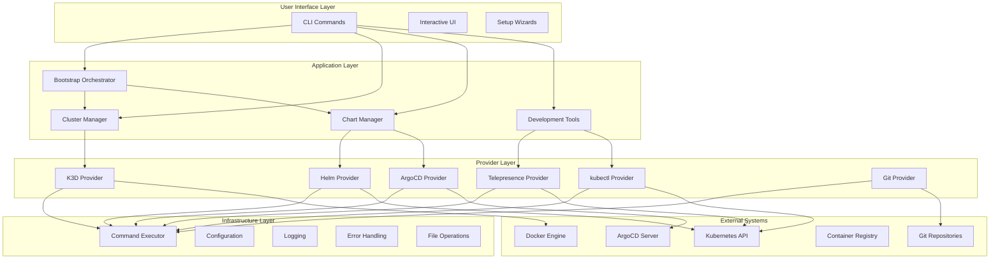
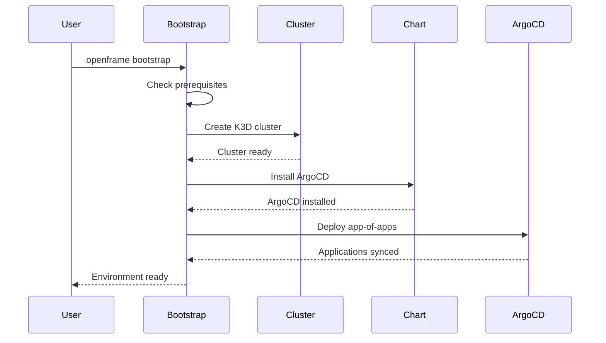
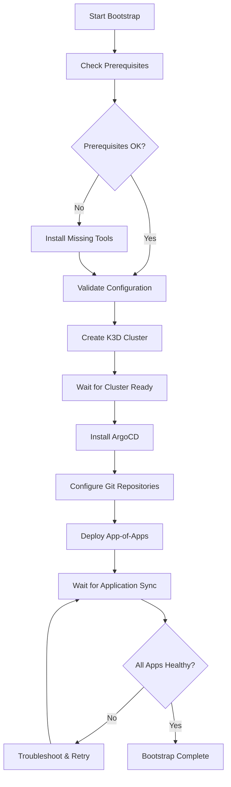
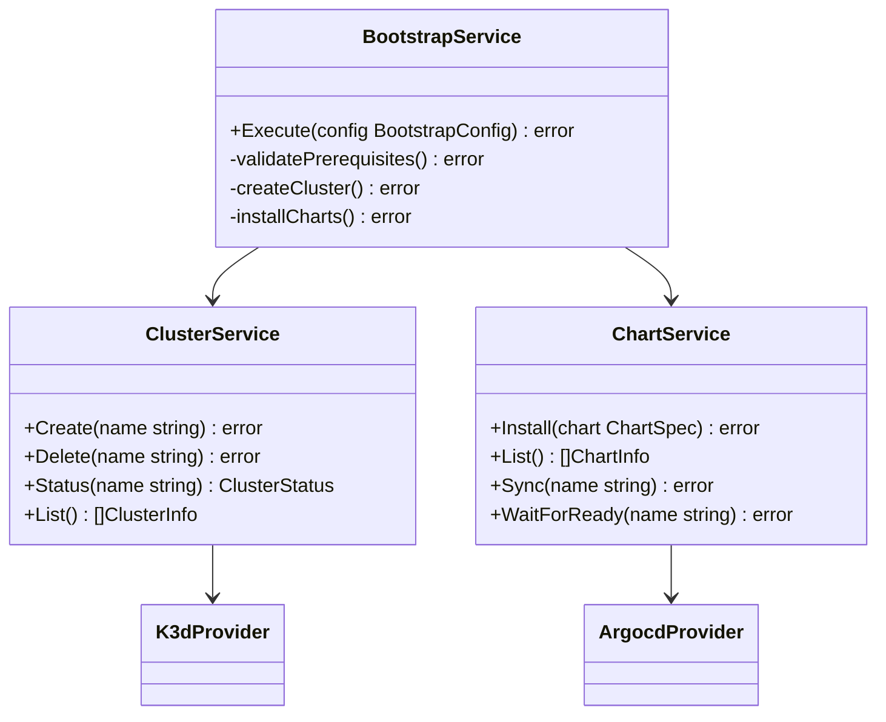
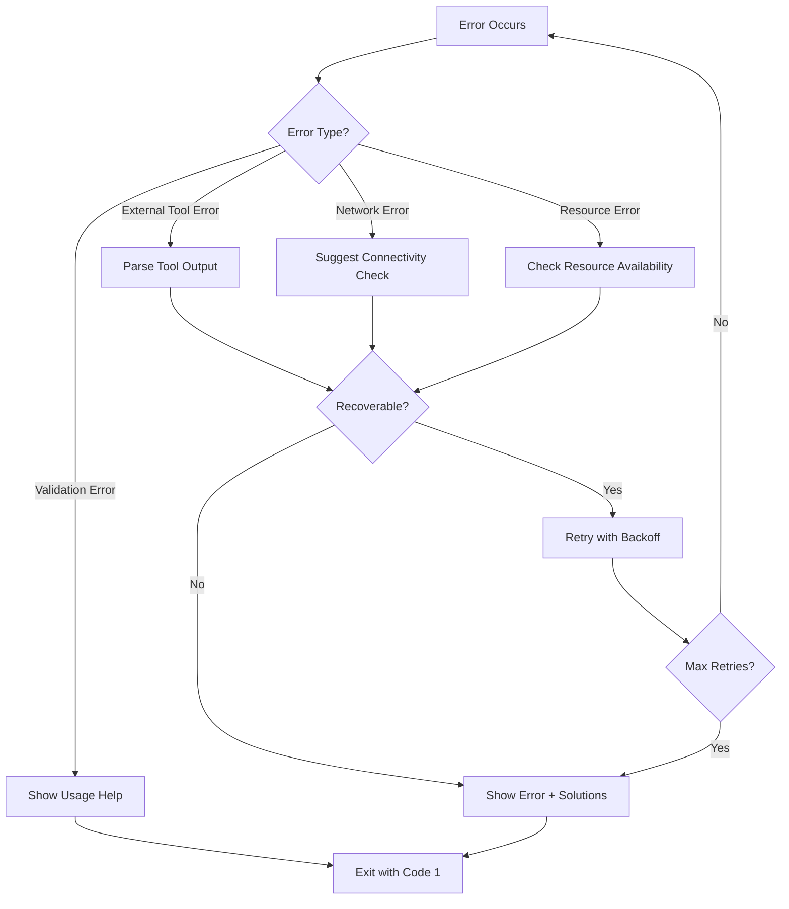
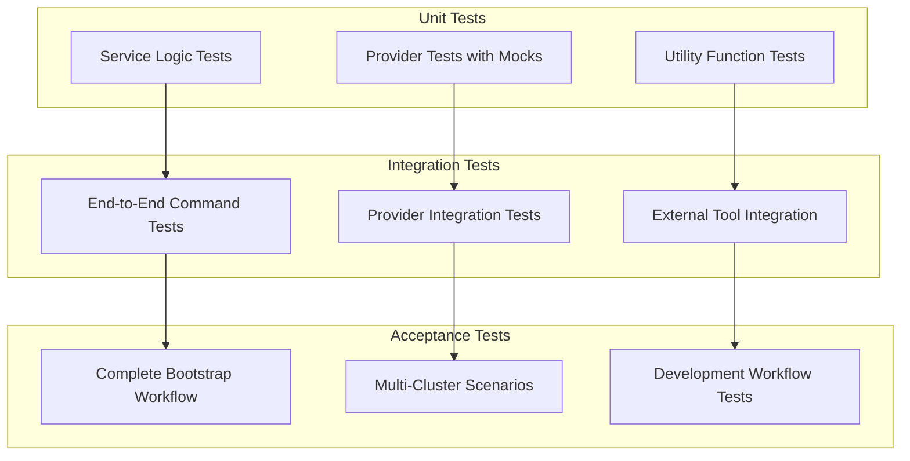
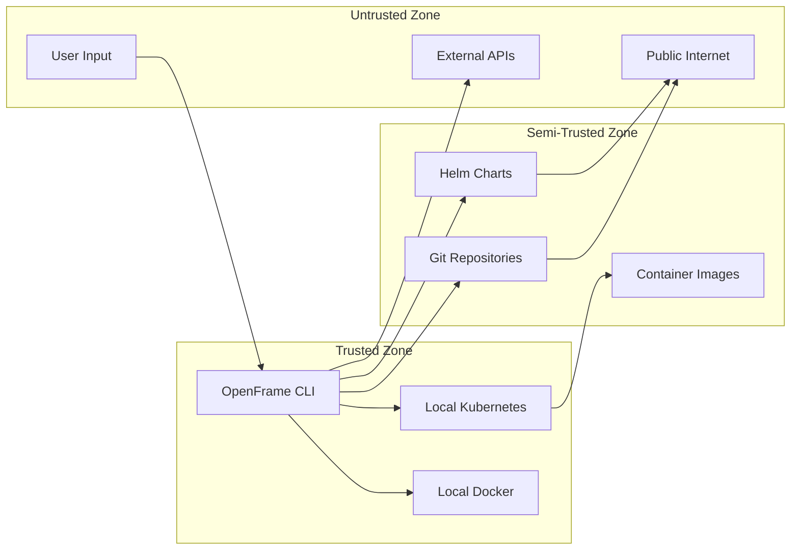
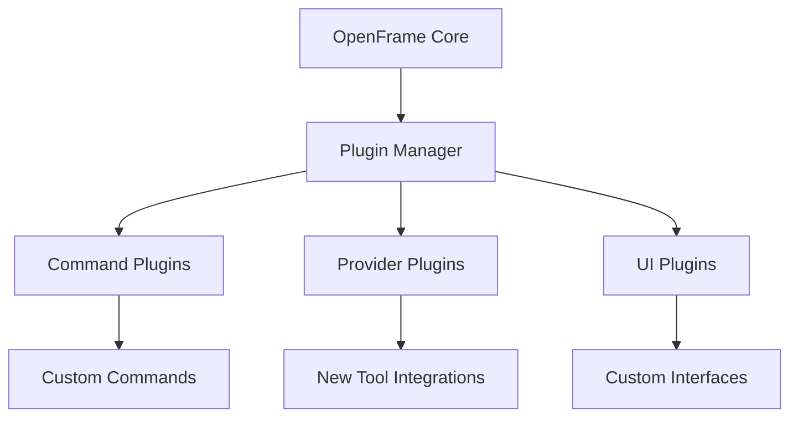

# Architecture Overview

OpenFrame CLI is built with a clean, layered architecture that separates concerns and provides extensibility. This guide provides a comprehensive overview of the system design, component relationships, and key architectural decisions.

## High-Level Architecture

OpenFrame CLI follows a layered architecture pattern with clear separation between the CLI interface, business logic, and external integrations:



## Core Components

### Command Layer (`cmd/`)

The command layer implements the CLI interface using the Cobra framework:

| Component | Purpose | Key Features |
|-----------|---------|--------------|
| **Root Command** | Entry point and version management | Interactive help, global flags, subcommand routing |
| **Bootstrap Command** | Complete environment setup | Orchestrates cluster + chart installation |
| **Cluster Commands** | Kubernetes cluster lifecycle | Create, delete, list, status operations |
| **Chart Commands** | Application deployment | Helm charts, ArgoCD applications |
| **Dev Commands** | Development workflows | Service intercepts, scaffolding |

### Service Layer (`internal/`)

The service layer contains the core business logic:

#### Bootstrap Service (`internal/bootstrap/`)
- **Purpose**: Orchestrates complete environment setup
- **Key Functions**:
  - Validates prerequisites
  - Creates Kubernetes clusters
  - Installs core charts (ArgoCD, Traefik)
  - Configures GitOps workflows



#### Cluster Service (`internal/cluster/`)
- **Purpose**: Manages Kubernetes cluster lifecycle
- **Key Functions**:
  - K3D cluster creation and deletion
  - Cluster status monitoring
  - Node management and scaling
  - Configuration and context management

#### Chart Service (`internal/chart/`)
- **Purpose**: Manages application deployments
- **Key Functions**:
  - Helm chart installation
  - ArgoCD application management
  - GitOps workflow configuration
  - Application synchronization monitoring

#### Development Services (`internal/dev/`)
- **Purpose**: Provides development workflow tools
- **Key Functions**:
  - Service intercepts with Telepresence
  - Code scaffolding and templates
  - Local development environment setup
  - Debug and testing utilities

### Provider Layer

The provider layer abstracts external tool integrations:

#### K3D Provider (`internal/cluster/providers/k3d/`)
```go
type Manager interface {
    CreateCluster(config ClusterConfig) (*rest.Config, error)
    DeleteCluster(name string) error
    ListClusters() ([]ClusterInfo, error)
    GetClusterStatus(name string) (*ClusterStatus, error)
}
```

Key responsibilities:
- Docker container management for K3D nodes
- Kubernetes API server configuration
- Network and port forwarding setup
- Cluster lifecycle management

#### Helm Provider (`internal/chart/providers/helm/`)
```go
type Manager interface {
    InstallChart(release string, chart string, values map[string]interface{}) error
    UpgradeChart(release string, chart string, values map[string]interface{}) error
    UninstallChart(release string) error
    ListReleases() ([]Release, error)
}
```

Key responsibilities:
- Helm repository management
- Chart installation and upgrades
- Release lifecycle management
- Value overrides and templating

#### ArgoCD Provider (`internal/chart/providers/argocd/`)
```go
type Manager interface {
    CreateApplication(app ApplicationSpec) error
    SyncApplication(name string) error
    DeleteApplication(name string) error
    WaitForSync(name string, timeout time.Duration) error
}
```

Key responsibilities:
- ArgoCD application CRD management
- Git repository synchronization
- Application health monitoring
- Sync policy configuration

### Shared Infrastructure (`internal/shared/`)

Common utilities and cross-cutting concerns:

#### Command Executor (`internal/shared/executor/`)
- **Purpose**: Standardized external command execution
- **Features**:
  - Command building and execution
  - Output capture and streaming
  - Error handling and retry logic
  - Timeout management
  - Mock support for testing

#### Configuration Management (`internal/shared/config/`)
- **Purpose**: Application configuration and settings
- **Features**:
  - YAML/JSON configuration files
  - Environment variable overrides
  - Default value management
  - Validation and type safety

#### User Interface (`internal/shared/ui/`)
- **Purpose**: Consistent user interaction patterns
- **Features**:
  - Interactive prompts and wizards
  - Progress indicators and spinners
  - Colored output and formatting
  - Table rendering and alignment
  - Error message presentation

## Data Flow Architecture

### Bootstrap Workflow

The bootstrap process follows a carefully orchestrated sequence:



### Service Interaction Patterns

Services interact through well-defined interfaces:



## Key Design Decisions

### 1. Layered Architecture

**Decision**: Implement strict layering with dependency injection
**Rationale**: 
- Clear separation of concerns
- Easier testing through interface mocking
- Flexibility to swap implementations
- Maintainable and extensible codebase

### 2. Provider Pattern

**Decision**: Abstract external tools behind provider interfaces
**Rationale**:
- Support multiple Kubernetes distributions (K3D, Kind, etc.)
- Enable testing without external dependencies
- Simplify adding new tool integrations
- Consistent error handling and logging

### 3. Command Executor Abstraction

**Decision**: Centralize external command execution
**Rationale**:
- Consistent error handling across all external calls
- Unified logging and debugging capabilities
- Simplified testing with command mocking
- Retry logic and timeout management

### 4. Interactive CLI Design

**Decision**: Provide both interactive and non-interactive modes
**Rationale**:
- User-friendly for manual operations
- Scriptable for automation and CI/CD
- Progressive disclosure of complexity
- Clear error messages and guidance

### 5. GitOps-First Approach

**Decision**: Default to GitOps workflows with ArgoCD
**Rationale**:
- Industry best practices for Kubernetes deployments
- Declarative infrastructure management
- Audit trails and rollback capabilities
- Team collaboration through Git workflows

## Error Handling Strategy

### Error Types and Handling



### Error Categories

| Category | Examples | Handling Strategy |
|----------|----------|------------------|
| **User Input** | Invalid flags, missing config | Show usage help, suggest corrections |
| **Prerequisites** | Missing tools, permissions | Guide installation, check prerequisites |
| **Network** | Connection timeouts, DNS issues | Retry with backoff, check connectivity |
| **Resource** | Insufficient memory, disk space | Check resources, suggest alternatives |
| **External Tools** | kubectl errors, helm failures | Parse tool output, provide context |

## Configuration Architecture

### Configuration Sources (Priority Order)

1. **Command-line flags** - Highest priority
2. **Environment variables** - Override config files  
3. **Configuration files** - User and system configs
4. **Default values** - Built-in sensible defaults

### Configuration Structure

```yaml
# ~/.openframe/config.yaml
openframe:
  log_level: "info"
  config_dir: "~/.openframe"
  
cluster:
  provider: "k3d"
  default_name: "openframe-local"
  nodes: 1
  
bootstrap:
  mode: "oss-tenant"
  timeout: "15m"
  interactive: true
  
chart:
  timeout: "10m"
  wait_for_ready: true
  
dev:
  intercept_timeout: "5m"
  scaffold_template_dir: "~/.openframe/templates"
```

## Testing Architecture

### Test Strategy



### Mock Strategy

- **External Commands**: Mock command executor for tool interactions
- **Kubernetes API**: Use fake clientsets for API testing
- **File System**: Mock file operations for config testing
- **Network**: Mock HTTP clients for external service calls

## Security Architecture

### Security Principles

1. **Least Privilege**: Request minimal permissions necessary
2. **Secure Defaults**: Safe configurations out of the box
3. **Input Validation**: Sanitize all user inputs
4. **Secret Management**: Secure handling of credentials and keys
5. **Audit Logging**: Track security-relevant operations

### Trust Boundaries



## Performance Considerations

### Optimization Strategies

1. **Lazy Loading**: Load providers and tools only when needed
2. **Concurrent Operations**: Parallel execution where safe
3. **Caching**: Cache expensive operations (cluster status, etc.)
4. **Resource Monitoring**: Track memory and CPU usage
5. **Efficient Data Structures**: Use appropriate data types

### Resource Management

- **Memory**: Stream large outputs, avoid loading everything in memory
- **CPU**: Use worker pools for concurrent operations
- **Disk**: Clean up temporary files, use appropriate buffer sizes
- **Network**: Connection pooling, request batching where possible

## Extensibility Points

### Adding New Commands

1. **Create command file** in appropriate `cmd/` subdirectory
2. **Implement service logic** in `internal/` package
3. **Add provider interface** if external tool needed
4. **Write comprehensive tests** for all components
5. **Update documentation** and help text

### Adding New Providers

1. **Define provider interface** in appropriate service package
2. **Implement provider** in `internal/*/providers/` directory
3. **Add configuration support** for provider-specific settings
4. **Implement comprehensive testing** including mocks
5. **Update factory functions** to instantiate new provider

### Plugin Architecture (Future)

Future extensibility through plugins:



## Migration and Upgrade Strategy

### Backward Compatibility

- **Configuration**: Support old config format with migration
- **Commands**: Maintain command compatibility across versions
- **Data**: Migrate user data automatically when needed
- **Dependencies**: Graceful handling of version mismatches

### Version Management

```go
type VersionInfo struct {
    Version string    // Semantic version
    Commit  string    // Git commit hash
    Date    string    // Build timestamp
    Go      string    // Go version used
}
```

## Next Steps

To deepen your understanding of OpenFrame CLI architecture:

1. **[Security Guidelines](../security/README.md)** - Learn about security implementations
2. **[Testing Guide](../testing/README.md)** - Understand testing strategies
3. **[Contributing Guidelines](../contributing/guidelines.md)** - Learn development processes

## Additional Resources

- **[Architecture Documentation](./architecture/overview.md)** - Generated architecture docs from code
- **Go Design Patterns**: https://golang.org/doc/effective_go
- **Kubernetes Client Libraries**: https://kubernetes.io/docs/reference/using-api/client-libraries/
- **Cobra CLI Framework**: https://cobra.dev/
- **OpenMSP Community**: [Join Slack](https://join.slack.com/t/openmsp/shared_invite/zt-36bl7mx0h-3~U2nFH6nqHqoTPXMaHEHA)