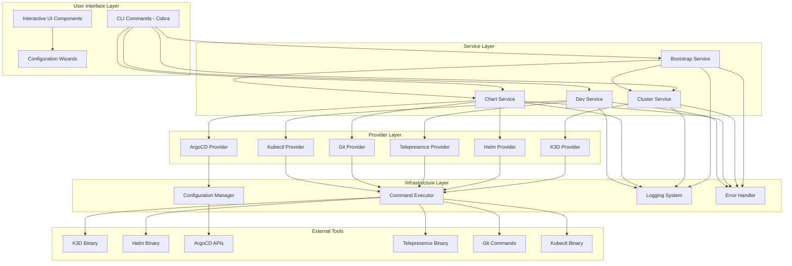
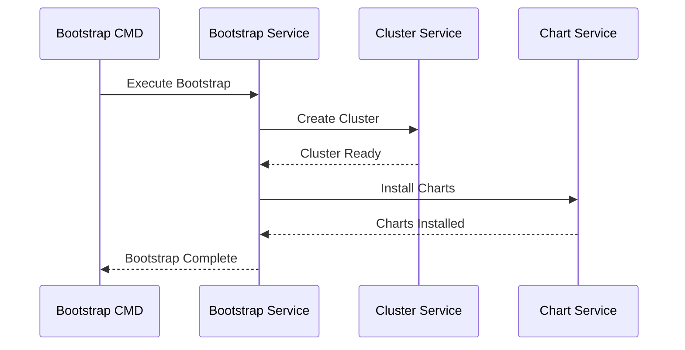
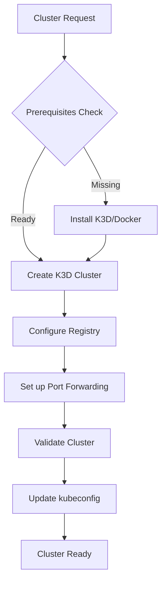
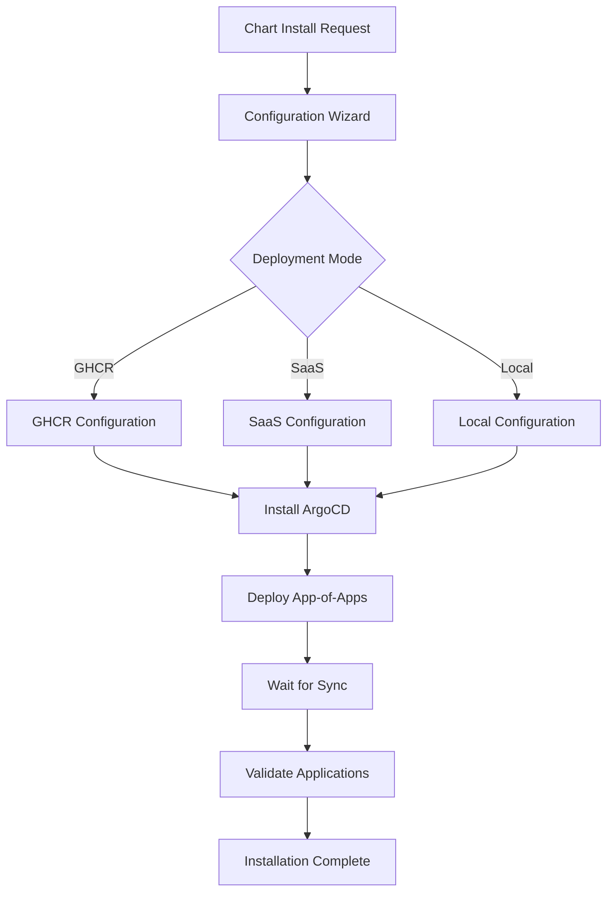
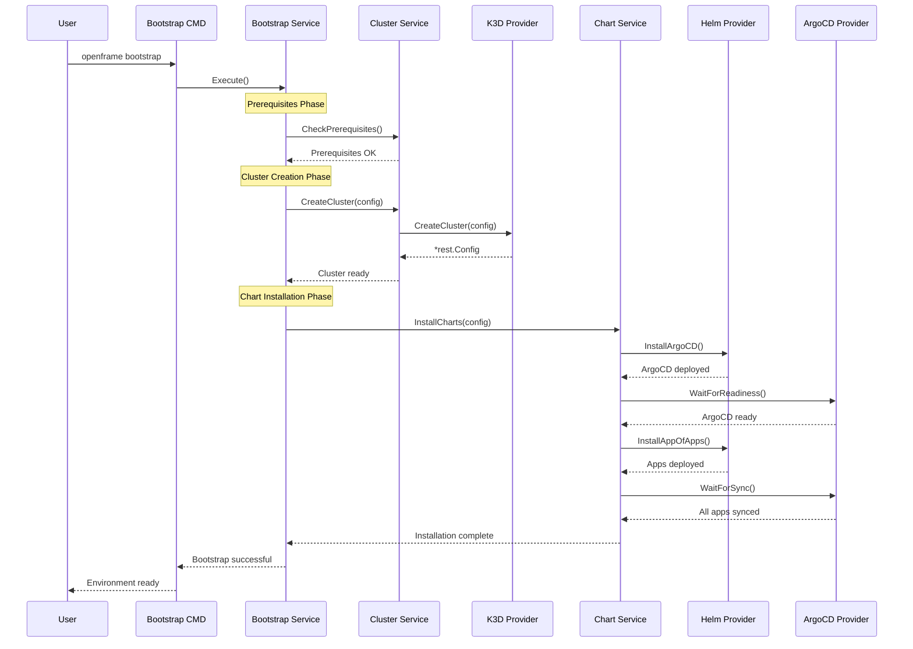
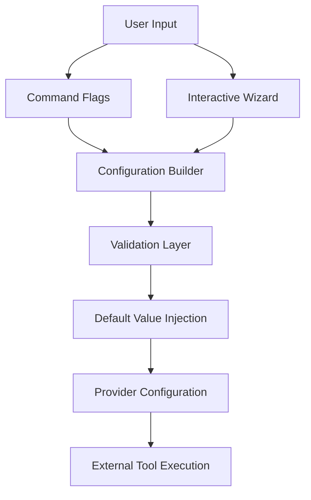
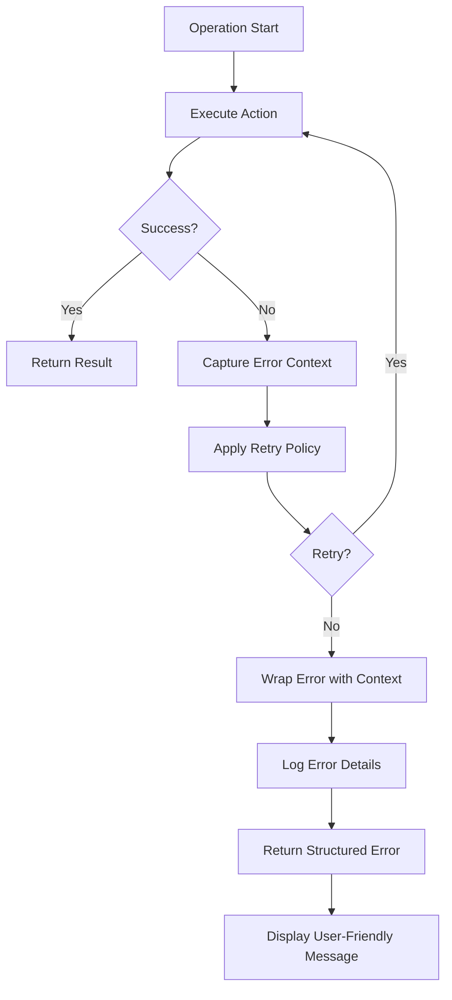

# Architecture Overview

OpenFrame CLI is built with a clean, modular architecture that separates concerns and provides clear boundaries between different system layers. This document provides a comprehensive overview of the system design, core components, and architectural decisions.

## High-Level Architecture

The OpenFrame CLI follows a layered architecture pattern with clear separation between the CLI interface, business logic, and external integrations:



## Core Components

### Command Layer (`cmd/`)

The command layer provides the CLI interface using the Cobra framework:

| Component | Location | Responsibility |
|-----------|----------|----------------|
| **Root Command** | `cmd/root.go` | CLI setup, version management, global flags |
| **Bootstrap Command** | `cmd/bootstrap/` | One-command environment setup |
| **Cluster Commands** | `cmd/cluster/` | Cluster lifecycle operations |
| **Chart Commands** | `cmd/chart/` | Chart installation and management |
| **Dev Commands** | `cmd/dev/` | Development tools and workflows |

**Key Features:**
- Interactive command execution with progress indicators
- Comprehensive help text and usage examples
- Flag validation and default value management
- Cross-platform argument handling

### Service Layer (`internal/`)

The service layer contains the core business logic organized by domain:

#### Bootstrap Service (`internal/bootstrap/`)

Orchestrates complete environment setup by coordinating cluster and chart services:



**Responsibilities:**
- Coordinate cluster creation and chart installation
- Handle prerequisites checking and installation
- Provide unified error handling and progress reporting
- Manage rollback scenarios on failure

#### Cluster Service (`internal/cluster/`)

Manages Kubernetes cluster lifecycle using K3D:



**Key Components:**
- **K3D Manager**: Cross-platform K3D operations with WSL2 support
- **Cluster Models**: Data structures for cluster configuration
- **Prerequisites Checker**: Validates Docker, K3D, and kubectl availability
- **UI Components**: Interactive cluster selection and configuration

#### Chart Service (`internal/chart/`)

Handles Helm chart and ArgoCD application management:



**Key Components:**
- **ArgoCD Provider**: Application lifecycle management and synchronization
- **Helm Provider**: Chart installation and value configuration
- **Git Provider**: Repository cloning and branch management
- **Configuration Wizard**: Interactive deployment mode selection

#### Dev Service (`internal/dev/`)

Provides development tools and workflows:

**Intercept Service:**
- Telepresence integration for service intercepts
- Namespace and service discovery
- Traffic routing configuration

**Scaffold Service:**
- Service template generation
- Boilerplate code creation
- Project structure setup

### Provider Layer

Providers abstract external tool integrations and provide consistent interfaces:

#### K3D Provider (`internal/cluster/providers/k3d/`)

```go
type Manager interface {
    CreateCluster(config *ClusterConfig) (*rest.Config, error)
    DeleteCluster(name string) error
    ListClusters() ([]Cluster, error)
    GetClusterStatus(name string) (*ClusterStatus, error)
}
```

**Features:**
- Cross-platform binary execution (Linux, macOS, Windows/WSL2)
- Automatic port forwarding setup
- Local registry configuration
- Cluster validation and health checking

#### Helm Provider (`internal/chart/providers/helm/`)

```go
type Manager interface {
    InstallChart(config *ChartConfig) error
    UpgradeChart(config *ChartConfig) error
    UninstallChart(name, namespace string) error
    GetChartStatus(name, namespace string) (*ChartStatus, error)
}
```

**Features:**
- Native Kubernetes client integration
- Value file generation and templating
- Release lifecycle management
- Dependency resolution

#### ArgoCD Provider (`internal/chart/providers/argocd/`)

```go
type ApplicationManager interface {
    CreateApplication(app *Application) error
    SyncApplication(name, namespace string) error
    WaitForSync(name, namespace string, timeout time.Duration) error
    GetApplicationStatus(name, namespace string) (*ApplicationStatus, error)
}
```

**Features:**
- Application CRD management
- Synchronization monitoring and waiting
- Health status checking
- Git repository integration

## Data Flow Patterns

### Bootstrap Workflow

The bootstrap command demonstrates the complete data flow through the system:



### Configuration Management

Configuration flows through the system in a structured manner:



**Configuration Sources (Priority Order):**
1. Command-line flags (highest priority)
2. Environment variables
3. Interactive wizard inputs
4. Configuration files
5. Built-in defaults (lowest priority)

### Error Handling Flow

The system implements comprehensive error handling with context preservation:



## Design Patterns

### Service Pattern

Each major feature area is implemented as a service with clear interfaces:

```go
// Example: Cluster Service Interface
type ClusterService interface {
    CreateCluster(ctx context.Context, config *ClusterConfig) (*ClusterResult, error)
    DeleteCluster(ctx context.Context, name string) error
    ListClusters(ctx context.Context) ([]*ClusterInfo, error)
    GetClusterStatus(ctx context.Context, name string) (*ClusterStatus, error)
}

// Implementation provides concrete behavior
type clusterService struct {
    k3dManager  k3d.Manager
    uiService   ui.Service
    logger      *slog.Logger
    executor    executor.Executor
}
```

### Provider Pattern

External tools are abstracted through provider interfaces:

```go
// Provider interface abstracts tool-specific operations
type K3DProvider interface {
    CreateCluster(config *K3DConfig) (*rest.Config, error)
    DeleteCluster(name string) error
    ListClusters() ([]K3DCluster, error)
}

// Implementation handles tool-specific details
type k3dProvider struct {
    executor    executor.Executor
    pathManager path.Manager
    logger      *slog.Logger
}
```

### Configuration Pattern

Configuration is handled through structured builders:

```go
type ConfigBuilder struct {
    config *Config
}

func NewConfigBuilder() *ConfigBuilder {
    return &ConfigBuilder{config: &Config{}}
}

func (b *ConfigBuilder) WithClusterName(name string) *ConfigBuilder {
    b.config.ClusterName = name
    return b
}

func (b *ConfigBuilder) WithRegistry(registry string) *ConfigBuilder {
    b.config.Registry = registry
    return b
}

func (b *ConfigBuilder) Build() (*Config, error) {
    return b.config.Validate()
}
```

## Cross-Platform Considerations

### Path Handling

The CLI handles different path conventions across platforms:

```go
type PathManager interface {
    GetExecutablePath(tool string) (string, error)
    ResolvePath(path string) (string, error)
    IsWSL() bool
    ConvertPath(path string) (string, error)
}
```

**WSL2 Integration:**
- Automatic detection of WSL2 environment
- Path conversion between Windows and Linux formats
- Docker socket handling for WSL2

### Command Execution

Cross-platform command execution with proper error handling:

```go
type Executor interface {
    Execute(cmd *exec.Cmd) ([]byte, error)
    ExecuteWithContext(ctx context.Context, cmd *exec.Cmd) ([]byte, error)
    SetWorkingDir(dir string)
    SetEnvironment(env map[string]string)
}
```

## Extension Points

### Adding New Commands

The CLI is designed for easy extension:

```go
// 1. Create command structure
func NewMyCommand() *cobra.Command {
    return &cobra.Command{
        Use:   "my-command",
        Short: "Description of my command",
        RunE:  runMyCommand,
    }
}

// 2. Implement command logic
func runMyCommand(cmd *cobra.Command, args []string) error {
    service := getMyService()
    return service.Execute(cmd.Context(), args)
}

// 3. Register with root command
func init() {
    rootCmd.AddCommand(NewMyCommand())
}
```

### Adding New Providers

New external tool integrations follow the provider pattern:

```go
// 1. Define provider interface
type MyToolProvider interface {
    DoSomething(config *Config) error
    GetStatus() (*Status, error)
}

// 2. Implement provider
type myToolProvider struct {
    executor executor.Executor
    logger   *slog.Logger
}

// 3. Register provider
func NewMyToolProvider(executor executor.Executor) MyToolProvider {
    return &myToolProvider{executor: executor}
}
```

### Adding New UI Components

Interactive components can be added through the UI framework:

```go
type MyWizard struct {
    ui ui.Service
}

func (w *MyWizard) Run() (*MyConfig, error) {
    config := &MyConfig{}
    
    // Multi-step wizard
    if err := w.ui.ShowStep("Step 1", w.configureBasics(config)); err != nil {
        return nil, err
    }
    
    if err := w.ui.ShowStep("Step 2", w.configureAdvanced(config)); err != nil {
        return nil, err
    }
    
    return config, nil
}
```

## Performance Considerations

### Concurrent Operations

The CLI uses Go's concurrency features for improved performance:

```go
func (s *service) processMultipleClusters(clusters []string) error {
    var wg sync.WaitGroup
    errCh := make(chan error, len(clusters))
    
    for _, cluster := range clusters {
        wg.Add(1)
        go func(name string) {
            defer wg.Done()
            if err := s.processCluster(name); err != nil {
                errCh <- err
            }
        }(cluster)
    }
    
    wg.Wait()
    close(errCh)
    
    // Collect errors
    for err := range errCh {
        if err != nil {
            return err
        }
    }
    
    return nil
}
```

### Resource Management

Proper resource cleanup and management:

```go
func (s *service) executeWithCleanup(operation func() error) error {
    resources := s.acquireResources()
    defer func() {
        if err := s.releaseResources(resources); err != nil {
            s.logger.Error("Failed to release resources", "error", err)
        }
    }()
    
    return operation()
}
```

### Caching Strategy

Strategic caching of expensive operations:

```go
type Cache interface {
    Get(key string) (interface{}, bool)
    Set(key string, value interface{}, ttl time.Duration)
    Invalidate(key string)
}

func (p *provider) getClusterStatus(name string) (*Status, error) {
    cacheKey := fmt.Sprintf("cluster:status:%s", name)
    
    if cached, found := p.cache.Get(cacheKey); found {
        return cached.(*Status), nil
    }
    
    status, err := p.fetchClusterStatus(name)
    if err != nil {
        return nil, err
    }
    
    p.cache.Set(cacheKey, status, 5*time.Minute)
    return status, nil
}
```

## Testing Architecture

The architecture supports comprehensive testing at multiple levels:

### Unit Testing Strategy

```go
func TestClusterService_CreateCluster(t *testing.T) {
    // Arrange
    mockProvider := &mocks.K3DProvider{}
    mockUI := &mocks.UIService{}
    
    service := NewClusterService(mockProvider, mockUI)
    
    config := &ClusterConfig{Name: "test-cluster"}
    expectedResult := &ClusterResult{Name: "test-cluster"}
    
    mockProvider.On("CreateCluster", config).Return(expectedResult, nil)
    
    // Act
    result, err := service.CreateCluster(context.Background(), config)
    
    // Assert
    assert.NoError(t, err)
    assert.Equal(t, expectedResult, result)
    mockProvider.AssertExpectations(t)
}
```

### Integration Testing Strategy

```go
func TestBootstrapIntegration(t *testing.T) {
    if testing.Short() {
        t.Skip("Skipping integration test in short mode")
    }
    
    // Use real Docker daemon for integration testing
    executor := executor.NewExecutor()
    service := bootstrap.NewService(executor)
    
    config := &BootstrapConfig{
        ClusterName: "integration-test",
        Mode:        "local",
    }
    
    result, err := service.Execute(context.Background(), config)
    
    assert.NoError(t, err)
    assert.NotNil(t, result)
    
    // Cleanup
    t.Cleanup(func() {
        service.Cleanup(config.ClusterName)
    })
}
```

## Security Architecture

### Credential Management

```go
type CredentialManager interface {
    StoreCredential(key string, value []byte) error
    RetrieveCredential(key string) ([]byte, error)
    DeleteCredential(key string) error
}

// Platform-specific implementations
// - Linux: uses system keyring
// - macOS: uses Keychain
// - Windows: uses Windows Credential Store
```

### Input Validation

```go
type Validator interface {
    ValidateClusterName(name string) error
    ValidateNamespace(namespace string) error
    ValidateURL(url string) error
    SanitizeInput(input string) string
}
```

## Future Architecture Considerations

### Plugin Architecture

Planned support for external plugins:

```go
type Plugin interface {
    Name() string
    Version() string
    Commands() []*cobra.Command
    Initialize(ctx context.Context) error
    Cleanup() error
}

type PluginManager interface {
    LoadPlugin(path string) (Plugin, error)
    RegisterPlugin(plugin Plugin) error
    ListPlugins() []Plugin
}
```

### Remote Configuration

Support for centralized configuration management:

```go
type RemoteConfig interface {
    FetchConfig(endpoint string) (*Config, error)
    PushConfig(endpoint string, config *Config) error
    SubscribeToUpdates(callback func(*Config)) error
}
```

## Summary

The OpenFrame CLI architecture provides:

- **Clear Separation of Concerns**: Layered architecture with well-defined boundaries
- **Extensibility**: Plugin points for new commands, providers, and UI components
- **Cross-Platform Support**: Consistent behavior across Linux, macOS, and Windows
- **Testability**: Interfaces and dependency injection enable comprehensive testing
- **Performance**: Concurrent operations and strategic caching
- **Security**: Secure credential handling and input validation

This architecture enables the CLI to grow and evolve while maintaining stability, performance, and user experience across different platforms and use cases.