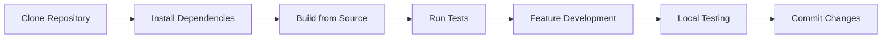

# Local Development Guide

Learn how to clone, build, and run OpenFrame CLI from source code for development, testing, and contributing to the project.

## 🎯 Development Workflow Overview



## 📦 Repository Setup

### Clone the Repository

```bash
# Clone the main repository
git clone https://github.com/flamingo-stack/openframe-cli.git
cd openframe-cli

# Set up upstream remote for contributions
git remote add upstream https://github.com/flamingo-stack/openframe-cli.git

# Verify remotes
git remote -v
```

### Repository Structure

Understanding the codebase layout:

```text
openframe-cli/
├── cmd/                    # CLI command definitions (Cobra)
│   ├── bootstrap/         # Bootstrap command implementation
│   ├── cluster/           # Cluster management commands
│   ├── chart/             # Chart installation commands
│   ├── dev/               # Development tools commands
│   └── root.go            # Root command and CLI setup
├── internal/              # Internal packages (not exported)
│   ├── bootstrap/         # Bootstrap service logic
│   ├── cluster/           # K3D cluster management
│   ├── chart/             # ArgoCD/Helm chart services
│   ├── dev/               # Development workflow services
│   └── shared/            # Shared utilities and components
├── tests/                 # Test suites and utilities
│   ├── integration/       # End-to-end integration tests
│   ├── mocks/            # Generated mocks for testing
│   └── testutil/         # Testing helper functions
├── docs/                 # Documentation (including this guide)
├── main.go               # Application entry point
├── go.mod                # Go module definition
├── go.sum                # Dependency checksums
├── Makefile              # Build automation
└── .goreleaser.yaml      # Release configuration
```

## 🔧 Dependency Management

### Install Go Dependencies

```bash
# Download and install all dependencies
go mod download

# Verify dependencies
go mod verify

# Clean up unused dependencies
go mod tidy

# View dependency graph
go mod graph | head -20
```

### Verify Prerequisites

Ensure external tools are available:

```bash
# Check Docker
docker --version && docker ps >/dev/null

# Check Kubernetes tools (optional, auto-installed)
which k3d kubectl helm || echo "Tools will be auto-installed"

# Verify Go environment
go env GOVERSION GOOS GOARCH
```

## 🏗️ Building from Source

### Development Build

Build OpenFrame CLI for development and testing:

```bash
# Quick development build
go build -o bin/openframe main.go

# Build with debug information
go build -race -gcflags="all=-N -l" -o bin/openframe-debug main.go

# Cross-platform builds
GOOS=linux GOARCH=amd64 go build -o bin/openframe-linux main.go
GOOS=darwin GOARCH=amd64 go build -o bin/openframe-darwin main.go
GOOS=windows GOARCH=amd64 go build -o bin/openframe.exe main.go
```

### Using Makefile

The project includes build automation:

```bash
# View available targets
make help

# Development build
make build

# Build for all platforms
make build-all

# Build and run tests
make test

# Clean build artifacts
make clean

# Development with hot reload
make dev
```

### Verify Build

Test your local build:

```bash
# Test basic functionality
./bin/openframe --version
./bin/openframe --help

# Test core commands (without execution)
./bin/openframe bootstrap --help
./bin/openframe cluster --help
./bin/openframe dev --help
```

## 🧪 Running Tests

### Test Categories

OpenFrame CLI includes comprehensive test coverage:

| Test Type | Location | Purpose | Command |
|-----------|----------|---------|---------|
| **Unit Tests** | `internal/*/` | Component logic testing | `go test ./internal/...` |
| **Integration Tests** | `tests/integration/` | End-to-end workflow testing | `go test ./tests/integration/...` |
| **Mock Tests** | `tests/mocks/` | Isolated component testing | `go test -tags=mock ./...` |

### Running Tests

```bash
# Run all tests
go test ./...

# Run tests with verbose output
go test -v ./...

# Run tests with race detection
go test -race ./...

# Run tests with coverage
go test -cover ./...
go test -coverprofile=coverage.out ./...
go tool cover -html=coverage.out

# Run specific test packages
go test ./internal/bootstrap/...
go test ./internal/cluster/...

# Run tests matching pattern
go test -run TestBootstrap ./...
go test -run "TestCluster.*Create" ./...
```

### Test Environment

Set up test-specific environment:

```bash
# Test configuration
export OPENFRAME_TEST_MODE="true"
export OPENFRAME_NON_INTERACTIVE="true"
export OPENFRAME_LOG_LEVEL="debug"

# Test cluster settings
export OPENFRAME_TEST_CLUSTER="openframe-test"
export OPENFRAME_TEST_TIMEOUT="300s"

# Disable external dependencies for unit tests
export OPENFRAME_MOCK_EXTERNAL="true"
```

### Integration Tests

Run end-to-end integration tests:

```bash
# Requires Docker and network access
export OPENFRAME_INTEGRATION_TESTS="true"

# Run integration tests
go test ./tests/integration/... -timeout=10m

# Run specific integration scenarios
go test ./tests/integration/bootstrap_test.go -v
go test ./tests/integration/cluster_test.go -v
```

## 🔄 Development Workflow

### Hot Reload Development

Set up automatic rebuilding during development:

```bash
# Install air for hot reloading (optional)
go install github.com/air-verse/air@latest

# Create .air.toml configuration
cat > .air.toml << 'EOF'
root = "."
testdata_dir = "testdata"
tmp_dir = "tmp"

[build]
  args_bin = ["--version"]
  bin = "./tmp/main"
  cmd = "go build -o ./tmp/main main.go"
  delay = 1000
  exclude_dir = ["assets", "tmp", "vendor", "testdata"]
  exclude_file = []
  exclude_regex = ["_test.go"]
  exclude_unchanged = false
  follow_symlink = false
  full_bin = ""
  include_dir = []
  include_ext = ["go", "tpl", "tmpl", "html"]
  kill_delay = "0s"
  log = "build-errors.log"
  send_interrupt = false
  stop_on_root = false

[color]
  app = ""
  build = "yellow"
  main = "magenta"
  runner = "green"
  watcher = "cyan"

[log]
  time = false

[misc]
  clean_on_exit = false
EOF

# Start hot reload development
air
```

### Manual Development Loop

Without hot reload tools:

```bash
#!/bin/bash
# dev-loop.sh - Development helper script

while true; do
    echo "🔨 Building OpenFrame CLI..."
    
    if go build -o bin/openframe main.go; then
        echo "✅ Build successful"
        echo "🧪 Running tests..."
        
        if go test ./internal/... -short; then
            echo "✅ Tests passed"
            echo "🎯 Ready for testing (Ctrl+C to rebuild)"
            
            # Test your changes
            ./bin/openframe --version
            read -p "Press Enter to rebuild..." || break
        else
            echo "❌ Tests failed"
            read -p "Fix tests and press Enter..." || break
        fi
    else
        echo "❌ Build failed"
        read -p "Fix build and press Enter..." || break
    fi
    
    clear
done
```

### Local Testing Workflow

Test your changes thoroughly:

```bash
# 1. Unit test development
go test ./internal/bootstrap/ -v

# 2. Integration test (requires Docker)
export OPENFRAME_TEST_MODE="true"
./bin/openframe cluster create test-cluster --dry-run

# 3. Full workflow test
./bin/openframe bootstrap --deployment-mode=oss-tenant --non-interactive --dry-run

# 4. Clean up test resources
./bin/openframe cluster delete test-cluster --force
```

## 🐞 Debugging

### Debug with Delve

Set up step-through debugging:

```bash
# Install Delve debugger
go install github.com/go-delve/delve/cmd/dlv@latest

# Debug main application
dlv debug main.go -- bootstrap --verbose

# Debug with breakpoints
dlv debug main.go
(dlv) break main.main
(dlv) break internal/bootstrap.(*Service).Execute
(dlv) continue

# Debug tests
dlv test ./internal/bootstrap/ -- -test.run TestBootstrap
```

### Debug Configuration

Set debug environment variables:

```bash
# Enable detailed logging
export OPENFRAME_LOG_LEVEL="trace"
export OPENFRAME_DEBUG_COMMANDS="true"

# Enable command tracing
export OPENFRAME_TRACE_COMMANDS="true"

# Debug specific components
export OPENFRAME_DEBUG_CLUSTER="true"
export OPENFRAME_DEBUG_CHART="true"
```

### Logging and Tracing

OpenFrame CLI uses structured logging:

```go
// Example debug logging in your code
import "github.com/flamingo-stack/openframe-cli/internal/shared/ui"

// Debug log
ui.Debug("Processing cluster creation", "name", clusterName)

// Info log with context
ui.Info("Cluster created successfully", 
    "name", clusterName,
    "nodes", nodeCount,
    "duration", time.Since(start))

// Error log with details
ui.Error("Failed to create cluster", 
    "name", clusterName,
    "error", err,
    "retries", retryCount)
```

## 📝 Code Generation

### Mocks and Interfaces

Generate test mocks:

```bash
# Install mockery
go install github.com/vektra/mockery/v2@latest

# Generate mocks for interfaces
mockery --all --output tests/mocks --outpkg mocks

# Generate specific mock
mockery --name ClusterProvider --output tests/mocks --outpkg mocks
```

### Documentation Generation

Generate code documentation:

```bash
# Generate Go documentation
godoc -http=:6060 &
open http://localhost:6060/pkg/github.com/flamingo-stack/openframe-cli/

# Generate markdown documentation from comments
go install github.com/johnnylee/godoc-markdown@latest
godoc-markdown github.com/flamingo-stack/openframe-cli > API.md
```

## 🚀 Local Development Commands

### Common Development Tasks

```bash
# Clean development environment
make clean
rm -rf bin/ tmp/ *.log

# Full development build and test
make build test

# Run linting
golangci-lint run

# Format code
go fmt ./...
goimports -w .

# Update dependencies
go get -u ./...
go mod tidy

# Generate test coverage report
go test -coverprofile=coverage.out ./...
go tool cover -html=coverage.out -o coverage.html
open coverage.html
```

### Development Aliases

Add to your shell profile for convenience:

```bash
# OpenFrame development aliases
alias of-build="go build -o bin/openframe main.go"
alias of-test="go test ./... -v"
alias of-run="./bin/openframe"
alias of-debug="dlv debug main.go --"
alias of-clean="rm -rf bin/ tmp/ *.out *.log"

# Development workflow
alias of-dev-build="make clean build test"
alias of-dev-test="go test ./internal/... -short"
alias of-lint="golangci-lint run"
```

## ✅ Development Checklist

Before committing changes:

- [ ] **Code builds successfully**: `go build main.go`
- [ ] **Tests pass**: `go test ./...`
- [ ] **Linting passes**: `golangci-lint run`
- [ ] **Code formatted**: `go fmt ./...`
- [ ] **Dependencies updated**: `go mod tidy`
- [ ] **Integration tests pass**: `go test ./tests/integration/...` (if applicable)
- [ ] **Documentation updated**: Update relevant docs
- [ ] **Manual testing completed**: Test changed functionality

## 🎯 Next Steps

With your local development environment ready:

1. **[Architecture Overview](../architecture/README.md)** - Understand the codebase structure
2. **[Contributing Guidelines](../contributing/guidelines.md)** - Learn the contribution workflow  
3. **[Testing Guide](../testing/README.md)** - Master testing strategies
4. **[Security Guidelines](../security/README.md)** - Implement security best practices

You're now ready to contribute to OpenFrame CLI development! 🚀

## 🤝 Getting Help

- **Build Issues**: Check the Makefile and build logs
- **Test Failures**: Review test output and environment variables
- **Development Questions**: Join the OpenMSP Slack community at https://www.openmsp.ai/
- **Contributing Process**: Follow the [Contributing Guidelines](../contributing/guidelines.md)