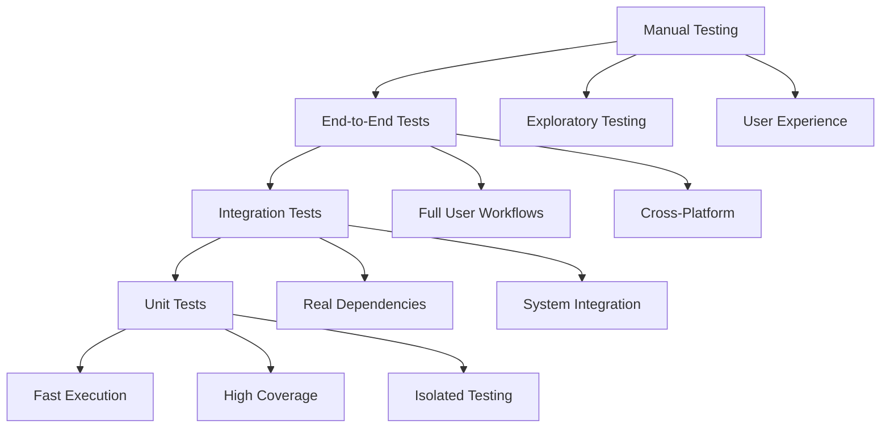

# Testing Guide

This document provides comprehensive guidance on testing strategies, tools, and best practices for OpenFrame CLI development. Our testing approach ensures reliability, performance, and maintainability across all supported platforms.

## Testing Philosophy

### Testing Pyramid

OpenFrame CLI follows the testing pyramid approach with emphasis on fast, reliable tests:



### Test Categories

| Test Type | Purpose | Speed | Coverage |
|-----------|---------|-------|----------|
| **Unit Tests** | Individual function testing | Fast (ms) | 80%+ |
| **Integration Tests** | Component interaction testing | Medium (seconds) | Key workflows |
| **End-to-End Tests** | Full system testing | Slow (minutes) | Critical paths |
| **Performance Tests** | Load and benchmark testing | Variable | Performance regression |

## Test Structure and Organization

### Directory Layout

```text
openframe-cli/
├── internal/
│   ├── cluster/
│   │   ├── service.go
│   │   ├── service_test.go          # Unit tests
│   │   └── integration_test.go      # Integration tests
├── tests/
│   ├── integration/                 # Cross-component integration
│   │   ├── common/
│   │   │   ├── cli_runner.go
│   │   │   └── cluster_management.go
│   │   ├── bootstrap_test.go
│   │   └── cluster_test.go
│   ├── e2e/                        # End-to-end tests
│   │   ├── full_workflow_test.go
│   │   └── cross_platform_test.go
│   ├── testutil/                   # Test utilities
│   │   ├── assertions.go
│   │   ├── setup.go
│   │   └── utilities.go
│   └── mocks/                      # Mock implementations
│       ├── dev/
│       └── kubernetes.go
```

### Naming Conventions

- **Unit Tests**: `*_test.go` alongside source files
- **Integration Tests**: `integration_test.go` or `tests/integration/*_test.go`
- **End-to-End Tests**: `tests/e2e/*_test.go`
- **Test Functions**: `TestFunctionName` for tests, `BenchmarkFunctionName` for benchmarks

## Unit Testing

### Unit Test Framework

OpenFrame CLI uses Go's built-in testing framework enhanced with testify for assertions:

```go
package cluster_test

import (
    "context"
    "testing"
    "time"

    "github.com/stretchr/testify/assert"
    "github.com/stretchr/testify/mock"
    "github.com/stretchr/testify/require"

    "github.com/openframe/cli/internal/cluster"
    "github.com/openframe/cli/tests/mocks"
)

func TestClusterService_CreateCluster(t *testing.T) {
    tests := []struct {
        name           string
        config         *cluster.Config
        mockSetup      func(*mocks.K3DProvider, *mocks.UIService)
        expectedResult *cluster.Result
        expectedError  string
    }{
        {
            name: "successful cluster creation",
            config: &cluster.Config{
                Name:     "test-cluster",
                Registry: "local",
            },
            mockSetup: func(k3d *mocks.K3DProvider, ui *mocks.UIService) {
                k3d.On("CreateCluster", mock.AnythingOfType("*cluster.K3DConfig")).
                    Return(&cluster.K3DResult{Name: "test-cluster"}, nil)
                ui.On("ShowProgress", mock.Anything).Return(nil)
            },
            expectedResult: &cluster.Result{Name: "test-cluster"},
            expectedError:  "",
        },
        {
            name: "cluster creation failure",
            config: &cluster.Config{
                Name: "test-cluster",
            },
            mockSetup: func(k3d *mocks.K3DProvider, ui *mocks.UIService) {
                k3d.On("CreateCluster", mock.AnythingOfType("*cluster.K3DConfig")).
                    Return(nil, errors.New("k3d command failed"))
            },
            expectedResult: nil,
            expectedError:  "k3d command failed",
        },
    }

    for _, tt := range tests {
        t.Run(tt.name, func(t *testing.T) {
            // Setup mocks
            mockK3D := &mocks.K3DProvider{}
            mockUI := &mocks.UIService{}
            
            if tt.mockSetup != nil {
                tt.mockSetup(mockK3D, mockUI)
            }

            // Create service with mocks
            service := cluster.NewService(mockK3D, mockUI)

            // Execute test
            ctx, cancel := context.WithTimeout(context.Background(), 30*time.Second)
            defer cancel()

            result, err := service.CreateCluster(ctx, tt.config)

            // Assertions
            if tt.expectedError != "" {
                assert.Error(t, err)
                assert.Contains(t, err.Error(), tt.expectedError)
                assert.Nil(t, result)
            } else {
                assert.NoError(t, err)
                assert.Equal(t, tt.expectedResult, result)
            }

            // Verify mock expectations
            mockK3D.AssertExpectations(t)
            mockUI.AssertExpectations(t)
        })
    }
}
```

### Test Utilities

Create reusable test utilities for common operations:

```go
// tests/testutil/setup.go
package testutil

import (
    "context"
    "testing"
    "time"
)

type TestSetup struct {
    Context    context.Context
    Cancel     context.CancelFunc
    TempDir    string
    Logger     *slog.Logger
}

func NewTestSetup(t *testing.T) *TestSetup {
    ctx, cancel := context.WithTimeout(context.Background(), 30*time.Second)
    
    tempDir := t.TempDir()
    
    logger := slog.New(slog.NewTextHandler(io.Discard, nil)) // Silent logger for tests
    
    return &TestSetup{
        Context: ctx,
        Cancel:  cancel,
        TempDir: tempDir,
        Logger:  logger,
    }
}

func (s *TestSetup) Cleanup() {
    s.Cancel()
}

// Test assertion helpers
func AssertClusterExists(t *testing.T, clusterName string) {
    // Implementation to verify cluster exists
    cmd := exec.Command("k3d", "cluster", "list", clusterName)
    err := cmd.Run()
    assert.NoError(t, err, "Cluster %s should exist", clusterName)
}

func AssertClusterNotExists(t *testing.T, clusterName string) {
    // Implementation to verify cluster doesn't exist
    cmd := exec.Command("k3d", "cluster", "list", clusterName)
    err := cmd.Run()
    assert.Error(t, err, "Cluster %s should not exist", clusterName)
}
```

### Mock Generation

Use mockery for generating mocks from interfaces:

```bash
# Install mockery
go install github.com/vektra/mockery/v2@latest

# Generate mocks for interfaces
mockery --dir=internal/cluster --name=K3DProvider --output=tests/mocks
mockery --dir=internal/chart --name=HelmProvider --output=tests/mocks
mockery --dir=internal/shared/ui --name=Service --output=tests/mocks
```

Example mock usage:

```go
// tests/mocks/k3d_provider.go (generated)
type K3DProvider struct {
    mock.Mock
}

func (m *K3DProvider) CreateCluster(config *cluster.K3DConfig) (*cluster.K3DResult, error) {
    args := m.Called(config)
    return args.Get(0).(*cluster.K3DResult), args.Error(1)
}

// Usage in tests
mockProvider := &mocks.K3DProvider{}
mockProvider.On("CreateCluster", mock.Anything).Return(expectedResult, nil)
```

## Integration Testing

### Integration Test Setup

Integration tests verify component interactions with real or realistic dependencies:

```go
// tests/integration/cluster_test.go
//go:build integration
// +build integration

package integration

import (
    "context"
    "testing"
    "time"

    "github.com/stretchr/testify/require"
    "github.com/stretchr/testify/suite"

    "github.com/openframe/cli/internal/cluster"
    "github.com/openframe/cli/tests/integration/common"
)

type ClusterIntegrationSuite struct {
    suite.Suite
    cliRunner *common.CLIRunner
    cleanup   []func()
}

func (suite *ClusterIntegrationSuite) SetupSuite() {
    // Verify Docker is available
    require.NoError(suite.T(), common.CheckDockerAvailable())
    
    // Setup CLI runner
    suite.cliRunner = common.NewCLIRunner(suite.T())
    
    // Additional setup
}

func (suite *ClusterIntegrationSuite) TearDownSuite() {
    // Run cleanup functions
    for _, cleanup := range suite.cleanup {
        cleanup()
    }
}

func (suite *ClusterIntegrationSuite) TestClusterLifecycle() {
    clusterName := "integration-test-cluster"
    
    // Cleanup cluster if exists
    suite.addCleanup(func() {
        suite.cliRunner.Run("cluster", "delete", clusterName)
    })

    // Test cluster creation
    result, err := suite.cliRunner.RunWithOutput("cluster", "create", clusterName)
    suite.NoError(err)
    suite.Contains(string(result), "Cluster created successfully")

    // Verify cluster exists
    result, err = suite.cliRunner.RunWithOutput("cluster", "list")
    suite.NoError(err)
    suite.Contains(string(result), clusterName)

    // Test cluster status
    result, err = suite.cliRunner.RunWithOutput("cluster", "status", clusterName)
    suite.NoError(err)
    suite.Contains(string(result), "Running")

    // Test cluster deletion
    result, err = suite.cliRunner.RunWithOutput("cluster", "delete", clusterName)
    suite.NoError(err)
    suite.Contains(string(result), "Cluster deleted successfully")
}

func (suite *ClusterIntegrationSuite) addCleanup(cleanup func()) {
    suite.cleanup = append(suite.cleanup, cleanup)
}

func TestClusterIntegration(t *testing.T) {
    suite.Run(t, new(ClusterIntegrationSuite))
}
```

### Common Integration Utilities

```go
// tests/integration/common/cli_runner.go
package common

import (
    "bytes"
    "context"
    "os/exec"
    "testing"
    "time"
)

type CLIRunner struct {
    t       *testing.T
    timeout time.Duration
    cliPath string
}

func NewCLIRunner(t *testing.T) *CLIRunner {
    return &CLIRunner{
        t:       t,
        timeout: 5 * time.Minute,
        cliPath: "./openframe", // Adjust path as needed
    }
}

func (r *CLIRunner) Run(args ...string) error {
    _, err := r.RunWithOutput(args...)
    return err
}

func (r *CLIRunner) RunWithOutput(args ...string) ([]byte, error) {
    ctx, cancel := context.WithTimeout(context.Background(), r.timeout)
    defer cancel()

    cmd := exec.CommandContext(ctx, r.cliPath, args...)
    
    var stdout, stderr bytes.Buffer
    cmd.Stdout = &stdout
    cmd.Stderr = &stderr

    err := cmd.Run()
    
    if err != nil {
        r.t.Logf("Command failed: %s %v", r.cliPath, args)
        r.t.Logf("Stdout: %s", stdout.String())
        r.t.Logf("Stderr: %s", stderr.String())
    }

    return stdout.Bytes(), err
}

func CheckDockerAvailable() error {
    cmd := exec.Command("docker", "ps")
    return cmd.Run()
}
```

## End-to-End Testing

### E2E Test Structure

End-to-end tests validate complete user workflows:

```go
// tests/e2e/bootstrap_workflow_test.go
//go:build e2e
// +build e2e

package e2e

import (
    "context"
    "testing"
    "time"

    "github.com/stretchr/testify/require"
    "github.com/stretchr/testify/suite"

    "github.com/openframe/cli/tests/integration/common"
)

type BootstrapE2ESuite struct {
    suite.Suite
    cliRunner *common.CLIRunner
    cleanup   []func()
}

func (suite *BootstrapE2ESuite) SetupSuite() {
    // Ensure clean environment
    suite.cliRunner = common.NewCLIRunner(suite.T())
    
    // Verify prerequisites
    require.NoError(suite.T(), common.CheckDockerAvailable())
}

func (suite *BootstrapE2ESuite) TestFullBootstrapWorkflow() {
    clusterName := "e2e-bootstrap-test"
    
    // Cleanup
    suite.addCleanup(func() {
        suite.cliRunner.Run("cluster", "delete", clusterName)
    })

    // Step 1: Bootstrap complete environment
    result, err := suite.cliRunner.RunWithOutput("bootstrap", "--cluster-name", clusterName, "--non-interactive")
    suite.NoError(err)
    suite.Contains(string(result), "Bootstrap completed successfully")

    // Step 2: Verify cluster is running
    result, err = suite.cliRunner.RunWithOutput("cluster", "status", clusterName)
    suite.NoError(err)
    suite.Contains(string(result), "Running")

    // Step 3: Verify ArgoCD is installed
    result, err = suite.cliRunner.RunWithOutput("chart", "status")
    suite.NoError(err)
    suite.Contains(string(result), "ArgoCD")
    suite.Contains(string(result), "Healthy")

    // Step 4: Test development workflow
    result, err = suite.cliRunner.RunWithOutput("dev", "scaffold", "test-service")
    suite.NoError(err)
    suite.Contains(string(result), "Service scaffolded successfully")

    // Step 5: Cleanup
    result, err = suite.cliRunner.RunWithOutput("cluster", "delete", clusterName)
    suite.NoError(err)
    suite.Contains(string(result), "Cluster deleted successfully")
}

func (suite *BootstrapE2ESuite) addCleanup(cleanup func()) {
    suite.cleanup = append(suite.cleanup, cleanup)
}

func TestBootstrapE2E(t *testing.T) {
    suite.Run(t, new(BootstrapE2ESuite))
}
```

### Cross-Platform E2E Testing

```go
//go:build e2e
// +build e2e

func TestCrossPlatformCompatibility(t *testing.T) {
    if testing.Short() {
        t.Skip("Skipping cross-platform test in short mode")
    }

    platforms := []struct {
        name    string
        goos    string
        goarch  string
        skipIf  func() bool
    }{
        {
            name:   "Linux AMD64",
            goos:   "linux",
            goarch: "amd64",
            skipIf: func() bool { return runtime.GOOS != "linux" },
        },
        {
            name:   "Darwin AMD64",
            goos:   "darwin", 
            goarch: "amd64",
            skipIf: func() bool { return runtime.GOOS != "darwin" },
        },
        {
            name:   "Windows AMD64",
            goos:   "windows",
            goarch: "amd64",
            skipIf: func() bool { return runtime.GOOS != "windows" },
        },
    }

    for _, platform := range platforms {
        t.Run(platform.name, func(t *testing.T) {
            if platform.skipIf() {
                t.Skipf("Skipping %s test on %s", platform.name, runtime.GOOS)
            }

            // Build platform-specific binary
            binary := buildPlatformBinary(t, platform.goos, platform.goarch)
            defer os.Remove(binary)

            // Run basic functionality test
            cliRunner := &CLIRunner{
                t:       t,
                timeout: 2 * time.Minute,
                cliPath: binary,
            }

            // Test version command
            result, err := cliRunner.RunWithOutput("--version")
            require.NoError(t, err)
            assert.Contains(t, string(result), "OpenFrame CLI")
        })
    }
}
```

## Performance Testing

### Benchmark Tests

```go
package cluster_test

func BenchmarkClusterCreation(b *testing.B) {
    mockProvider := &mocks.K3DProvider{}
    mockProvider.On("CreateCluster", mock.Anything).Return(&cluster.K3DResult{}, nil)

    service := cluster.NewService(mockProvider, nil)
    config := &cluster.Config{Name: "bench-cluster"}

    b.ResetTimer()
    
    for i := 0; i < b.N; i++ {
        _, err := service.CreateCluster(context.Background(), config)
        if err != nil {
            b.Fatal(err)
        }
    }
}

func BenchmarkCommandParsing(b *testing.B) {
    args := []string{"cluster", "create", "test-cluster", "--verbose"}
    
    b.ResetTimer()
    
    for i := 0; i < b.N; i++ {
        cmd := getRootCommand()
        cmd.SetArgs(args)
        if err := cmd.Execute(); err != nil {
            b.Fatal(err)
        }
    }
}
```

### Load Testing

```go
func TestConcurrentClusterOperations(t *testing.T) {
    if testing.Short() {
        t.Skip("Skipping load test in short mode")
    }

    const numConcurrent = 10
    
    var wg sync.WaitGroup
    errors := make(chan error, numConcurrent)
    
    for i := 0; i < numConcurrent; i++ {
        wg.Add(1)
        go func(id int) {
            defer wg.Done()
            
            clusterName := fmt.Sprintf("load-test-%d", id)
            cliRunner := common.NewCLIRunner(t)
            
            // Create cluster
            err := cliRunner.Run("cluster", "create", clusterName)
            if err != nil {
                errors <- fmt.Errorf("failed to create cluster %s: %w", clusterName, err)
                return
            }
            
            // Delete cluster
            err = cliRunner.Run("cluster", "delete", clusterName)
            if err != nil {
                errors <- fmt.Errorf("failed to delete cluster %s: %w", clusterName, err)
            }
        }(i)
    }
    
    wg.Wait()
    close(errors)
    
    // Check for errors
    for err := range errors {
        t.Error(err)
    }
}
```

## Test Coverage

### Coverage Analysis

```bash
# Run tests with coverage
go test -coverprofile=coverage.out ./...

# Generate coverage report
go tool cover -html=coverage.out -o coverage.html

# View coverage summary
go tool cover -func=coverage.out

# Set coverage threshold
go test -coverprofile=coverage.out ./...
go tool cover -func=coverage.out | tail -1 | awk '{print $3}' | sed 's/%//' | awk '{if($1<80) exit 1}'
```

### Coverage Configuration

```go
// tests/testutil/coverage.go
package testutil

import (
    "os"
    "testing"
)

func RequireMinimumCoverage(t *testing.T, minimum float64) {
    if os.Getenv("SKIP_COVERAGE_CHECK") != "" {
        t.Skip("Coverage check skipped")
    }
    
    // Implementation to check coverage threshold
    // This would integrate with coverage tools
}
```

## Running Tests

### Test Execution Commands

```bash
# Run all tests
go test ./...

# Run tests with verbose output
go test -v ./...

# Run only unit tests
go test -short ./...

# Run integration tests
go test -tags=integration ./tests/integration/...

# Run e2e tests
go test -tags=e2e ./tests/e2e/...

# Run specific test
go test -run TestClusterService_CreateCluster ./internal/cluster

# Run tests with race detection
go test -race ./...

# Run tests with timeout
go test -timeout 10m ./...

# Run benchmarks
go test -bench=. ./...

# Run benchmarks with memory stats
go test -bench=. -benchmem ./...
```

### Makefile Test Targets

```makefile
.PHONY: test test-unit test-integration test-e2e test-coverage test-race

test: ## Run all tests
	go test ./...

test-unit: ## Run unit tests only
	go test -short ./...

test-integration: ## Run integration tests
	go test -tags=integration ./tests/integration/...

test-e2e: ## Run end-to-end tests  
	go test -tags=e2e -timeout=30m ./tests/e2e/...

test-coverage: ## Run tests with coverage
	go test -coverprofile=coverage.out ./...
	go tool cover -html=coverage.out -o coverage.html
	@echo "Coverage report: coverage.html"

test-race: ## Run tests with race detection
	go test -race ./...

test-bench: ## Run benchmarks
	go test -bench=. -benchmem ./...

test-all: test-unit test-integration test-e2e ## Run all test suites
```

## CI/CD Integration

### GitHub Actions Test Workflow

```yaml
# .github/workflows/test.yml
name: Tests

on:
  push:
    branches: [ main, develop ]
  pull_request:
    branches: [ main ]

jobs:
  unit-tests:
    name: Unit Tests
    runs-on: ubuntu-latest
    
    steps:
    - uses: actions/checkout@v3
    
    - name: Set up Go
      uses: actions/setup-go@v3
      with:
        go-version: 1.19
    
    - name: Cache Go modules
      uses: actions/cache@v3
      with:
        path: ~/go/pkg/mod
        key: ${{ runner.os }}-go-${{ hashFiles('**/go.sum') }}
        restore-keys: |
          ${{ runner.os }}-go-
    
    - name: Run unit tests
      run: go test -short -race -coverprofile=coverage.out ./...
    
    - name: Upload coverage
      uses: codecov/codecov-action@v3
      with:
        file: ./coverage.out

  integration-tests:
    name: Integration Tests
    runs-on: ubuntu-latest
    
    services:
      docker:
        image: docker:dind
        options: --privileged
    
    steps:
    - uses: actions/checkout@v3
    
    - name: Set up Go
      uses: actions/setup-go@v3
      with:
        go-version: 1.19
    
    - name: Install dependencies
      run: |
        curl -s https://raw.githubusercontent.com/k3d-io/k3d/main/install.sh | bash
        curl https://get.helm.sh/helm-v3.10.0-linux-amd64.tar.gz | tar -xzO linux-amd64/helm > /usr/local/bin/helm
        chmod +x /usr/local/bin/helm
    
    - name: Build CLI
      run: go build -o openframe .
    
    - name: Run integration tests
      run: go test -tags=integration -timeout=15m ./tests/integration/...

  e2e-tests:
    name: E2E Tests
    runs-on: ${{ matrix.os }}
    strategy:
      matrix:
        os: [ubuntu-latest, macos-latest, windows-latest]
    
    steps:
    - uses: actions/checkout@v3
    
    - name: Set up Go
      uses: actions/setup-go@v3
      with:
        go-version: 1.19
    
    - name: Build CLI
      run: go build -o openframe .
    
    - name: Run E2E tests
      run: go test -tags=e2e -timeout=30m ./tests/e2e/...
```

## Testing Best Practices

### Test Organization

1. **Arrange, Act, Assert**: Structure tests clearly
2. **One Assertion Per Test**: Focus on single behavior
3. **Descriptive Names**: Test names should describe behavior
4. **Setup and Cleanup**: Proper resource management
5. **Independent Tests**: Tests should not depend on each other

### Mocking Strategy

1. **Mock External Dependencies**: Network, filesystem, external tools
2. **Keep Real Business Logic**: Don't mock what you're testing
3. **Verify Interactions**: Assert that mocks are called correctly
4. **Reset Mocks**: Clean state between tests

### Performance Considerations

1. **Parallel Tests**: Use `t.Parallel()` when safe
2. **Test Timeouts**: Set appropriate timeouts
3. **Resource Cleanup**: Clean up resources promptly
4. **Efficient Setup**: Reuse expensive setup when possible

### Error Testing

1. **Test Error Paths**: Don't just test happy paths
2. **Specific Error Assertions**: Check error types and messages
3. **Error Propagation**: Verify errors bubble up correctly
4. **Recovery Testing**: Test error recovery scenarios

## Troubleshooting Tests

### Common Test Issues

1. **Flaky Tests**
   - Add retries for external dependencies
   - Increase timeouts for slow operations
   - Improve test isolation

2. **Resource Leaks**
   - Always clean up resources in defer blocks
   - Use test-specific namespaces
   - Monitor resource usage

3. **Platform Differences**
   - Use build tags for platform-specific tests
   - Test path handling carefully
   - Consider file permissions differences

4. **Race Conditions**
   - Use `-race` flag to detect races
   - Proper synchronization in concurrent code
   - Avoid shared state in tests

### Debugging Test Failures

```go
func TestWithDebugging(t *testing.T) {
    if testing.Verbose() {
        // Enable debug logging in verbose mode
        logger := slog.New(slog.NewTextHandler(os.Stderr, &slog.HandlerOptions{
            Level: slog.LevelDebug,
        }))
        
        // Use logger in test
    }
    
    // Test implementation
    
    if t.Failed() {
        // Dump additional debug information
        t.Logf("Debug info: %+v", debugData)
    }
}
```

## Summary

The OpenFrame CLI testing strategy provides:

- **Comprehensive Coverage**: Unit, integration, and E2E tests
- **Fast Feedback**: Quick unit tests with thorough integration testing
- **Cross-Platform Support**: Testing on Linux, macOS, and Windows
- **Performance Monitoring**: Benchmarking and load testing
- **CI/CD Integration**: Automated testing in GitHub Actions
- **Quality Assurance**: Coverage requirements and best practices

Follow this testing guide to maintain high code quality, prevent regressions, and ensure reliable operation across all supported platforms and use cases.