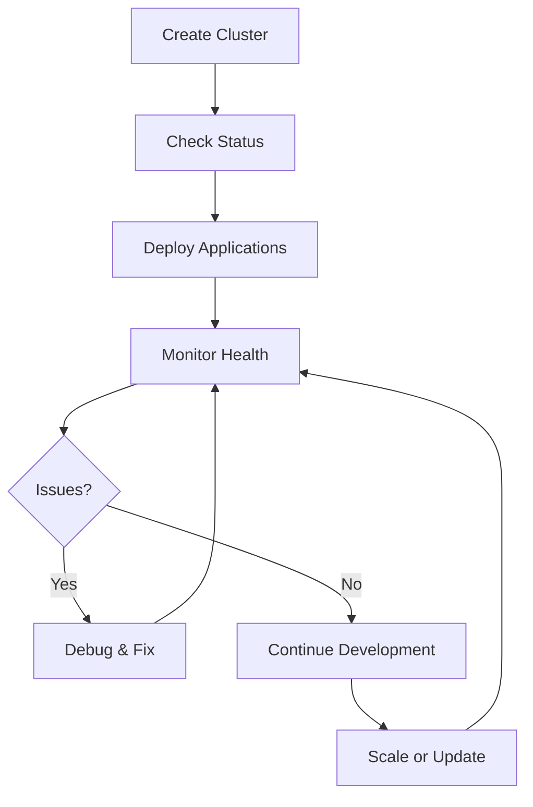
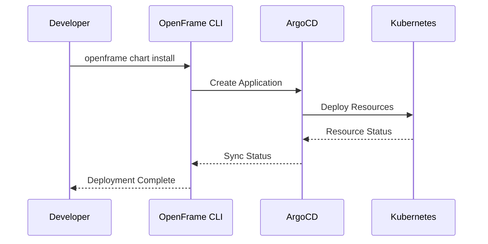

# First Steps with OpenFrame CLI

Now that you have OpenFrame CLI installed and your first environment bootstrapped, let's explore the key features and workflows. This guide covers the essential first steps to get you productive with OpenFrame.

## Your First 5 Actions

### 1. Explore the CLI Structure

Get familiar with the command hierarchy:

```bash
# See all available commands
openframe --help

# Explore each command group
openframe cluster --help
openframe chart --help  
openframe dev --help
openframe bootstrap --help
```

The CLI is organized into logical groups:
- **bootstrap**: One-time environment setup
- **cluster**: Kubernetes cluster lifecycle  
- **chart**: Application and service deployment
- **dev**: Development and debugging tools

### 2. Check Your Environment Status

Verify everything is running correctly:

```bash
# Overall cluster health
openframe cluster status

# List all running clusters
openframe cluster list

# Check installed charts and applications
openframe chart list
```

Expected healthy output:
```text
📊 Cluster Status: openframe-local
✅ Cluster is running
✅ ArgoCD is healthy
✅ All core services operational
```

### 3. Access the ArgoCD Dashboard

ArgoCD provides a web interface for GitOps deployments:

```bash
# Get admin password
kubectl -n argocd get secret argocd-initial-admin-secret \
  -o jsonpath="{.data.password}" | base64 -d; echo

# Port forward to access UI
kubectl port-forward svc/argocd-server -n argocd 8080:443

# Open in browser: https://localhost:8080
# Username: admin
# Password: (from command above)
```

In the ArgoCD UI, you'll see:
- **Applications**: Deployed services and components
- **Repositories**: Connected Git repositories  
- **Settings**: Configuration and policies
- **User Info**: Access controls and authentication

### 4. Deploy Your First Application

Let's deploy a simple application to test the workflow:

```bash
# Create a test namespace
kubectl create namespace hello-world

# Deploy a sample application
kubectl apply -f - <<EOF
apiVersion: apps/v1
kind: Deployment
metadata:
  name: hello-world
  namespace: hello-world
spec:
  replicas: 1
  selector:
    matchLabels:
      app: hello-world
  template:
    metadata:
      labels:
        app: hello-world
    spec:
      containers:
      - name: hello-world
        image: nginx:alpine
        ports:
        - containerPort: 80
---
apiVersion: v1
kind: Service
metadata:
  name: hello-world
  namespace: hello-world
spec:
  selector:
    app: hello-world
  ports:
    - protocol: TCP
      port: 80
      targetPort: 80
EOF
```

Verify the deployment:
```bash
# Check pods
kubectl get pods -n hello-world

# Check service
kubectl get svc -n hello-world

# Test connectivity
kubectl port-forward svc/hello-world -n hello-world 8081:80 &
curl http://localhost:8081
kill %1  # Stop port forward
```

### 5. Set Up Your Development Environment

Configure kubectl context and helpful aliases:

```bash
# Set default context
kubectl config use-context k3d-openframe-local

# Add helpful aliases to your shell profile
cat >> ~/.bashrc << 'EOF'
# OpenFrame aliases
alias of="openframe"
alias ofcs="openframe cluster status"
alias ofcl="openframe cluster list"
alias k="kubectl"
alias kgp="kubectl get pods"
alias kgs="kubectl get svc"
alias kgn="kubectl get nodes"
EOF

# Reload shell configuration
source ~/.bashrc
```

## Key Workflows to Learn

### Cluster Management Workflow



#### Common Cluster Commands
```bash
# Create a new cluster
openframe cluster create my-new-cluster

# List all clusters
openframe cluster list

# Get detailed status
openframe cluster status my-cluster

# Delete a cluster
openframe cluster delete my-cluster

# Clean up resources
openframe cluster cleanup
```

### Application Deployment Workflow



#### Common Chart Commands
```bash
# Install a chart from repository
openframe chart install my-app \
  --repo=https://github.com/my-org/my-app \
  --path=charts/my-app

# List installed applications
openframe chart list

# Check application sync status
kubectl get applications -n argocd

# Manually sync an application
kubectl patch application my-app -n argocd \
  --type=json \
  -p='[{"op": "replace", "path": "/spec/syncPolicy", "value": {"automated": {"selfHeal": true}}}]'
```

### Development Workflow

For local development with live Kubernetes integration:

```bash
# Start a development intercept
openframe dev intercept my-service \
  --namespace=default \
  --port=3000:8080

# Generate scaffold for new service
openframe dev scaffold my-new-service \
  --template=microservice \
  --language=go
```

## Essential Configuration

### Customize OpenFrame Settings

Create a configuration file for personalized settings:

```bash
mkdir -p ~/.openframe
cat > ~/.openframe/config.yaml << 'EOF'
# OpenFrame CLI Configuration
default:
  cluster_name: "openframe-local"
  namespace: "default"
  log_level: "info"
  
bootstrap:
  mode: "oss-tenant"
  interactive: true
  timeout: "15m"

cluster:
  provider: "k3d"
  nodes: 1
  
chart:
  timeout: "10m"
  wait: true
  
dev:
  intercept_timeout: "5m"
  scaffold_templates_dir: "~/.openframe/templates"
EOF
```

### Configure Git Integration

For ArgoCD to access your repositories:

```bash
# Add a Git repository to ArgoCD
kubectl apply -f - <<EOF
apiVersion: v1
kind: Secret
metadata:
  name: my-private-repo
  namespace: argocd
  labels:
    argocd.argoproj.io/secret-type: repository
stringData:
  type: git
  url: https://github.com/my-org/my-private-repo
  password: <your-token>
  username: <your-username>
EOF
```

### Set Up Ingress (Optional)

Configure Traefik ingress for external access:

```bash
# Create an ingress for your application
kubectl apply -f - <<EOF
apiVersion: networking.k8s.io/v1
kind: Ingress
metadata:
  name: hello-world-ingress
  namespace: hello-world
  annotations:
    kubernetes.io/ingress.class: traefik
spec:
  rules:
  - host: hello-world.local
    http:
      paths:
      - path: /
        pathType: Prefix
        backend:
          service:
            name: hello-world
            port:
              number: 80
EOF

# Add to /etc/hosts for local testing
echo "127.0.0.1 hello-world.local" | sudo tee -a /etc/hosts

# Access via: http://hello-world.local
```

## Monitoring and Debugging

### Check System Health

```bash
# View all pods across namespaces
kubectl get pods --all-namespaces

# Check node resource usage
kubectl top nodes

# Check pod resource usage  
kubectl top pods --all-namespaces

# View cluster events
kubectl get events --sort-by=.metadata.creationTimestamp
```

### Debug Common Issues

#### Pod Not Starting
```bash
# Describe pod to see events
kubectl describe pod <pod-name> -n <namespace>

# Check logs
kubectl logs <pod-name> -n <namespace>

# Check resource constraints
kubectl get resourcequota -n <namespace>
```

#### Service Not Accessible
```bash
# Check service endpoints
kubectl get endpoints <service-name> -n <namespace>

# Test internal connectivity
kubectl run test-pod --image=busybox -it --rm -- sh
# Inside pod:
wget -q -O- http://<service-name>.<namespace>.svc.cluster.local
```

#### ArgoCD Application Not Syncing
```bash
# Check application status
kubectl get application <app-name> -n argocd -o yaml

# Force refresh
kubectl patch application <app-name> -n argocd \
  --type=json \
  -p='[{"op": "replace", "path": "/spec/source/targetRevision", "value": "HEAD"}]'

# Manual sync
kubectl patch application <app-name> -n argocd \
  --type=json \
  -p='[{"op": "add", "path": "/metadata/annotations/argocd.argoproj.io~1sync", "value": ""}]'
```

## Best Practices

### Development Environment
1. **Use namespaces**: Organize applications by environment or team
2. **Resource limits**: Set appropriate CPU/memory limits
3. **Health checks**: Implement liveness and readiness probes
4. **Secrets management**: Use Kubernetes secrets, not hardcoded values

### GitOps Workflow
1. **Infrastructure as Code**: Store all configurations in Git
2. **Automated sync**: Enable ArgoCD auto-sync for non-production
3. **Manual approval**: Require manual sync for production deployments  
4. **Rollback strategy**: Use Git reverts for quick rollbacks

### Cluster Management
1. **Regular backups**: Backup cluster state and data
2. **Monitor resources**: Set up alerts for resource usage
3. **Update strategy**: Plan regular updates for cluster components
4. **Security scanning**: Regularly scan images and configurations

## Next Steps

Now that you're familiar with OpenFrame basics, explore advanced topics:

### Development Workflows
Learn how to set up a complete development environment:
- Configure your IDE and editor
- Set up local development workflows
- Use service intercepts for debugging

### Architecture Understanding
Dive deeper into how OpenFrame components work:
- Study the service architecture
- Understand data flows and dependencies
- Learn about security models and best practices

### Advanced Deployment Patterns
Master sophisticated deployment strategies:
- Blue/green deployments
- Canary releases
- Multi-environment promotion pipelines

## Getting Help

### Community Resources
- **OpenMSP Slack**: [Join the community](https://join.slack.com/t/openmsp/shared_invite/zt-36bl7mx0h-3~U2nFH6nqHqoTPXMaHEHA) for questions and support
- **Documentation**: Explore other guides in this repository
- **Examples**: Check the examples directory for sample configurations

### Useful Commands Reference
```bash
# Quick status check
openframe cluster status

# View all resources
kubectl get all --all-namespaces

# Emergency cluster reset
openframe cluster delete <cluster-name>
openframe bootstrap

# Export current configuration
kubectl get all -o yaml > backup.yaml

# View OpenFrame CLI logs
openframe --verbose <command>
```

### Debugging Resources
- ArgoCD UI: https://localhost:8080 (after port forward)
- Traefik Dashboard: https://localhost:9000 (after port forward)
- Kubernetes Dashboard: Install with `kubectl apply -f https://raw.githubusercontent.com/kubernetes/dashboard/v2.7.0/aio/deploy/recommended.yaml`

You're now ready to be productive with OpenFrame CLI! Explore the features, experiment with deployments, and join the community for support and sharing experiences.