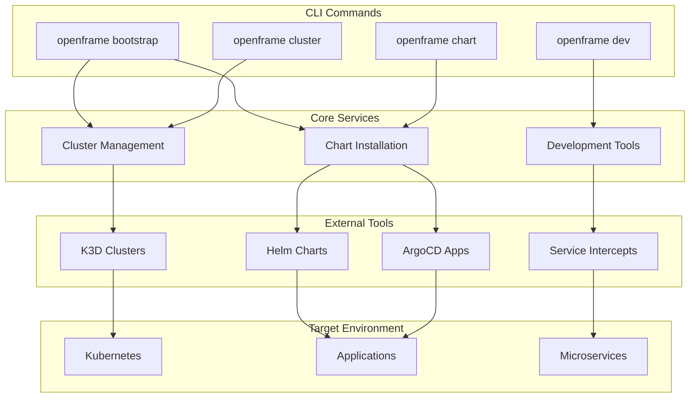

# Introduction to OpenFrame CLI

OpenFrame CLI is a modern, interactive command-line tool for managing OpenFrame Kubernetes clusters and development workflows. It provides seamless cluster lifecycle management, chart installation with ArgoCD, and developer-friendly tools for service intercepts and scaffolding.

## What is OpenFrame CLI?

OpenFrame CLI is part of the broader OpenFrame ecosystem - an AI-powered MSP platform that replaces expensive proprietary software with open-source alternatives enhanced by intelligent automation. The CLI serves as the entry point for developers and operators to bootstrap, manage, and develop on OpenFrame environments.

## Key Features

### 🚀 Complete Environment Bootstrapping
- **One-command setup**: Bootstrap entire OpenFrame environments with `openframe bootstrap`
- **Multi-mode deployment**: Support for OSS tenant, SaaS tenant, and SaaS shared modes
- **Automated cluster creation**: Creates K3D clusters with all necessary components
- **ArgoCD integration**: Automatic chart installation and application management

### 🔧 Cluster Management
- **Lifecycle operations**: Create, delete, list, and monitor Kubernetes clusters
- **K3D integration**: Lightweight Kubernetes for development and testing
- **Status monitoring**: Real-time cluster health and resource monitoring
- **Easy cleanup**: Remove clusters and associated resources with simple commands

### 📦 Chart & Application Management
- **Helm chart installation**: Streamlined chart deployment with dependency management
- **ArgoCD applications**: GitOps-based application lifecycle management
- **App-of-apps pattern**: Hierarchical application management for complex deployments
- **Synchronization monitoring**: Track deployment progress with detailed logging

### 🛠 Development Tools
- **Service intercepts**: Local development with Telepresence integration
- **Scaffolding**: Generate boilerplate code and configurations
- **Live debugging**: Debug services running in Kubernetes from your local environment
- **Hot reload**: Rapid development cycles with instant feedback

## Target Audience

### DevOps Engineers
- Simplify Kubernetes cluster management
- Automate deployment pipelines with GitOps
- Monitor and maintain OpenFrame environments

### Software Developers  
- Develop and test microservices locally
- Debug applications running in Kubernetes
- Scaffold new services and components quickly

### System Administrators
- Bootstrap complete OpenFrame environments
- Manage multiple clusters and deployments
- Monitor system health and performance

### MSP Teams
- Deploy OpenFrame for multiple tenants
- Manage client environments efficiently
- Reduce vendor costs with open-source alternatives

## Architecture Overview

## Key Benefits

| Benefit | Description |
|---------|-------------|
| **Rapid Setup** | Go from zero to running OpenFrame environment in minutes |
| **Developer Friendly** | Interactive prompts, helpful error messages, and clear documentation |
| **Production Ready** | Battle-tested components with enterprise-grade reliability |
| **Open Source** | Complete transparency, community-driven development |
| **Cost Effective** | Replace expensive proprietary tools with open-source alternatives |
| **GitOps Native** | Built-in ArgoCD integration for modern deployment practices |

## How It Works

1. **Bootstrap**: Run `openframe bootstrap` to create a complete environment
2. **Develop**: Use `openframe dev` commands for local development workflows  
3. **Deploy**: Manage applications with `openframe chart` commands
4. **Monitor**: Check cluster status with `openframe cluster` commands

The CLI handles all the complexity of Kubernetes cluster management, chart installations, and development tool configuration, allowing you to focus on building and deploying applications.

## Next Steps

Ready to get started? Continue with these guides:

- **[Prerequisites](prerequisites.md)** - Check system requirements and install dependencies
- **[Quick Start](quick-start.md)** - Get OpenFrame running in 5 minutes
- **[First Steps](first-steps.md)** - Explore key features and workflows

## Community and Support

OpenFrame is built by the community for the community. Get help and connect with other users:

- **OpenMSP Slack**: [Join the community](https://join.slack.com/t/openmsp/shared_invite/zt-36bl7mx0h-3~U2nFH6nqHqoTPXMaHEHA)
- **Website**: [https://flamingo.run](https://flamingo.run)
- **OpenFrame Platform**: [https://openframe.ai](https://openframe.ai)

> **Note**: We don't use GitHub Issues or Discussions - all support and community interaction happens in the OpenMSP Slack community.