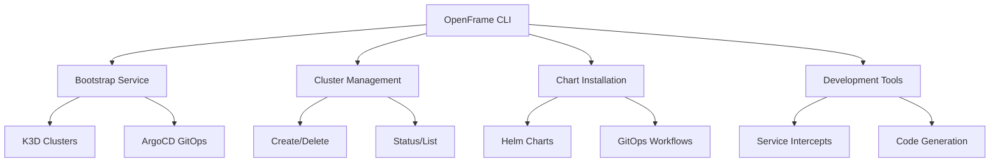

# Introduction to OpenFrame CLI

Welcome to OpenFrame CLI, a modern command-line tool that simplifies Kubernetes cluster management and development workflows for MSP (Managed Service Provider) platforms.

[](https://www.youtube.com/watch?v=awc-yAnkhIo)

## What is OpenFrame CLI?

OpenFrame CLI is a powerful, interactive command-line interface built in Go that replaces complex shell scripts with a unified tool for managing:

- **Kubernetes Clusters**: Create, manage, and destroy local K3D clusters
- **GitOps Workflows**: Automated ArgoCD and Helm chart deployment
- **Development Tools**: Service intercepts, scaffolding, and hot-reload development
- **MSP Platform Integration**: Seamless integration with the broader OpenFrame ecosystem

## Key Features

### 🚀 One-Command Bootstrap
```bash
openframe bootstrap
```
Creates a complete Kubernetes environment with ArgoCD, networking, and certificates in minutes.

### 🎯 Interactive Experience
- Wizard-driven setup for new users
- Smart defaults with customization options
- Real-time progress tracking and feedback

### 🔧 Developer-Friendly Tools
- **Service Intercepts**: Debug microservices locally using Telepresence
- **Hot Reload**: Skaffold integration for rapid development cycles  
- **Scaffolding**: Generate new services with best practices

### 🏗️ Enterprise-Ready Architecture
- Clean separation of concerns with layered architecture
- Comprehensive error handling and retry mechanisms
- Extensive testing coverage and validation

## Target Audience

**Primary Users:**
- **MSP Developers**: Building and maintaining OpenFrame platform services
- **DevOps Engineers**: Setting up local development and testing environments
- **Platform Engineers**: Managing Kubernetes infrastructure for MSP operations

**Use Cases:**
- Local development environment setup
- Testing and validation workflows
- CI/CD pipeline integration
- MSP service deployment and management

## Architecture Overview



## Core Benefits

| Benefit | Description |
|---------|-------------|
| **Simplified Setup** | Replace dozens of manual steps with single commands |
| **Consistent Environments** | Identical local clusters for all team members |
| **Rapid Development** | Service intercepts and hot-reload capabilities |
| **GitOps Ready** | Built-in ArgoCD integration for continuous delivery |
| **MSP Optimized** | Designed specifically for MSP platform requirements |

## Integration with OpenFrame Ecosystem

OpenFrame CLI is part of the broader OpenFrame platform that includes:

- **Mingo AI**: Intelligent technician assistant for MSP operations
- **Fae**: Client-facing AI interface
- **OpenFrame Platform**: Unified MSP management interface
- **GitOps Workflows**: Automated deployment and management

The CLI serves as the foundational development tool that enables the entire platform ecosystem.

## Getting Started

Ready to begin? Follow these next steps:

1. **[Prerequisites](prerequisites.md)** - Ensure your system meets requirements
2. **[Quick Start](quick-start.md)** - Get running in 5 minutes
3. **[First Steps](first-steps.md)** - Explore core features and workflows

## Support and Community

- **Documentation**: Comprehensive guides in the `/docs` directory
- **Community**: Join the OpenMSP Slack community at https://www.openmsp.ai/
- **Issues**: Report bugs and request features via our Slack community
- **Updates**: Follow release announcements on our YouTube channel

[](https://www.youtube.com/watch?v=O8hbBO5Mym8)

The OpenFrame CLI empowers MSP developers to build, deploy, and maintain enterprise-grade platforms with the simplicity of modern development tools.