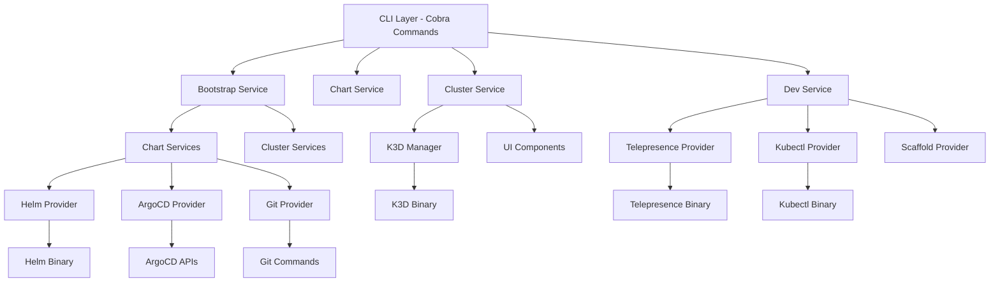

# OpenFrame CLI Introduction

Welcome to **OpenFrame CLI** - a modern, interactive command-line tool designed to streamline Kubernetes cluster management and development workflows for the OpenFrame platform.

## What is OpenFrame CLI?

OpenFrame CLI is a powerful Go-based command-line interface that orchestrates complex Kubernetes operations with simple, interactive commands. It bridges the gap between development and deployment by providing seamless cluster lifecycle management, automated chart installation with ArgoCD, and developer-friendly tools for service intercepts and scaffolding.

## Key Features

### 🚀 **One-Command Bootstrap**
- Create and configure complete K3D clusters instantly
- Automated ArgoCD installation and app-of-apps setup
- GitHub integration for seamless repository management

### 🔧 **Cluster Lifecycle Management**
- Create, delete, list, and monitor K3D clusters
- Cross-platform support (Linux, macOS, Windows with WSL)
- Built-in cleanup and status monitoring

### 📦 **Chart Management**
- Interactive deployment mode selection (GHCR, SaaS, Local)
- Helm values configuration wizard
- ArgoCD application synchronization monitoring

### 🛠️ **Developer Tools**
- Telepresence service intercepts for local development
- Skaffold scaffolding for new services
- Kubernetes namespace and service management

### 🎯 **Smart Prerequisites**
- Automatic tool detection and installation
- Support for K3D, Helm, kubectl, Telepresence
- Windows-specific path handling and WSL compatibility

## Architecture Overview

OpenFrame CLI follows a clean, layered architecture with clear separation of concerns:

## Who Should Use OpenFrame CLI?

### **DevOps Engineers**
- Simplify Kubernetes cluster provisioning
- Automate ArgoCD deployments
- Standardize development environments

### **Platform Engineers**
- Manage multiple OpenFrame deployments
- Configure chart installations consistently
- Monitor application synchronization

### **Developers**
- Set up local development environments quickly
- Test services with Telepresence intercepts
- Scaffold new microservices efficiently

### **MSP Teams**
- Deploy OpenFrame platforms rapidly
- Standardize client environment setups
- Manage multi-tenant configurations

## Core Components

| Component | Purpose |
|-----------|---------|
| **Bootstrap** | One-command cluster + chart setup |
| **Cluster Management** | K3D cluster lifecycle operations |
| **Chart Installation** | ArgoCD and app-of-apps deployment |
| **Dev Tools** | Telepresence intercepts and scaffolding |
| **Prerequisites** | Automatic tool validation and installation |

## Getting Started

Ready to dive in? Follow these steps:

1. **[Check Prerequisites](prerequisites.md)** - Ensure your system is ready
2. **[Quick Start Guide](quick-start.md)** - Get up and running in 5 minutes
3. **[First Steps](first-steps.md)** - Explore key features after installation

## Community & Support

- **Slack Community**: [OpenMSP Slack](https://join.slack.com/t/openmsp/shared_invite/zt-36bl7mx0h-3~U2nFH6nqHqoTPXMaHEHA)
- **Platform**: [OpenFrame.ai](https://openframe.ai)
- **Company**: [Flamingo.run](https://flamingo.run)

> **Note**: We don't use GitHub Issues or GitHub Discussions. All support and community discussions happen in our OpenMSP Slack community.

## What's Next?

This introduction gives you a high-level overview of OpenFrame CLI's capabilities. Continue with the prerequisites guide to prepare your environment, or jump straight to the quick start if you're ready to get hands-on.

The CLI is designed to be intuitive and self-guiding, with interactive wizards that walk you through complex operations. Each command includes help text and validation to ensure successful execution.