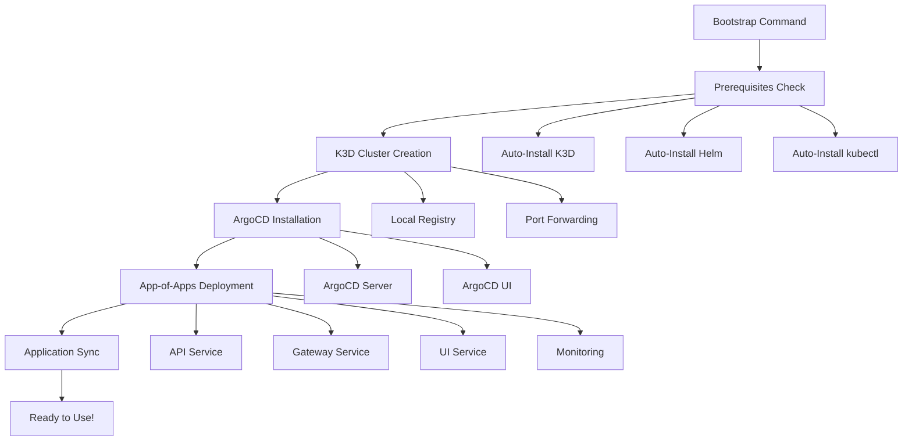

# Quick Start Guide

Get up and running with OpenFrame CLI in just 5 minutes! This guide will take you from zero to a fully functional OpenFrame Kubernetes cluster.

[](https://www.youtube.com/watch?v=O8hbBO5Mym8)

## TL;DR - One Command Setup

If you just want to get started immediately:

```bash
# Clone and build
git clone https://github.com/flamingo-stack/openframe-oss-tenant.git
cd openframe-oss-tenant
go build -o openframe .

# Bootstrap complete environment
./openframe bootstrap
```

This single command will create a K3D cluster, install ArgoCD, and set up the complete OpenFrame platform. Skip to [Verify Installation](#verify-installation) to confirm everything worked.

## Step-by-Step Installation

### Step 1: Clone the Repository

```bash
git clone https://github.com/flamingo-stack/openframe-oss-tenant.git
cd openframe-oss-tenant
```

### Step 2: Build the CLI

```bash
go build -o openframe .
```

**Expected output:**
```text
go: downloading modules...
Built successfully: openframe
```

### Step 3: Verify CLI Installation

```bash
./openframe --version
```

**Expected output:**
```text
OpenFrame CLI v1.0.0
Commit: abc123def
Built: 2024-01-01T00:00:00Z
```

### Step 4: Run Bootstrap Command

The bootstrap command will:
1. Check and install prerequisites (K3D, Helm, kubectl)
2. Create a local K3D Kubernetes cluster
3. Install and configure ArgoCD
4. Deploy the OpenFrame app-of-apps pattern

```bash
./openframe bootstrap
```

**Interactive wizard will guide you through:**

```text
🚀 OpenFrame Bootstrap Wizard

┌─────────────────────────────────────────┐
│  Welcome to OpenFrame CLI Bootstrap!    │
│                                         │
│  This wizard will:                      │
│  • Create a K3D Kubernetes cluster      │
│  • Install ArgoCD for GitOps           │
│  • Deploy OpenFrame applications       │
│                                         │
│  Prerequisites will be checked and     │
│  installed automatically.              │
└─────────────────────────────────────────┘

Checking prerequisites...
✅ Docker found and running
⬇️  Installing K3D...
✅ K3D installed successfully
⬇️  Installing Helm...
✅ Helm installed successfully
⬇️  Installing kubectl...
✅ kubectl installed successfully

Creating K3D cluster 'openframe-local'...
✅ Cluster created successfully

Installing ArgoCD...
✅ ArgoCD deployed and ready

Installing OpenFrame applications...
✅ App-of-apps pattern deployed
✅ All applications synced and healthy

🎉 Bootstrap completed successfully!

Cluster: openframe-local
ArgoCD UI: https://localhost:8080
Username: admin
Password: [generated password shown here]

Next steps:
• Run './openframe cluster status' to check cluster health
• Run './openframe chart install' to deploy additional charts
• Visit ArgoCD UI to monitor applications
```

## Verify Installation

### Check Cluster Status

```bash
./openframe cluster status
```

**Expected output:**
```text
📊 Cluster Status: openframe-local

Cluster Info:
✅ Status: Running
✅ Nodes: 1/1 Ready
✅ API Server: https://127.0.0.1:6443

ArgoCD Status:
✅ Server: Ready
✅ Applications: 5/5 Synced
✅ UI: https://localhost:8080

Resource Usage:
📈 CPU: 15% (2 cores used)
📊 Memory: 45% (12GB used)
💽 Storage: 25% (15GB used)
```

### List Running Applications

```bash
kubectl get applications -n argocd
```

**Expected output:**
```text
NAME              SYNC STATUS   HEALTH STATUS   AGE
api-service       Synced        Healthy         2m
gateway-service   Synced        Healthy         2m
ui-service        Synced        Healthy         2m
monitoring        Synced        Healthy         2m
ingress-nginx     Synced        Healthy         2m
```

### Access ArgoCD UI

1. Open your browser to `https://localhost:8080`
2. Login with the credentials shown during bootstrap
3. Explore your deployed applications

## Basic Usage Examples

### Create Additional Clusters

```bash
# Create a new cluster for development
./openframe cluster create dev-cluster

# List all clusters
./openframe cluster list
```

### Install Additional Charts

```bash
# Interactive chart installation
./openframe chart install

# This will launch a wizard for:
# • Selecting deployment mode (GHCR, SaaS, Local)
# • Configuring Helm values
# • Monitoring installation progress
```

### Development Tools

```bash
# Set up Telepresence intercept
./openframe dev intercept api-service

# Scaffold a new service
./openframe dev scaffold new-service
```

## What Just Happened?

The bootstrap process created a complete OpenFrame development environment:



## Troubleshooting Common Issues

### Port Already in Use

If you get port conflicts:

```bash
# Check what's using port 6443 or 8080
sudo lsof -i :6443
sudo lsof -i :8080

# Delete existing cluster and try again
./openframe cluster delete openframe-local
./openframe bootstrap
```

### Prerequisites Installation Failed

```bash
# Check system permissions
docker ps  # Should work without sudo

# On Linux, add user to docker group if needed
sudo usermod -aG docker $USER
newgrp docker

# Try bootstrap again
./openframe bootstrap
```

### ArgoCD Not Accessible

```bash
# Check port forwarding
kubectl get svc -n argocd

# Restart port forwarding
kubectl port-forward svc/argocd-server -n argocd 8080:443
```

### Applications Not Syncing

```bash
# Check ArgoCD application status
kubectl get applications -n argocd

# View application details
kubectl describe application api-service -n argocd

# Force sync through CLI
./openframe chart install --force-sync
```

## Clean Up

To remove everything and start fresh:

```bash
# Delete the cluster (removes everything)
./openframe cluster delete openframe-local

# Clean up any remaining K3D clusters
k3d cluster delete --all

# Remove the CLI binary if desired
rm ./openframe
```

## Next Steps

Now that you have OpenFrame CLI running:

1. **[First Steps Guide](first-steps.md)** - Learn the essential commands and workflows
2. **[Development Setup](../development/setup/local-development.md)** - Set up a development environment
3. **[Architecture Overview](../development/architecture/README.md)** - Understand how the system works

## Getting Help

- Run `./openframe --help` for command documentation
- Join our [OpenMSP Slack community](https://join.slack.com/t/openmsp/shared_invite/zt-36bl7mx0h-3~U2nFH6nqHqoTPXMaHEHA)
- Each command includes detailed help: `./openframe <command> --help`

The CLI is designed to be self-documenting with interactive wizards and comprehensive help text. Most operations include progress indicators and clear error messages to guide you through any issues.